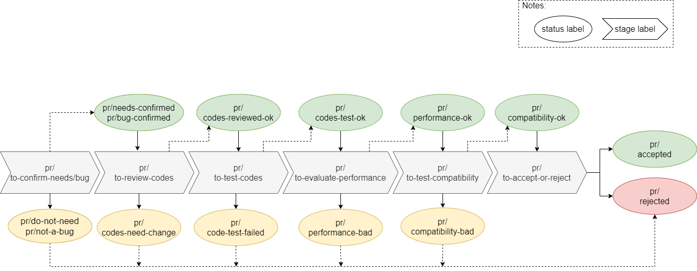
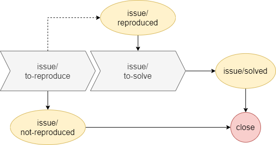

# Contributing

We are really glad that you are reading this, because we need volunteer developers and maintainers to enhance this open source project. Pls feel free to submit issues, bugfixes or new features. We really appreciate any contributing work you made to the project.

In general, you can contribute the project in three ways as listed below.

* Contribute codes to the project, either bugfix or new feature is appreciated.
* Review pull requests of the project.
* Solve issues of the project.

## 1. Contribute Codes

How to contribute codes to the project? In general, we follow the "fork-and-pull" [Git workflow](https://nvie.com/posts/a-successful-git-branching-model/). Two main branches with infinite lifetime exist: **master** and **devel**. It is recommended that you should follow the workflow below if you want to submit a patch to the project.

* S1. **Fork** the repo on Github.
* S2. **Clone** the project to your local develop environments.
* S3. **Checkout** to `devel` branch of the project in you local develop environments.
* S4. **Commit** changes on your local branch.
* S5. **Push** your work back to the forked repo on Github.
* S6. Submit a **Pull Request** so that we can review your changes.

NOTE: Be sure to merge the latest from "upstream" before making a pull request!

## 2. Review [Pull Requests](https://github.com/iqiyi/dpvs/pulls)

In consideration of the complexity of some pull requests(PR), the DPVS PRs are reviewed in a stage by stage way. In order to demonstrate the PR review progress explictly, a series of [PR labels](https://github.com/iqiyi/dpvs/labels) are defined by DPVS Maintainers. All PR labels start with prefix 'pr/'. There are two types of PR labels: the stage labels, and the status labels. The former show what need to do of the current stage, while the later show the status of previous stages. According to whether problems were found in previous stages, status labels are of two types: status ok labels, and status false labels. The following table list all the PR labels that DPVS has defined.

| stage                                                        | status /ok                                                   | status/false                                                 |
| ------------------------------------------------------------ | ------------------------------------------------------------ | ------------------------------------------------------------ |
| to-confirm-needs | needs-confirmed | do-not-need   |
| to-confirm-bug | bug-confirmed | not-a-bug     |
| to-review-codes | codes-reviewed-ok | codes-need-change |
| to-test-codes | codes-tested-ok | codes-test-failed |
| to-evaluate-performance | performance-ok | performance-bad |
| to-test-compatibility | compatibility-ok | compatibility-bad |
| to-accept-or-reject | accepted      | rejected      |

Different types of labels are colored with different colors. PR labels are described in summary here.
* stage labels: colored orange, what to do for the PR.
* status labels:
  - status-ok labels: colored green, the PR status is ok and review progress can continue.
  - status-false labels: colored purple, problems are found and the PR needs modification or to be rejected.

The figure below shows the overall review progress of a PR.

* S1. DPVS maintainers assign a stage label(label of orange color) to a PR.
* S2. Reviewers check the PR list, pick those labels with orange color, and do the current review stage work. Submit the review results within the PR.
* S3. DPVS maintainers assign a status label according to the review results, i.e. a status-ok label if the no problem found of this stage, otherwise a status-false label.
* S4. If subsequent review stages are needed, goto step S1, otherwise close the PR.

It should be noted that not all the six stages are required for simple PRs. For example, "to-test-codes", "to-evaluate-performance" and "to-test-compatibility" stages may be skipped if they are not needed obviously.

**Anyone can pick the PRs colored with orange and do the work of current stage. If your work is verified, it would take into account when we consider your activeness in DPVS community, and you may get awarded.**

It is expected that the PRs should be reviewed in a week and closed(merged or rejected) in a month. Complicated PRs may need longer timer to review, maintainers should update the review progress timely and keep in touch with code contributors if the codes in the PR need modification before accepted.

## 3. Solve [Issues](https://github.com/iqiyi/dpvs/issues)

It's appreciated to help dpvs maintainers solve the Issues from DPVS community, especially those reporting bugs or problems. Nothing is more pleasant than helping others, isn't it?  Similar to PRs, a series of [issue labels](https://github.com/iqiyi/dpvs/labels) are defined by DPVS maintainers, which have fixed prefix 'issue/'. Similarly, the issue labels are also have different types.

* stage labels: colored orange, what to do for the issue.
* status labels:
  - status-ok labels: colored green, the issue status is ok.
  - status-false labels: colored purple, the issue is not a problem.

| stage labels                                                | status/ok label                                           | status/false labels                                          |
| ----------------------------------------------------------- | --------------------------------------------------------- | ------------------------------------------------------------ |
| to-reproduce | reproduced | not-reproduced |
| to-solve     | solved     |                                                              |

The figure below shows the processing progress of an DPVS issue.

**Anyone can pick the Issues colored orange and do the work of current stage. If the issue is confirmed to be solved, it would take into account when we consider your activeness in DPVS community, and you may get awarded.**

It is expected that Issues should be replied in a week and solved in a month. If the issue author is not replied after a month from reply, the issue is closed.

# Coding conventions

Basically, codeing style should be consistent in the whole project. We recommend to use the [Linux kernel coding style](https://www.kernel.org/doc/html/v4.10/process/coding-style.html#).

NOTE: As for indentations, we use 4-char indents, not 8-char indents. This is different from Linux kernel coding style.

# Rewards to Contributors

The DPVS contributors(including code contributors, PR reviewers, and issue solvers) can be rewarded in the following aspects.

* Excellent contributors should be invited into **DPVS maintainers**, who are granted with high privileges of the project.
* IQIYI would prepare some **gold membership cards** for the active contributors every year.

