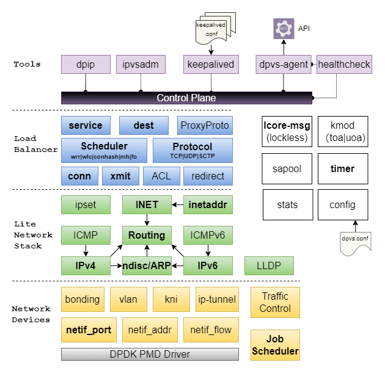

  


# Introduction

`DPVS` is a high performance **Layer-4 load balancer** based on [DPDK](http://dpdk.org). It's derived from Linux Virtual Server [LVS](http://www.linuxvirtualserver.org/) and its modification [alibaba/LVS](https://github.com/alibaba/LVS).

> Notes: The name `DPVS` comes from "DPDK-LVS".


Several techniques are applied for high performance:

* *Kernel by-pass* (user space implementation).
* *Share-nothing*, per-CPU for key data (lockless).
* *RX Steering* and *CPU affinity* (avoid context switch).
* *Batching* TX/RX.
* *Zero Copy* (avoid packet copy and syscalls).
* *Polling* instead of interrupt.
* *Lockless message* for high performance IPC.
* Other techs enhanced by *DPDK*.

Major features of `DPVS` including:

* *L4 Load Balancer*, including FNAT, DR, Tunnel, DNAT modes, etc.
* *SNAT* mode for Internet access from internal network.
* *NAT64* forwarding in FNAT mode for quick IPv6 adaptation without application changes.
* Different *schedule algorithms* like RR, WLC, WRR, MH(Maglev Hashing), Conhash(Consistent Hashing) etc.
* User-space *Lite IP stack* (IPv4/IPv6, Routing, ARP, Neighbor, ICMP ...).
* Support *KNI*, *VLAN*, *Bonding*, *Tunneling* for different IDC environment.
* Security aspect, support *TCP syn-proxy*, *Conn-Limit*, *black-list*， *white-list*.
* QoS: *Traffic Control*.

`DPVS` feature modules are illustrated as following picture.



# Quick Start

## Test Environment

This *quick start* is tested with the environment below.

* Linux Distribution: CentOS 7.2
* Kernel: 3.10.0-327.el7.x86_64
* CPU: Intel(R) Xeon(R) CPU E5-2650 v3 @ 2.30GHz
* NIC: Intel Corporation Ethernet Controller 10-Gigabit X540-AT2 (rev 03)
* Memory: 64G with two NUMA node.
* GCC: gcc version 4.8.5 20150623 (Red Hat 4.8.5-4)

Other environments should also be OK if DPDK works, please check [dpdk.org](http://www.dpdk.org) for more info.

* Please check this link for NICs supported by DPDK: http://dpdk.org/doc/nics.
* Note `flow control` ([rte_flow](http://dpdk.org/doc/guides/nics/overview.html#id1)) is needed for `FNAT` and `SNAT` mode with multi-cores.

> Notes: To let dpvs work properly with multi-cores, rte_flow items must support "ipv4, ipv6, tcp, udp" four items, and rte_flow actions must support "drop, queue" at least.

## Clone DPVS

```bash
$ git clone https://github.com/iqiyi/dpvs.git
$ cd dpvs
```

Well, let's start from DPDK then.

## DPDK setup.

Currently, `dpdk-stable-20.11.1` is recommended for `DPVS`, and we will not support dpdk version earlier than dpdk-20.11 any more. If you are still using earlier dpdk versions, such as `dpdk-stable-17.11.2`, `dpdk-stable-17.11.6` and `dpdk-stable-18.11.2`, please use earlier dpvs releases, such as [v1.8.10](https://github.com/iqiyi/dpvs/releases/tag/v1.8.10).

> Notes: You can skip this section if experienced with DPDK, and refer the [link](http://dpdk.org/doc/guides/linux_gsg/index.html) for details.

```bash
$ wget https://fast.dpdk.org/rel/dpdk-20.11.1.tar.xz   # download from dpdk.org if link failed.
$ tar xf dpdk-20.11.1.tar.xz
```

### DPDK patchs

There are some patches for DPDK to support extra features needed by DPVS. Apply them if needed. For example, there's a patch for DPDK `kni` driver for hardware multicast, apply it if you are to launch `ospfd` on `kni` device.

> Notes: Assuming we are in DPVS root directory and dpdk-stable-20.11.1 is under it, please note it's not mandatory, just for convenience.

```
$ cd <path-of-dpvs>
$ cp patch/dpdk-stable-20.11.1/*.patch dpdk-stable-20.11.1/
$ cd dpdk-stable-20.11.1/
$ patch -p1 < 0001-kni-use-netlink-event-for-multicast-driver-part.patch
$ patch -p1 < 0002-pdump-change-dpdk-pdump-tool-for-dpvs.patch
$ ...
```

> Tips: It's advised to patch all if your are not sure about what they are meant for.

### DPDK build and install

Use meson-ninja to build DPDK libraries, and export environment variable `PKG_CONFIG_PATH` for DPDK app (DPVS). The `dpdk.mk` in DPVS checks the presence of libdpdk.

```bash
$ cd dpdk-stable-20.11.1
$ mkdir dpdklib                 # user desired install folder
$ mkdir dpdkbuild               # user desired build folder
$ meson -Denable_kmods=true -Dprefix=dpdklib dpdkbuild
$ ninja -C dpdkbuild
$ cd dpdkbuild; ninja install
$ export PKG_CONFIG_PATH=$(pwd)/../dpdklib/lib64/pkgconfig/libdpdk.pc
```

> Tips: You can use script [dpdk-build.sh](./scripts/dpdk-build.sh) to facilitate dpdk build. Run `dpdk-build.sh -h` for the usage of the script.

Next is to set up DPDK hugepage. Our test environment is NUMA system. For single-node system please refer to the [link](http://dpdk.org/doc/guides/linux_gsg/sys_reqs.html).

```bash
$ # for NUMA machine
$ echo 8192 > /sys/devices/system/node/node0/hugepages/hugepages-2048kB/nr_hugepages
$ echo 8192 > /sys/devices/system/node/node1/hugepages/hugepages-2048kB/nr_hugepages

$ mkdir /mnt/huge
$ mount -t hugetlbfs nodev /mnt/huge
```

Install kernel modules and bind NIC with `uio_pci_generic` driver. Quick start uses only one NIC, normally we use two for FNAT cluster, even four for bonding mode. For example, suppose the NIC we would use to run DPVS is eth0, in the meantime, we still keep another standalone NIC eth1 for debugging.

```bash
$ modprobe uio_pci_generic

$ cd dpdk-stable-20.11.1
$ insmod dpdkbuild/kernel/linux/kni/rte_kni.ko carrier=on

$ ./usertools/dpdk-devbind.py --status
$ ifconfig eth0 down          # assuming eth0 is 0000:06:00.0
$ ./usertools/dpdk-devbind.py -b uio_pci_generic 0000:06:00.0
```

> Notes:
> 1. An alternative to the `uio_pci_generic` is `igb_uio`, which is moved to a separated repository [dpdk-kmods](http://git.dpdk.org/dpdk-kmods).
> 2. A kernel module parameter `carrier` is added to `rte_kni.ko` since [DPDK v18.11](https://elixir.bootlin.com/dpdk/v18.11/source/kernel/linux/kni/kni_misc.c), and the default value for it is "off".  We need to load `rte_kni.ko` with the extra parameter `carrier=on` to make KNI devices work properly.

`dpdk-devbind.py -u` can be used to unbind driver and switch it back to Linux driver like `ixgbe`. You can also use `lspci` or `ethtool -i eth0` to check the NIC PCI bus-id. Please refer to [DPDK site](http://www.dpdk.org) for more details.

> Notes: PMD of Mellanox NIC is built on top of libibverbs using the Raw Ethernet Accelerated Verbs AP. It doesn't rely on UIO/VFIO driver. Thus, Mellanox NICs should not bind the `igb_uio` driver. Refer to [Mellanox DPDK](https://community.mellanox.com/s/article/mellanox-dpdk) for details.

## Build DPVS

It's simple, just set `PKG_CONFIG_PATH` and build it.

```bash
$ export PKG_CONFIG_PATH=<path-of-libdpdk.pc>  # normally located at dpdklib/lib64/pkgconfig/libdpdk.pc
$ cd <path-of-dpvs>

$ make              # or "make -j" to speed up
$ make install
```
> Notes:
> 1. Build dependencies may be needed, such as `pkg-config`(version 0.29.2+),`automake`, `libnl3`, `libnl-genl-3.0`, `openssl`, `popt` and `numactl`. You can install the missing dependencies by using the package manager of the system, e.g., `yum install popt-devel` (CentOS).
> 2. Early `pkg-config` versions (v0.29.2 before) may cause dpvs build failure. If so, please upgrade this tool.

Output files are installed to `dpvs/bin`.

```bash
$ ls bin/
dpip  dpvs  ipvsadm  keepalived
```

* `dpvs` is the main program.
* `dpip` is the tool to set IP address, route, vlan, neigh, etc.
* `ipvsadm` and `keepalived` come from LVS, both are modified.

## Launch DPVS

Now, `dpvs.conf` must locate at `/etc/dpvs.conf`, just copy it from `conf/dpvs.conf.single-nic.sample`.

```bash
$ cp conf/dpvs.conf.single-nic.sample /etc/dpvs.conf
```

and start DPVS,

```bash
$ cd <path-of-dpvs>/bin
$ ./dpvs &
```

Check if it's get started ?

```bash
$ ./dpip link show
1: dpdk0: socket 0 mtu 1500 rx-queue 8 tx-queue 8
    UP 10000 Mbps full-duplex fixed-nego promisc-off
    addr A0:36:9F:9D:61:F4 OF_RX_IP_CSUM OF_TX_IP_CSUM OF_TX_TCP_CSUM OF_TX_UDP_CSUM
```

If you see this message. Well done, `DPVS` is working with NIC `dpdk0`!

>Don't worry if you see this error:
```
EAL: Error - exiting with code: 1
  Cause: ports in DPDK RTE (2) != ports in dpvs.conf(1)
```
>It means the NIC count of DPVS does not match `/etc/dpvs.conf`. Please use `dpdk-devbind` to adjust the NIC number or modify `dpvs.conf`. We'll improve this part to make DPVS more "clever" to avoid modify config file when NIC count does not match.

What config items does `dpvs.conf` support? How to configure them? Well, `DPVS` maintains a config item file `conf/dpvs.conf.items` which lists all supported config entries and corresponding feasible values. Besides, some config sample files maintained as `./conf/dpvs.*.sample` show the configurations of dpvs in some specified cases.

## Test Full-NAT (FNAT) Load Balancer

The test topology looks like the following diagram.


Set VIP and Local IP (LIP, needed by FNAT mode) on DPVS. Let's put commands into `setup.sh`. You do some check by `./ipvsadm -ln`, `./dpip addr show`.

```bash
$ cat setup.sh
VIP=192.168.100.100
LIP=192.168.100.200
RS=192.168.100.2

./dpip addr add ${VIP}/24 dev dpdk0
./ipvsadm -A -t ${VIP}:80 -s rr
./ipvsadm -a -t ${VIP}:80 -r ${RS} -b

./ipvsadm --add-laddr -z ${LIP} -t ${VIP}:80 -F dpdk0
$
$ ./setup.sh
```

Access VIP from Client, it looks good!

```bash
client $ curl 192.168.100.100
Your ip:port : 192.168.100.3:56890
```

## Tutorial Docs

More configure examples can be found in the [Tutorial Document](./doc/tutorial.md). Including,

* WAN-to-LAN `FNAT` reverse proxy.
* Direct Route (`DR`) mode setup.
* Master/Backup model (`keepalived`) setup.
* OSPF/ECMP cluster model setup.
* `SNAT` mode for Internet access from internal network.
* Virtual Devices (`Bonding`, `VLAN`, `kni`, `ipip`/`GRE`).
* `UOA` module to get real UDP client IP/port in `FNAT`.
* ... and more ...

We also listed some frequently asked questions in the [FAQ Document](./doc/faq.md). It may help when you run into problems with DPVS.

# Performance Test

Our test shows the forwarding speed (pps) of DPVS is several times than LVS and as good as Google's [Maglev](https://research.google.com/pubs/pub44824.html).


# License

Please refer to the [License](./LICENSE.md) file for details.

# Contributing

Please refer to the [CONTRIBUTING](./CONTRIBUTING.md) file for details.

# Community

Currently, DPVS has been widely accepted by dozens of community cooperators, who have successfully used and contributed a lot to DPVS. We just list some of them alphabetically as below.

|[**CMSoft**](http://cmsoft.10086.cn/)      |   |
| ----------------------------------------- | -------------------------------------- |
|[**IQiYi**](https://www.iqiyi.com/)        |     |
|[**NetEase**](https://www.163yun.com/)     | |
|[**Shopee**](https://shopee.com/)          |   |
|[**Xiaomi**](https://www.mi.com/)          |       |

# Contact Us

`DPVS` is developed by [iQiYi](https://www.iqiyi.com) *QLB* team since April 2016. It's widely used in iQiYi IDC for L4 load balancer and SNAT clusters, and we have already replaced nearly all our LVS clusters with DPVS. We open-sourced DPVS at October 2017, and are excited to see that **more people can get involved** in this project. Welcome to try, report issues and submit pull requests. And please feel free to contact us through **Github** or **Email**.

* github: `https://github.com/iqiyi/dpvs`
* email: `iig_cloud_qlb # qiyi.com` (Please remove the white-spaces and replace `#` with `@`).
