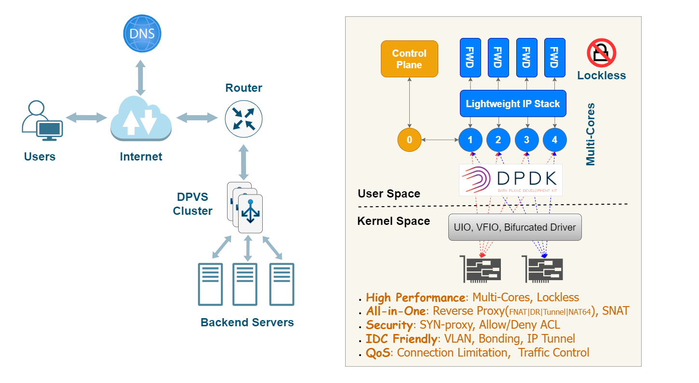
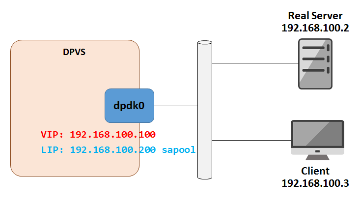

  


# Introduction

`DPVS` is a high performance **Layer-4 load balancer** based on [DPDK](http://dpdk.org). It's derived from Linux Virtual Server [LVS](http://www.linuxvirtualserver.org/) and its modification [alibaba/LVS](https://github.com/alibaba/LVS).

> Notes: The name `DPVS` comes from "DPDK-LVS".



Several techniques are applied for high performance:

* *Kernel by-pass* (user space implementation).
* *Share-nothing*, per-CPU for key data (lockless).
* *RX Steering* and *CPU affinity* (avoid context switch).
* *Batching* TX/RX.
* *Zero Copy* (avoid packet copy and syscalls).
* *Polling* instead of interrupt.
* *Lockless message* for high performance IPC.
* Other techs enhanced by *DPDK*.

Major features of `DPVS` including:

* *L4 Load Balancer*, supports FNAT, DR, Tunnel and DNAT reverse proxy modes.
* *NAT64* mode for IPv6 quick adaption without changing backend server.
* *SNAT* mode for Internet access from internal network.
* Adequate *schedule algorithms* like RR, WLC, WRR, MH(Maglev Hash), Conhash(Consistent Hash), etc.
* User-space *lite network stack*: IPv4, IPv6, Routing, ARP, Neighbor, ICMP, LLDP, IPset, etc.
* Support *KNI*, *VLAN*, *Bonding*, *IP Tunnel* for different IDC environment.
* Security aspects support *TCP SYN-proxy*, *Allow/Deny ACL*.
* QoS features such as  *Traffic Control*, *Concurrent Connection Limit*.
* Versatile tools, services can be configured with `dpip` `ipvsadm` command line tools, or from config files of `keepalived`, or via restful API provided by `dpvs-agent`.

DPVS consists of the modules illustrated in the diagram below.


# Quick Start

## Test Environment

This *quick start* is performed in the environments described below.

* Linux Distribution: CentOS 7.6
* Kernel: 3.10.0-957.el7.x86_64
* CPU: Intel(R) Xeon(R) CPU E5-2650 v4 @ 2.20GHz
* NIC: Intel Corporation Ethernet Controller 10-Gigabit X540-AT2 (rev 03)
* Memory: 64G with two NUMA node.
* GCC: 4.8.5 20150623 (Red Hat 4.8.5-36)
* Golang: go1.20.4 linux/amd64 (required only when CONFIG_DPVS_AGENT enabled).

Other environments should also be OK if DPDK works, please check [dpdk.org](http://www.dpdk.org) for more information.

> Notes:
> 1. Please check this link for NICs supported by DPDK: http://dpdk.org/doc/nics.
> 2. `Flow Control` ([rte_flow](http://dpdk.org/doc/guides/nics/overview.html#id1)) is required for `FNAT` and `SNAT` mode when DPVS running on multi-cores unless `conn redirect` is enabled. The minimum requirements to ensure DPVS works with multi-core properly is that `rte_flow` must support "ipv4, ipv6, tcp, udp" four items, and "drop, queue" two actions.
> 3. DPVS doesn't confine itself to the this test environments. In fact, DPVS is an user-space application which relies very little on operating system, kernel versions, compilers, and other platform discrepancies. As far as is known, DPVS has been verified at least in the following environments.
>   * Centos 7.2, 7.6, 7.9
>   * Anolis 8.6, 8.8, 8.9
>   * GCC 4.8, 8.5
>   * Kernel: 3.10.0, 4.18.0, 5.10.134
>   * NIC: Intel IXGBE, NVIDIA MLX5

## Clone DPVS

```bash
$ git clone https://github.com/iqiyi/dpvs.git
$ cd dpvs
```

Well, let's start from DPDK then.

## DPDK setup

Currently, `dpdk-stable-20.11.10` is recommended for `DPVS`, and we will not support dpdk version earlier than dpdk-20.11 any more. If you are still using earlier dpdk versions, such as `dpdk-stable-17.11.6` and `dpdk-stable-18.11.2`, please use earlier DPVS releases, such as [v1.8.12](https://github.com/iqiyi/dpvs/releases/tag/v1.8.12).

> Notes: You can skip this section if experienced with DPDK, and refer the [link](http://dpdk.org/doc/guides/linux_gsg/index.html) for details.

```bash
$ wget https://fast.dpdk.org/rel/dpdk-20.11.10.tar.xz   # download from dpdk.org if link failed.
$ tar xf dpdk-20.11.10.tar.xz
```

### DPDK patchs

There are some patches for DPDK to support extra features needed by DPVS. Apply them if needed. For example, there's a patch for DPDK `kni` driver for hardware multicast, apply it if you are to launch `ospfd` on `kni` device.

> Notes: It's assumed we are in DPVS root directory where you have installed dpdk-stable-20.11.10 source codes. Please note it's not mandatory, just for convenience.

```
$ cd <path-of-dpvs>
$ cp patch/dpdk-stable-20.11.10/*.patch dpdk-stable-20.11.10/
$ cd dpdk-stable-20.11.10/
$ patch -p1 < 0001-kni-use-netlink-event-for-multicast-driver-part.patch
$ patch -p1 < 0002-pdump-change-dpdk-pdump-tool-for-dpvs.patch
$ ...
```

> Tips: It's advised to patch all if your are not sure about what they are meant for.
 
### DPDK build and install

Use meson-ninja to build DPDK, and export environment variable `PKG_CONFIG_PATH` for DPDK application (DPVS). The sub-Makefile `src/dpdk.mk` in DPVS will check the presence of libdpdk.

```bash
$ cd dpdk-stable-20.11.10
$ mkdir dpdklib                 # user desired install folder
$ mkdir dpdkbuild               # user desired build folder
$ meson -Denable_kmods=true -Dprefix=dpdklib dpdkbuild
$ ninja -C dpdkbuild
$ cd dpdkbuild; ninja install
$ export PKG_CONFIG_PATH=$(pwd)/../dpdklib/lib64/pkgconfig/
```

> Tips: You can use script [dpdk-build.sh](./scripts/dpdk-build.sh) to facilitate dpdk build. Run `dpdk-build.sh -h` for the usage of the script.

Next is to set up DPDK hugepage. Our test environment is NUMA system. For single-node system please refer to the [link](http://dpdk.org/doc/guides/linux_gsg/sys_reqs.html).

```bash
$ # for NUMA machine
$ echo 8192 > /sys/devices/system/node/node0/hugepages/hugepages-2048kB/nr_hugepages
$ echo 8192 > /sys/devices/system/node/node1/hugepages/hugepages-2048kB/nr_hugepages
```
By default, hugetlbfs is mounted at `/dev/hugepages`, as shown below.

```bash
$ mount | grep hugetlbfs
hugetlbfs on /dev/hugepages type hugetlbfs (rw,relatime)
```
If it's not your case, you should mount hugetlbfs by yourself.

```bash
$ mkdir /mnt/huge
$ mount -t hugetlbfs nodev /mnt/huge
```

> Notes:
> 1. Hugepages of other size, such as 1GB-size hugepages, can also be used if your system supports.
> 2. It's recommended to reserve hugepage memory and isolate CPUs used by DPVS with linux kernel cmdline options in production environments, for example `isolcpus=1-9 default_hugepagesz=1G hugepagesz=1G hugepages=32`.

Next, install kernel modules required by DPDK and DPVS.

* DPDK driver kernel module: 
Depending on your NIC and system, NIC may require binding a DPDK-compitable driver, such as `vfio-pci`, `igb_uio`, or `uio_pci_generic`. Refer to [DPDK doc](https://doc.dpdk.org/guides/linux_gsg/linux_drivers.html) for more details. In this test, we use the linux standard UIO kernel module `uio_pci_generic`.

* KNI kernel module: 
KNI kernel module `rte_kni.ko` is required by DPVS as the exception data path which processes packets not dealt with in DPVS to kernel stack.

```bash
$ modprobe uio_pci_generic

$ cd dpdk-stable-20.11.10
$ insmod dpdkbuild/kernel/linux/kni/rte_kni.ko carrier=on

$ # bind eth0 to uio_pci_generic (Be aware: Network on eth0 will get broken!)
$ ./usertools/dpdk-devbind.py --status
$ ifconfig eth0 down          # assuming eth0's pci-bus location is 0000:06:00.0
$ ./usertools/dpdk-devbind.py -b uio_pci_generic 0000:06:00.0
```
> Notes:
> 1. The test in our Quick Start uses only one NIC. Bind as many NICs as required in your DPVS application to DPDK driver kernel module. For example, you should bind at least 2 NICs if you are testing DPVS with two-arm.
> 2. `dpdk-devbind.py -u` can be used to unbind driver and switch it back to Linux driver like `ixgbe`. Use `lspci` or `ethtool -i eth0` to check the NIC's PCI bus-id. Please refer to [DPDK Doc:Binding and Unbinding Network Ports to/from the Kernel Modules](https://doc.dpdk.org/guides/linux_gsg/linux_drivers.html#binding-and-unbinding-network-ports-to-from-the-kernel-modules) for more details.
> 3. NVIDIA/Mellanox NIC uses bifurcated driver which doesn't rely on UIO/VFIO driver, so not bind any DPDK driver kernel module, but [NVIDIA MLNX_OFED/EN](https://network.nvidia.com/products/infiniband-drivers/linux/mlnx_ofed/) is required. Refer to [Mellanox DPDK](https://enterprise-support.nvidia.com/s/article/mellanox-dpdk) for its PMD and [Compilation Prerequisites](https://doc.dpdk.org/guides/platform/mlx5.html#linux-prerequisites) for OFED installation.
> 4. A kernel module parameter `carrier` has been added to `rte_kni.ko` since [DPDK v18.11](https://elixir.bootlin.com/dpdk/v18.11/source/kernel/linux/kni/kni_misc.c), and the default value for it is "off". We need to load `rte_kni.ko` with extra parameter `carrier=on` to make KNI devices work properly.
> 5. Multiple DPVS instances can run on a single server if there are enough NICs or VFs within one NIC. Refer to [tutorial:Multiple Instances](https://github.com/iqiyi/dpvs/blob/devel/doc/tutorial.md#multi-instance) for details.

## Build DPVS

It's simple, just set `PKG_CONFIG_PATH` and build it.

```bash
$ export PKG_CONFIG_PATH=<path-of-libdpdk.pc>  # normally located at dpdklib/lib64/pkgconfig/
$ cd <path-of-dpvs>

$ make              # or "make -j" to speed up
$ make install
```
> Notes:
> 1. Build dependencies may be needed, such as `pkg-config`(version 0.29.2+, `automake`, `libnl3`, `libnl-genl-3.0`, `openssl`, `popt` and `numactl`. You can install the missing dependencies with package manager of your system, e.g., `yum install popt-devel automake` (CentOS) or `apt install libpopt-dev autoconfig` (Ubuntu).
> 2. Early `pkg-config` versions (v0.29.2 before) may cause dpvs build failure. If so, please upgrade this tool. Specially, you may upgrade the `pkg-config` on Centos7 to meet the version requirement.
> 3. If you want to compile `dpvs-agent` and `healthcheck`, enable `CONFIG_DPVS_AGENT` in config.mk, and install Golang build environments(Refer to [go.mod](tools/dpvs-agent/go.mod) file for required Golang version).

Output binary files are installed to `dpvs/bin`.

```bash
$ ls bin/
dpip  dpvs  dpvs-agent  healthcheck  ipvsadm  keepalived
```

* `dpvs` is the main program.
* `dpip` is the tool to manage IP address, route, vlan, neigh, etc.
* `ipvsadm` and `keepalived` come from LVS, both are modified.
* `dpvs-agent` and `healthcheck` are alternatives to `keepalived` powered with HTTP API developed with Golang.

## Launch DPVS

Now, `dpvs.conf` must locate at `/etc/dpvs.conf`, just copy it from `conf/dpvs.conf.single-nic.sample`.

```bash
$ cp conf/dpvs.conf.single-nic.sample /etc/dpvs.conf
```

and start DPVS,

```bash
$ cd <path-of-dpvs>/bin
$ ./dpvs &

$ # alternatively and strongly advised, start DPVS with NIC and CPU explicitly specified:
$ ./dpvs -- -a 0000:06:00.0 -l 1-9
```
> Notes:
> 1. Run `./dpvs --help` for DPVS supported command line options, and `./dpvs -- --help` for common DPDK EAL command line options.
> 2. The default `dpvs.conf` require 9 CPUs(1 master worker, 8 slave workers), modify it if not so many available CPUs in your system.

Check if it's get started ?

```bash
$ ./dpip link show
1: dpdk0: socket 0 mtu 1500 rx-queue 8 tx-queue 8
    UP 10000 Mbps full-duplex fixed-nego promisc-off
    addr A0:36:9F:9D:61:F4 OF_RX_IP_CSUM OF_TX_IP_CSUM OF_TX_TCP_CSUM OF_TX_UDP_CSUM
```

If you see this message. Well done, `DPVS` is working with NIC `dpdk0`!

>Don't worry if you see this error:
```
EAL: Error - exiting with code: 1
  Cause: ports in DPDK RTE (2) != ports in dpvs.conf(1)
```
>It means the number of NIC recognized by DPVS mismatched `/etc/dpvs.conf`. Please either modify NIC number in `dpvs.conf` or specify NICs with EAL option `-a` explicitly.

What config items does `dpvs.conf` support? How to configure them? Well, `DPVS` maintains a config item file `conf/dpvs.conf.items` which lists all supported config entries, default values, and feasible value ranges. Besides, some sample config files maintained in `./conf/dpvs.*.sample` gives practical configurations of DPVS in corresponding circumstances.

## Test Full-NAT (FNAT) Load Balancer

The test topology looks like the following diagram.



Set VIP and Local IP (LIP, needed by FNAT mode) on DPVS. Let's put commands into `setup.sh`. You do some check by `./ipvsadm -ln`, `./dpip addr show`.

```bash
$ cat setup.sh
VIP=192.168.100.100
LIP=192.168.100.200
RS=192.168.100.2

./dpip addr add ${VIP}/24 dev dpdk0
./ipvsadm -A -t ${VIP}:80 -s rr
./ipvsadm -a -t ${VIP}:80 -r ${RS}:80 -b

./ipvsadm --add-laddr -z ${LIP} -t ${VIP}:80 -F dpdk0
$
$ ./setup.sh
```

Access VIP from Client, it looks good!

```bash
client $ curl 192.168.100.100
Your ip:port : 192.168.100.3:56890
```

## Tutorial Docs

More examples can be found in the [Tutorial Document](./doc/tutorial.md). Including,

* WAN-to-LAN `FNAT` reverse proxy.
* Direct Route (`DR`) mode setup.
* Master/Backup model (`keepalived`) setup.
* OSPF/ECMP cluster model setup.
* `SNAT` mode for Internet access from internal network.
* Virtual Devices (`Bonding`, `VLAN`, `kni`, `ipip`/`GRE` tunnel).
* `UOA` module to get real UDP client IP/port in `FNAT`.
* ... and more ...

We also listed some frequently asked questions in the [FAQ Document](./doc/faq.md). It may help when you run into problems with DPVS.

Browse the [doc](./doc) directory for other documentations, including:
* [IPset](./doc/IPset.md)
* [Traffic Control (TC)](./doc/tc.md)
* [Performance tune](./doc/Worker-Performance-Tuning.md)
* [Backend healthcheck without keepalived](./doc/dest-check.md)
* [Client address conservation in Fullnat](./doc/client-address-conservation-in-fullnat.md)
* [Advices to build and run DPVS in container](./doc/containerized/README.md)

# Performance Test

Our test shows the forwarding speed (PPS/packets per second) of DPVS is several times than LVS and as good as Google's [Maglev](https://research.google.com/pubs/pub44824.html).


Click [here](./test/release/v1.9.2/performance.md) for the lastest performance data.

# License

Please refer to the [License](./LICENSE.md) file for details.

# Contributing

Please refer to the [CONTRIBUTING](./CONTRIBUTING.md) file for details.

# Community

Currently, DPVS has been widely accepted by dozens of community cooperators, who have successfully used and contributed a lot to DPVS. We just list some of them alphabetically as below.

|[**CMSoft**](http://cmsoft.10086.cn/)      |   |
| ----------------------------------------- | -------------------------------------- |
|[**IQiYi**](https://www.iqiyi.com/)        |     |
|[**NetEase**](https://www.163yun.com/)     | |
|[**Shopee**](https://shopee.com/)          |   |
|[**Xiaomi**](https://www.mi.com/)          |       |

# Contact Us

`DPVS` is developed by [iQiYi](https://www.iqiyi.com) *QLB* team since April 2016. It's widely used in iQiYi IDC for L4 load balancer and SNAT clusters, and we have already replaced nearly all our LVS clusters with DPVS. We open-sourced DPVS at October 2017, and are excited to see that **more people can get involved** in this project. Welcome to try, report issues and submit pull requests. And please feel free to contact us through **Github** or **Email**.

* github: `https://github.com/iqiyi/dpvs`
* email: `iig_cloud_qlb # qiyi.com` (Please remove the white-spaces and replace `#` with `@`).
