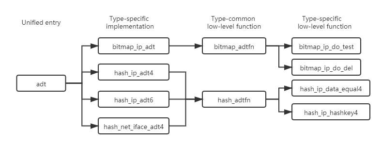

DPVS IPset
------

* [Concepts](#concepts)
* [Set Types](#types)
  * [bitmap:ip](#bitmap_ip)
  * [bitmap:ip,mac](#bitmap_ip_mac)
  * [bitmap:port](#bitmap_port)
  * [hash:ip](#hash_ip)
  * [hash:ip,port](#hash_ip_port)
  * [hash:ip,port,ip](#hash_ip_port_ip)
  * [hash:net](#hash_net)
  * [hash:net,port](#hash_net_port)
  * [hash:net,port,iface](#hash_net_port_iface)
  * [hash:ip,port,net](#hash_ip_port_net)
  * [hash:net,port,net](#hash_net_port_net)
  * [hash:net,port,net,port](#hash_net_port_net_port)
* [For Developers](#developer)

<a id='concepts'/>

# Concepts

DPVS ipset is derived from [Linux IP sets](https://ipset.netfilter.org/index.html). Depending on the type of the set, an IP set may store IP(v4/v6) addresses, (TCP/UDP) port numbers, IP and MAC address pairs, IP address and port number pairs, etc.

Administrator may use `dpip` tool to create/destroy an ipset, add/delete entries to/from an existing ipset, test if an entry matches an ipset, or list/flush all entries of an ipset. Ipset intends to cooperate with DPVS's other modules, such as TC, ACL, to achieve fexible control over packet process.

According to storage methods, DPVS's ipset types can be divided into two categories: bitmap sets and hash sets. Bitmap sets support IPv4 only and have better performance, but an IPv4 or (TCP, UDP) port range must be specified when the set is created and corresponding memory is allocated even if there is no element yet. Hash sets store entries use hash tables with a maximum entry limits, the performance is not as good, but can support more complicated entries. Notes that complicated set type generally costs more CPU and memory resources, so it's advised to use the most suitable set types for your application case.

You can find the latest ipset usage with command `dpip ipset -h`.

```bash
# ./bin/dpip ipset -h
Usage:
    dpip ipset create SETNAME TYPE [ OPTIONS ]
    dpip ipset destroy SETNAME
    dpip ipset { add | del | test } SETNAME ENTRY [ ADTOPTS ]
    dpip ipset { show | flush } [ SETNAME ]
Parameters:
    TYPE      := { bitmap:ip | bitmap:ip,mac | bitmap:port | hash:ip | hash:net | hash:ip,port
                    | hash:net,port | hash:net,port,iface | hash:ip,port,ip | hash:ip,port,net
                    | hash:net,port,net | hash:net,port,net,port }
    ENTRY     := combinations of one or more comma seperated tokens below,
                 { { IP | NET } | PORT | MAC | IFACE }
    IP        := ipv4 or ipv6 string literal
    NET       := "{ IP/prefix | IP(range from)[-IP(range end)] }"
    MAC       := 6 bytes MAC address string literal
    PORT      := "[{ tcp | udp | icmp | icmp6 }:]port1[-port2]"
    OPTIONS   := { comment | range NET | hashsize NUM | maxelem NUM }
    ADTOPTS   := { comment STRING | unmatch (for add only) }
    flag      := { -F(--force) | { -4 | -6 } | -v }
```

For example, the following command creates a hash:net,port type ipset named `foo`, whose hash table bucket size is 256, and can store 1000 entries at most with comment enabled.

```bash
./bin/dpip ipset create foo hash:net,port hashsize 256 maxelem 1000 comment
```

Then we add some entries into the ipset foo.

```bash
 ./bin/dpip ipset add foo 10.132.0.0/16,udp:10240
 ./bin/dpip ipset add foo 192.168.88.0/24,tcp:8080-8082
 ./bin/dpip ipset add foo 192.168.88.200-192.168.88.255,tcp:8082 nomatch comment "bad guys"
```

As shown above, we add to the ipset foo the whole network range 10.132.0.0/16 with udp port 10240 firstly, and then add a network range 192.168.88.0/24 with tcp port 8080, 8081, 8082, and finally exclude the ip range 192.168.88.200-192.168.88.255 with tcp port 8082.

Now let's have a look at what are stored in ipset.

```Bash
# ./bin/dpip -v ipset list
Name: foo
Type: hash:net,port
Header: family inet  hashsize 256  maxelem 1000  comment
Size in memory: 5160
References: 0
Number of entries: 7
Members:
192.168.88.200/29,tcp:8082 nomatch  comment "bad guys"
192.168.88.208/28,tcp:8082 nomatch  comment "bad guys"
192.168.88.224/27,tcp:8082 nomatch  comment "bad guys"
192.168.88.0/24,tcp:8080
192.168.88.0/24,tcp:8081
192.168.88.0/24,tcp:8082
10.132.0.0/16,udp:10240
```
Note that 7 ipset entries are created, and IPv4 range is transformed to CIDR range format when stored into ipset. The flag `-v` in the command above indicates to sort ipset entries if the ipset type supports `sort_compare` method in dpip.

Finally, let's do some tests.

```bash
# ./bin/dpip ipset -v test foo 10.132.1.2,udp:10240
10.132.1.2,udp:10240 is in set foo
# ./bin/dpip ipset -v test foo 10.100.100.100,udp:10240
10.100.100.100,udp:10240 is NOT in set foo
# ./bin/dpip ipset test foo 192.168.88.0,tcp:8080
true
# ./bin/dpip ipset test foo 192.168.88.22,tcp:8082
true
# ./bin/dpip ipset test foo 192.168.88.222,tcp:8082
false
```
The last test returned "false" because of the nomatch entry `192.168.88.200-192.168.88.255,tcp:8082 nomatch`. If we add one more specific entry `192.168.88.222/32,tcp:8082` and test again, the result would turn out to be "true". Note that hash types always match entries in descending order of net cidr.

```bash
# ./bin/dpip ipset add foo 192.168.88.222,tcp:8082 comment "you are an exception"
# ./bin/dpip ipset list -v
Name: foo
Type: hash:net,port
Header: family inet  hashsize 256  maxelem 1000  comment
Size in memory: 5312
References: 0
Number of entries: 8
Members:
192.168.88.222/32,tcp:8082  comment "you are an exception"
192.168.88.200/29,tcp:8082 nomatch  comment "bad guys"
192.168.88.208/28,tcp:8082 nomatch  comment "bad guys"
192.168.88.224/27,tcp:8082 nomatch  comment "bad guys"
192.168.88.0/24,tcp:8080
192.168.88.0/24,tcp:8081
192.168.88.0/24,tcp:8082
10.132.0.0/16,udp:10240

# ./bin/dpip ipset test foo 192.168.88.222,tcp:8082
true
```

<a id='types'/>

# Set Types

> For more exmaple of ipset types, refer to [ipset test script](../test/ipset/dpip.sh) and the [test results](../test/ipset/dpip.log).

<a id='bitmap_ip'/>

#### bitmap:ip

The bitmap:ip set type uses a memory range to store IPv4 addresses. IPv4 range is supported when add/delete entries: ipset parses the range and derives all specific IPv4 addresses in the range, then save them in the bitmap storage. Therefore, we can add an IPv4 range to bitmap:ip, and delete a subrange IPv4 address from the ipset. IPv6 is not supported by the type.

```bash
# ./bin/dpip ipset create foo bitmap:ip range 192.168.0.0/16
# ./bin/dpip ipset add foo 192.168.1.0/29
# ./bin/dpip ipset list foo
Name: foo
Type: bitmap:ip
Header: range 192.168.0.0/16
Size in memory: 8240
References: 0
Number of entries: 8
Members:
192.168.1.0
192.168.1.1
192.168.1.2
192.168.1.3
192.168.1.4
192.168.1.5
192.168.1.6
192.168.1.7
# ./bin/dpip ipset del foo 192.168.1.4-192.168.1.6
# ./bin/dpip ipset list foo
Name: foo
Type: bitmap:ip
Header: range 192.168.0.0/16
Size in memory: 8240
References: 0
Number of entries: 5
Members:
192.168.1.0
192.168.1.1
192.168.1.2
192.168.1.3
192.168.1.7
```

<a id='bitmap_ip_mac'/>

#### bitmap:ip,mac

The bitmap:ip,mac set type uses a memory range to store IPv4 and a MAC address pairs. If MAC address is not specified in the pair, it is ignored when matching against this entry, i.e., only IPv4 address is considered in this case.

```bash
# ./bin/dpip ipset create foo bitmap:ip,mac range 192.168.100.0/24 comment
# ./bin/dpip ipset add foo 192.168.100.100,AA:BB:CC:DD:EE:FF comment "initial"
# ./bin/dpip ipset list foo
Name: foo
Type: bitmap:ip,mac
Header: range 192.168.100.0/24  comment
Size in memory: 9808
References: 0
Number of entries: 1
Members:
192.168.100.100,AA:BB:CC:DD:EE:FF  comment "initial"
# ./bin/dpip ipset add foo 192.168.100.100,11:22:33:44:55:66 comment "overwrite" -F
# ./bin/dpip ipset list foo
Name: foo
Type: bitmap:ip,mac
Header: range 192.168.100.0/24  comment
Size in memory: 9808
References: 0
Number of entries: 1
Members:
192.168.100.100,11:22:33:44:55:66  comment "overwrite"
# ./bin/dpip ipset test foo 192.168.100.100,11:22:33:44:55:66
true
# ./bin/dpip ipset test foo 192.168.100.100
true
# ./bin/dpip ipset test foo 192.168.100.100,12:34:45:78:a9
false
```

<a id='bitmap_port'/>

#### bitmap:port

The bitmap:port set type uses a memory range to store port numbers. Only TCP and UDP protocols are supported. When matching against a bitmap:port ipset, protocol should be specified explicitly. A bitmap:port ipset can hold up to 65536 TCP ports and 65536 UDP ports.

```bash
# ./bin/dpip ipset create foo bitmap:port range 0-65535
# ./bin/dpip ipset add foo tcp:80
# ./bin/dpip ipset add foo tcp:8080
# ./bin/dpip ipset test foo tcp:80
true
# ./bin/dpip ipset test foo tcp:8080
true
# ./bin/dpip ipset test foo udp:80
false
# ./bin/dpip ipset add foo udp:80
# ./bin/dpip ipset test foo udp:80
true
# ./bin/dpip ipset del foo tcp:8080
# ./bin/dpip ipset test foo tcp:8080
false
```

<a id='hash_ip'/>

#### hash:ip

The hash:ip set type uses a hash table to store IPv4 or IPv6 host addresses. IP range is supported when adding/deleting entries, but the range is parsed and transformed to specific host IP addresses before stored into hash table.


```bash
# ./bin/dpip ipset create foo hash:ip comment
# ./bin/dpip ipset add foo 10.100.100.100 comment "a single address"
# ./bin/dpip ipset add foo 192.168.1.0-192.168.1.9 comment "an ip range"
# ./bin/dpip ipset add foo 192.168.2.0/30 comment "a cidr range"
# ./bin/dpip ipset list foo
Name: foo
Type: hash:ip
Header: family inet  hashsize 1024  maxelem 65535  comment
Size in memory: 18664
References: 0
Number of entries: 15
Members:
10.100.100.100  comment "a single address"
192.168.1.0  comment "an ip range"
192.168.1.1  comment "an ip range"
192.168.1.2  comment "an ip range"
192.168.1.3  comment "an ip range"
192.168.1.4  comment "an ip range"
192.168.1.5  comment "an ip range"
192.168.1.6  comment "an ip range"
192.168.1.7  comment "an ip range"
192.168.1.8  comment "an ip range"
192.168.1.9  comment "an ip range"
192.168.2.0  comment "a cidr range"
192.168.2.1  comment "a cidr range"
192.168.2.2  comment "a cidr range"
192.168.2.3  comment "a cidr range"
# ./bin/dpip ipset test foo 192.168.1.6
true
# ./bin/dpip ipset test foo 192.168.2.1
true
```

<a id='hash_ip_port'/>

#### hash:ip,port

The hash:ip,port set type uses a hash table to store IP address and port number pairs. Both IPv4 and IPv6 address are supported. The port number is interpreted together with a protocol. Supported protocols include TCP, UDP, ICMP, and ICMPv6, any other protocols are interpreted as unspec type with a protocol number of zero. Range is allowed when adding/deleting entries, but is transformed to specific host IP and port entries when stored into hash table.


```bash
# ./bin/dpip ipset -6 create bar hash:ip,port
# ./bin/dpip ipset add bar 2001::1,tcp:8080-8082
# ./bin/dpip ipset add bar 2001::1,udp:80
# ./bin/dpip ipset add bar 2001::2,0
# ./bin/dpip ipset list bar
Name: bar
Type: hash:ip,port
Header: family inet6  hashsize 1024  maxelem 65535
Size in memory: 17144
References: 0
Number of entries: 5
Members:
2001::1,tcp:8081
2001::1,tcp:8080
2001::1,udp:80
2001::1,tcp:8082
2001::2,unspec:0
# ./bin/dpip ipset test bar 2001::1,tcp:8081
true
# ./bin/dpip ipset test bar 2001::1,udp:8081
false
# ./bin/dpip ipset test bar 2001::1,udp:80
true
# ./bin/dpip ipset test bar 2001::2
true
```

<a id='hash_ip_port_ip'/>

#### hash:ip,port,ip

The hash:ip,port,ip set type uses a hash table to store IP address, port number, and a second IP address triples. Both IPv4 and IPv6 address are supported, but the first and second IP should be of the same IP address family. The port number is interpreted together with a protocol. Supported protocols include TCP, UDP, ICMP, and ICMPv6, any other protocols are interpreted as unspec type with a protocol number of zero. Range is allowed when adding/deleting entries, but is transformed to specific host IP and port entries when stored into hash table.

```bash
# ./bin/dpip ipset create foo hash:ip,port,ip
# ./bin/dpip ipset add foo 192.168.1.16/31,tcp:8080-8081,192.168.2.100-192.168.2.102
# ./bin/dpip ipset list foo
Name: foo
Type: hash:ip,port,ip
Header: family inet  hashsize 1024  maxelem 65535
Size in memory: 18208
References: 0
Number of entries: 12
Members:
192.168.1.16,tcp:8081,192.168.2.100
192.168.1.16,tcp:8081,192.168.2.101
192.168.1.16,tcp:8081,192.168.2.102
192.168.1.17,tcp:8081,192.168.2.100
192.168.1.17,tcp:8081,192.168.2.101
192.168.1.17,tcp:8081,192.168.2.102
192.168.1.16,tcp:8080,192.168.2.100
192.168.1.16,tcp:8080,192.168.2.101
192.168.1.16,tcp:8080,192.168.2.102
192.168.1.17,tcp:8080,192.168.2.100
192.168.1.17,tcp:8080,192.168.2.101
192.168.1.17,tcp:8080,192.168.2.102
# ./bin/dpip ipset test foo 192.168.1.18,tcp:8081,192.168.2.101
false
# ./bin/dpip ipset test foo 192.168.1.17,tcp:8081,192.168.2.101
true
# ./bin/dpip ipset test foo 192.168.1.16,udp:8081,192.168.2.101
false
# ./bin/dpip ipset test foo 192.168.1.16,tcp:8081,192.168.2.103
false
```

<a id='hash_net'/>

#### hash:net

The hash:net set type uses a hash table to store different sized IP network addresses. Both IPv4 and IPv6 address are supported. IPv4 supports both IP range and IP CIDR when adding/deleting entries, while IPv6 supports IP CIDR only. Network address with zero prefix size is not supported, and is interpreted as host prefix size, i.e., 32 for IPv4 and 128 for IPv6. Option "nomatch" can be used to set exceptions to the set when add/deleting entries. If a test is matched against with a "nomatch" entry, then the result would end with false.

```bash
# ./bin/dpip ipset create foo hash:net
# ./bin/dpip ipset add foo 192.168.1.123/24
# ./bin/dpip ipset add foo 192.168.1.200-192.168.1.255 nomatch
# ./bin/dpip -v ipset list foo
Name: foo
Type: hash:net
Header: family inet  hashsize 1024  maxelem 65535
Size in memory: 16992
References: 0
Number of entries: 4
Members:
192.168.1.200/29 nomatch
192.168.1.208/28 nomatch
192.168.1.224/27 nomatch
192.168.1.0/24
# ./bin/dpip ipset test foo 192.168.1.0
true
# ./bin/dpip ipset test foo 192.168.1.168
true
# ./bin/dpip ipset test foo 192.168.1.200
false
# ./bin/dpip ipset test foo 192.168.1.211
false
```

<a id='hash_net_port'/>

#### hash:net,port

The hash:net,port set type uses a hash table to store different sized IP network address and port pairs. Both IPv4 and IPv6 address are supported. IPv4 supports both IP range and IP CIDR when adding/deleting entries, while IPv6 supports IP CIDR only. Network address with zero prefix size is not supported, and is interpreted as host prefix size, i.e., 32 for IPv4 and 128 for IPv6. Option "nomatch" can be used to set exceptions to the set when add/deleting entries. If a test is matched against with a "nomatch" entry, then the result would end with false. The port number is interpreted together with a protocol. Supported protocols include TCP, UDP, ICMP, and ICMPv6, any other protocols are interpreted as unspec type with a protocol number of zero.

```bash
# ./bin/dpip ipset -6 create bar hash:net,port maxelem 1024
# ./bin/dpip ipset add bar 2001::/64,tcp:80-82
# ./bin/dpip -v ipset list bar
Name: bar
Type: hash:net,port
Header: family inet6  hashsize 1024  maxelem 1024
Size in memory: 17296
References: 0
Number of entries: 6
Members:
2001::1:2:0:0/96,tcp:80 nomatch
2001::1:2:0:0/96,tcp:81 nomatch
2001::1:2:0:0/96,tcp:82 nomatch
2001::/64,tcp:80
2001::/64,tcp:81
2001::/64,tcp:82
# ./bin/dpip ipset test bar 2001::a:b:c:d,tcp:82
true
# ./bin/dpip ipset test bar 2001::,tcp:80
true
# ./bin/dpip ipset test bar 2001::1:2:3:4,tcp:80
false
```

<a id='hash_net_port_iface'/>

#### hash:net,port,iface

The hash:net,port,iface set type uses a hash table to store different sized IP network address, port and interface name triples. Generally, it is similar to the hash:net,port set type, except that a interface name should be specified, which should be correspond to a valid DPVS interface.


```bash
# ./bin/dpip ipset create foo hash:net,port,iface
# ./bin/dpip ipset add foo 10.64.13.131/16,tcp:80-82,dpdk0
# ./bin/dpip ipset add foo 10.64.88.100-10.64.88.200,tcp:82,dpdk0 nomatch
# ./bin/dpip ipset list foo
# ./bin/dpip -v ipset list foo
Name: foo
Type: hash:net,port,iface
Header: family inet  hashsize 1024  maxelem 65535
Size in memory: 17752
References: 0
Number of entries: 9
Members:
10.64.88.200/32,tcp:82,dpdk0 nomatch
10.64.88.100/30,tcp:82,dpdk0 nomatch
10.64.88.104/29,tcp:82,dpdk0 nomatch
10.64.88.192/29,tcp:82,dpdk0 nomatch
10.64.88.112/28,tcp:82,dpdk0 nomatch
10.64.88.128/26,tcp:82,dpdk0 nomatch
10.64.0.0/16,tcp:80,dpdk0
10.64.0.0/16,tcp:81,dpdk0
10.64.0.0/16,tcp:82,dpdk0
# ./bin/dpip ipset test foo 10.64.12.34,tcp:80,dpdk0
true
# ./bin/dpip ipset test foo 10.64.88.123,tcp:80,dpdk0
true
# ./bin/dpip ipset test foo 10.64.88.123,tcp:82,dpdk0
false
# ./bin/dpip ipset test foo 10.64.88.123,tcp:82,dpdk2
set test failed
bin/dpip: invalid parameter
```

<a id='hash_ip_port_net'/>

#### hash:ip,port,net

The hash:ip,port,net set type uses a hash table to store IP address, port number and IP network address triples. Both IPv4 and IPv6 address are supported. The IP address of the IP and net should be of the same family. When adding/deleting entries, ranges are allowed but is transformed to specific host IP and port entries when stored into hash table for the "ip" and "port" segments. IPv4 supports both IP range and IP CIDR, while IPv6 supports IP CIDR only. Network address with zero prefix size is not supported, and is interpreted as host prefix size, i.e., 32 for IPv4 and 128 for IPv6. Option "nomatch" can be used to set exceptions to the set when add/deleting entries. If a test is matched against with a "nomatch" entry, then the result would end with false. The port number is interpreted together with a protocol. Supported protocols include TCP, UDP, ICMP, and ICMPv6, any other protocols are interpreted as unspec type with a protocol number of zero.

```bash
# ./bin/dpip ipset -6 create bar hash:ip,port,net
# ./bin/dpip ipset add bar 2001::1,8080-8082,2002::/64
# ./bin/dpip ipset add bar 2001::1,8080-8082,2002::aaaa:bbbb:ccc0:0/108 nomatch
# ./bin/dpip ipset -v list bar
Name: bar
Type: hash:ip,port,net
Header: family inet6  hashsize 1024  maxelem 65535
Size in memory: 17296
References: 0
Number of entries: 6
Members:
2001::1,unspec:8080,2002::aaaa:bbbb:ccc0:0/108 nomatch
2001::1,unspec:8081,2002::aaaa:bbbb:ccc0:0/108 nomatch
2001::1,unspec:8082,2002::aaaa:bbbb:ccc0:0/108 nomatch
2001::1,unspec:8080,2002::/64
2001::1,unspec:8081,2002::/64
2001::1,unspec:8082,2002::/64
# ./bin/dpip ipset test bar 2001::1,8081,2002::1:2:3:4
true
# ./bin/dpip ipset test bar 2001::1,8081,2002::1:2:3:4:5
false
# ./bin/dpip ipset test bar 2001::1,8081,2002::aaaa:bbbb:ccc1:2345
false
```

<a id='hash_net_port_net'/>

#### hash:net,port,net

The hash:net,port,net set type uses a hash table to store two different sized IP network addresses and a port number triples. It is similar to the hash:ip,port,net set type, except that the first segment indicates a network address rather than a single IP address. Option "nomatch" also supported, but should be used with caution. The first "net" segment takes precedence over the second one when matching against the set in descending order of cidr, regardless of whether the entry is of "nomatch" option.

```bash
# ./bin/dpip ipset create foo hash:net,port,net
# ./bin/dpip ipset add foo 10.60.0.0/16,tcp:10240-10242,10.130.0.0/16
# ./bin/dpip ipset add foo 10.60.100.100-10.60.100.200,tcp:10242,10.130.100.0/24 nomatch
# ./bin/dpip -v ipset show foo
Name: foo
Type: hash:net,port,net
Header: family inet  hashsize 1024  maxelem 65535
Size in memory: 17752
References: 0
Number of entries: 9
Members:
10.60.100.200/32,tcp:10242,10.130.100.0/24 nomatch
10.60.100.100/30,tcp:10242,10.130.100.0/24 nomatch
10.60.100.104/29,tcp:10242,10.130.100.0/24 nomatch
10.60.100.192/29,tcp:10242,10.130.100.0/24 nomatch
10.60.100.112/28,tcp:10242,10.130.100.0/24 nomatch
10.60.100.128/26,tcp:10242,10.130.100.0/24 nomatch
10.60.0.0/16,tcp:10240,10.130.0.0/16
10.60.0.0/16,tcp:10241,10.130.0.0/16
10.60.0.0/16,tcp:10242,10.130.0.0/16
# ./bin/dpip ipset test foo 10.60.0.0,tcp:10242,10.130.255.255
true
# ./bin/dpip ipset test foo 10.60.100.111,tcp:10240,10.130.3.4
true
# ./bin/dpip ipset test foo 10.60.100.111,tcp:10240,10.130.100.222
true
# ./bin/dpip ipset test foo 10.60.100.111,tcp:10242,10.130.3.4
true
# ./bin/dpip ipset test foo 10.60.100.111,tcp:10242,10.130.100.222
false
# ./bin/dpip ipset flush foo
# ./bin/dpip ipset add foo 192.168.100.0/24,udp:6000,192.168.200.0/25
# ./bin/dpip ipset add foo 192.168.100.0/25,udp:6000,192.168.200.0/24 nomatch
# ./bin/dpip ipset list foo
Name: foo
Type: hash:net,port,net
Header: family inet  hashsize 1024  maxelem 65535
Size in memory: 16688
References: 0
Number of entries: 2
Members:
192.168.100.0/24,udp:6000,192.168.200.0/25
192.168.100.0/25,udp:6000,192.168.200.0/24 nomatch
# ./bin/dpip ipset test foo 192.168.100.1,udp:6000,192.168.200.1
false
# ./bin/dpip ipset flush foo
# ./bin/dpip ipset add foo 192.168.100.0/24,udp:6000,192.168.200.0/25 nomatch
# ./bin/dpip ipset add foo 192.168.100.0/25,udp:6000,192.168.200.0/24
# ./bin/dpip ipset list foo
Name: foo
Type: hash:net,port,net
Header: family inet  hashsize 1024  maxelem 65535
Size in memory: 16688
References: 0
Number of entries: 2
Members:
192.168.100.0/24,udp:6000,192.168.200.0/25 nomatch
192.168.100.0/25,udp:6000,192.168.200.0/24
# ./bin/dpip ipset test foo 192.168.100.1,udp:6000,192.168.200.1
true

```

<a id='hash_net_port_net_port'/>

#### hash:net,port,net,port

The hash:net,port,net,port set type uses a hash table to store tuples of two different sized IP network addresses and two port numbers. It is similar to the hash:net,port,net set type, except that an additional port number is added to the set entry. Both port numbers are interpreted together with protocols. which should always be of the same type.


```bash
# ./bin/dpip ipset -6 create bar hash:net,port,net,port comment
# ./bin/dpip ipset add bar 2001::a:b:c:d/64,udp:8080-8081,2002::/64,udp:6000-6001
# ./bin/dpip -v ipset list bar
Name: bar
Type: hash:net,port,net,port
Header: family inet6  hashsize 1024  maxelem 65535  comment
Size in memory: 16992
References: 0
Number of entries: 4
Members:
2001::/64,udp:8080,2002::/64,udp:6000
2001::/64,udp:8080,2002::/64,udp:6001
2001::/64,udp:8081,2002::/64,udp:6000
2001::/64,udp:8081,2002::/64,udp:6001
# ./bin/dpip ipset test bar 2001::1:2:3:4,udp:8080,2002::1:2:3:4,udp:6001
true
# ./bin/dpip ipset test bar 2001::1:2:3:4,udp:8080,2002::1:2:3:4:5,udp:6001
false
# ./bin/dpip ipset test bar 2001::1:2:3:4,8080,2002::1:2:3:4,udp:6001
Error: port protocol doesn't match
bin/dpip: parse: invalid parameter
# ./bin/dpip ipset add bar 2001::/64,udp:8080,2002::1:2:0:0/96,udp:6000-6001 nomatch comment bad-guys
# ./bin/dpip ipset -v show bar
Name: bar
Type: hash:net,port,net,port
Header: family inet6  hashsize 1024  maxelem 65535  comment
Size in memory: 17296
References: 0
Number of entries: 6
Members:
2001::/64,udp:8080,2002::1:2:0:0/96,udp:6000 nomatch  comment "bad-guys"
2001::/64,udp:8080,2002::1:2:0:0/96,udp:6001 nomatch  comment "bad-guys" 2001::/64,udp:8080,2002::/64,udp:6000
2001::/64,udp:8080,2002::/64,udp:6001
2001::/64,udp:8081,2002::/64,udp:6000
2001::/64,udp:8081,2002::/64,udp:6001
# ./bin/dpip ipset test bar 2001::1:2:3:4,udp:8080,2002::1:2:3:4,udp:6001
false
```

<a id='developer'/>

# For Developers

Ipset module follows a "Deduction and Induction" architecture. The diagram below dipicts the workflow of ipset "adt （add-delete-test)" operations.

- Firstly, correct ipset type registered in the system is found by a given set name.
- Secondly, a type specific implemention, for example, hash_ip_adt4, is called.
- Then a common low-level function is invoked to finish the common, low-level works of bitmap or hash.
- Lastly comes the type specific low-level functions, which is responsible for the dedicated works of the type.



Type specific operations in the second and the last step are registered in the type's implementation, while common low-level functions in the third step are the basic routines of ipset:bitmap and ipset:hash. If the existing ipset types cannot satisfy your needs, it's convenient to create a new ipset type with the ipset framework.

You may follow the procedures below to create a new ipset type.

S1. Define a new ipset type `ipset_type` in a standalone C file.

```C
struct ipset_type {
    struct list_head l;
    char name[IPSET_MAXNAMELEN];
    /* Create a set */
    int (*create)(struct ipset *set, struct ipset_param *param);
    /* Destroy the set */
    void (*destroy)(struct ipset *set);
    /* Flush the elements */
    void (*flush)(struct ipset *set);
    /* List elements */
    void (*list)(struct ipset *set, struct ipset_info *info);
    /* Low level test/add/del functions */
    ipset_adtfn *adtfn;
};
```

For example, you can define a hash:ip,port type in file [ipset_hash_ipport.c](../src/ipset/ipset_hash_ipport.c).

```C
struct ipset_type hash_ipport_type = {
    .name       = "hash:ip,port",
    .create     = hash_ipport_create,
    .destroy    = hash_destroy,
    .flush      = hash_flush,
    .list       = hash_list,
    .adtfn      = hash_adtfn,
};
```

S2. Define and implement the type specific operations `ipset_type_variant` for both IPv4 and IPv6.

```C
struct ipset_type_variant {
    /* test/add/del entries called by dpip */
    int (*adt)(int opcode, struct ipset *set, struct ipset_param *param);
    /* Internal test function */
    int (*test)(struct ipset *set, struct ipset_test_param *param);
    /* Basic functions that each ipset type should implement partially */
    union {
        struct {
            int (*do_del)(struct bitmap_elem *e, struct bitmap_map *map);
            int (*do_test)(struct bitmap_elem *e, struct bitmap_map *map, size_t dsize);
            void (*do_list)(struct ipset *set, struct ipset_bitmap_header *header,
                    struct ipset_member *members);
        } bitmap;
        struct {
            /* Type that contains 'net' element must implement */
            void (*do_netmask)(void *elem, uint8_t cidr, bool inner);
            int (*do_compare)(const void *adt_elem, const void *set_elem);
            void (*do_list)(struct ipset_member *members, void *elem, bool comment);
            uint32_t (*do_hash)(void *data, int len, uint32_t mask);
        } hash;
    };
};
```

As for hash:ip,port type, we define the `ipset_type_variant` for IPv4 as follows:

```C
struct ipset_type_variant hash_ipport_variant4 = {
    .adt = hash_ipport_adt4,
    .test = hash_ipport_test4,
    .hash.do_compare = hash_ipport_data_equal4,
    .hash.do_list = hash_ipport_do_list4,
    .hash.do_hash = hash_ipport_hashkey4
};
```

S3. Implement the methods of the new `ipset_type`.

We could make use of the low-level common methods if no particular work should do for this type. For example, `hash_ipport_type` uses the hash type's common methods "hash_destroy", "hash_flush", "hash_list", and "hash_adtfn", but add a type specific "hash_ipport_create" method in which the `ipset_type_variant` is related to the new type.

S4. Register the new type in `ipset_init`.

For example, `hash_ipport_type` is registered as follows. Refer to [ipset_core.c](../src/ipset/ipset_core.c) for details.

```C
extern struct hash_ipport_type;

int ipset_init(void)
{
    ...
    ipset_type_register(&hash_ipport_type);
    ...
};
```

S5. Add supports for `dpip` tools.

Generally, add a new `ipset_type` object to dpip's ipset array, and implement required methods.

```C
struct ipset_type {
    char *name;
    int (* parse)(char *arg);
    int (* check)(void);
    void (* dump_header)(char *buf, struct ipset_info *info);
    int (* dump_member)(char *buf, struct ipset_member *m, int af);
    sort_compare_func sort_compare;
};
```

Note that the `check` and `sort_compare` method is not compulsory. As for the hash:ip,port type, we implemented all the methods and registered the type object into dpip's ipset type array. Refer to [tools/dpip/ipset.c](../tools/dpip/ipset.c) for details.

```C
struct ipset_type types[MAX_TYPE_NUM] = {
    {
        ...
    },
    {
        .name = "hash:ip,port",
        .parse = ipport_parse,
        .check = hash_ip_check,
        .dump_header = hash_dump_header,
        .dump_member = ipport_dump_member,
        .sort_compare = ipport_sort_compare
    },
    ...
};
```
