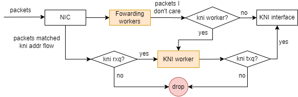

# DPVS Worker Performance Tuning

This doc should tell you how to achieve best performance by tunning CPU cores on which DPVS process is running.

### About DPVS Workers

DPVS is a multi-thread DPDK application program. It is based on the "polling" framework, all the threads would get into an infinite loop to process various jobs registered for the thread during the initialization stage. We call each such DPVS thread a DPVS Worker. There exists four different DPVS Worker types now.

* **Master Worker**:  the worker in charge of all jobs from the control plane;
* **Forwarding Worker**: the data plane workers in charge of packet receiving, processing, forwarding and all other jobs in data plane;
* **Isolate Recieving Worker**: the optional workers used to take the responsibility of *Forwarding Worker* to receive packets to reduce NIC packets imiss.
* **KNI Worker**: an optional worker used to do kni related jobs to avoid performance disturbance caused by work loads of *Master/Forwarding Worker*.

Like other DPDK applications, each DPVS Worker is bound to a distinct CPU core to avoid they interfere with each other. By default, the first N CPUs of the system are bound with DPVS Workers. The performance may not good enough when many other work loads are scheduled into these CPUs by the system. For example, CPU0, the first CPU core in the system, is generally a lot busier than other CPU cores, because many processes, interrupts, and kernel threads run on it by default. The following of this doc would tell you how to alleviate/offload irrelative work load on DPVS Workers.

### When do you need to consider this performance tuning?

In case of the following situations, you should consider this performance tuning.

* There are increasing imissed packets from NIC. You can get imiss data using the following command.

  ```
  dpip link show -s
  dpip link show [dpvs-nic-name] -s -i 2 -C
  ```

* There are frequent msg timeout from DPVS log.

  > Another msg timeout reason is the configuration "ctrl_defs/lcore_msg/sync_msg_timeout_us" is too  small. The default value for this configuration is 2000 us.

* There exists big  worker loops.

  > To observe worker loop time, you should set "CONFIG_RECORD_BIG_LOOP=y" in `config.mk`，recompile DPVS program and run it.
  >
  >  Besides, macros "BIG_LOOP_THRESH_SLAVE" and "BIG_LOOP_THRESH_MASTER" define the threshold time of worker loop. Modify them if needed.

### Optimize work load on CPUs for DPVS Worker

**Optimize Kernel  Command Line Parameters (Boot Options)**

```
default_hugepagesz=1G hugepagesz=1G hugepages=[nr-hugepages] isolcpus=[cpu-list] nohz_full=[cpu-list] nowatchdog nmi_watchdog=0 rcu_nocbs=[cpu-list] rcu_nocb_poll
```

Refer to [Linux kernel parameters document](https://www.kernel.org/doc/Documentation/admin-guide/kernel-parameters.txt) for detailed explanations of the above boot options.

Refer to [DPDK performance report](https://fast.dpdk.org/doc/perf/) for more BOOT and BIOS settings about high performance of DPDK applications.

Set the boot options and reboot your system，then you can check the hardware/software interrupts on each CPU from the system proc file `/proc/interrupts` and `/proc/softirqs`. Hopefully, the interrupts on the CPU specified by "cpu-list" would be reduced dramatically.

**How to choose CPU cores for DPVS Workers ?** 

The [cpu-list] in the above kernel command line parameters is the list of CPU cores for DPVS Workers.

Generally speaking, we may follow some practical rules below to choose the CPU core list.

* Avoid using the first CPU core, including both HT(Hyper-Threading) CPU cores of the first physical CPU core.
* Turn off  HT(Hyper-Threading) CPUs in the system if possible.
* Do not use both HT CPU cores from one physical CPU, unless the workers are the "forwarding worker" and "isolate receiving worker" couples.

You can get the CPU layout of your system by the script provided by DPDK `cpu_layout.py `, example as shown below. 

```
[root@~ dpdk]# python dpdk-stable-18.11.2/usertools/cpu_layout.py 
======================================================================
Core and Socket Information (as reported by '/sys/devices/system/cpu')
======================================================================

cores =  [0, 1, 2, 3, 4, 8, 9, 10, 11, 12]
sockets =  [0, 1]

        Socket 0    Socket 1   
        --------    --------   
Core 0  [0]         [10]       
Core 1  [1]         [11]       
Core 2  [2]         [12]       
Core 3  [3]         [13]       
Core 4  [4]         [14]       
Core 8  [5]         [15]       
Core 9  [6]         [16]       
Core 10 [7]         [17]       
Core 11 [8]         [18]       
Core 12 [9]         [19] 
```

There are 20 CPU cores, and HT is turned off in my system.  Following examples are based on this environment.

**Example #1: Run DPVS with 1 master worker and 4 forwarding worker**

* Master Worker:        Cpu1

* Forwarding Worker:    Cpu2 - Cpu5 

* Boot Option Cpu List: Cpu1 - Cpu5

Use DPDK EAL common option `--lcore` to map System CPU ID to DPVS Worker ID. Boot DPVS with the command:

```
./bin/dpvs -- --lcores 0@1,1@2,2@3,3@4,4@5
```

> The above command indicates DPVS to map the system's Cpu1 - Cpu5 into DPVS Worker 0 - 4, respectively.

Note:

1.  DPVS Worker ID is specified in DPVS configuration file "worker_defs/work [name]/cpu_id".
2.  EAL common option `-c COREMASK` or `-l CORELIST` is not supported by DPVS, because they conflict with  DPVS Worker ID.

```
### dpvs.conf worker config
worker_defs {
    <init> worker cpu0 {
        type    master
        cpu_id  0       #  DPVS Master Worker ID
    }

    <init> worker cpu1 {
        type    slave
        cpu_id  1       #  DPVS Forwarding Worker ID
        port    dpdk0 {
            rx_queue_ids     0
            tx_queue_ids     0
        }
    }

    <init> worker cpu2 {
        type    slave
        cpu_id  2       #  DPVS Forwarding Worker ID
        port    dpdk0 {
            rx_queue_ids     1
            tx_queue_ids     1
        }
    }

    <init> worker cpu3 {
        type        slave
        cpu_id      3   #  DPVS Forwarding Worker ID
        port        dpdk0 {
            rx_queue_ids     2
            tx_queue_ids     2
        }
    }

    <init> worker   cpu4 {
        type        slave
        cpu_id      4   #  DPVS Forwarding Worker ID
        port        dpdk0 {
            rx_queue_ids     3
            tx_queue_ids     3
        }
    }
}
```

Check CPU work load using the `top` command. The zero-idle CPUs are occupied by DPVS Workers.

```
top - 17:46:28 up 2 days, 21:29,  1 user,  load average: 8.35, 14.57, 16.19
Tasks: 244 total,   2 running, 241 sleeping,   0 stopped,   1 zombie
%Cpu0  :  0.0 us,  0.0 sy,  0.0 ni,100.0 id,  0.0 wa,  0.0 hi,  0.0 si,  0.0 st
%Cpu1  : 40.9 us, 59.1 sy,  0.0 ni,  0.0 id,  0.0 wa,  0.0 hi,  0.0 si,  0.0 st
%Cpu2  :100.0 us,  0.0 sy,  0.0 ni,  0.0 id,  0.0 wa,  0.0 hi,  0.0 si,  0.0 st
%Cpu3  :100.0 us,  0.0 sy,  0.0 ni,  0.0 id,  0.0 wa,  0.0 hi,  0.0 si,  0.0 st
%Cpu4  :100.0 us,  0.0 sy,  0.0 ni,  0.0 id,  0.0 wa,  0.0 hi,  0.0 si,  0.0 st
%Cpu5  :100.0 us,  0.0 sy,  0.0 ni,  0.0 id,  0.0 wa,  0.0 hi,  0.0 si,  0.0 st
%Cpu6  :  0.0 us,  0.0 sy,  0.0 ni,100.0 id,  0.0 wa,  0.0 hi,  0.0 si,  0.0 st
%Cpu7  :  0.0 us,  0.0 sy,  0.0 ni,100.0 id,  0.0 wa,  0.0 hi,  0.0 si,  0.0 st
%Cpu8  :  0.0 us,  0.0 sy,  0.0 ni,100.0 id,  0.0 wa,  0.0 hi,  0.0 si,  0.0 st
%Cpu9  :  0.0 us,  0.0 sy,  0.0 ni,100.0 id,  0.0 wa,  0.0 hi,  0.0 si,  0.0 st
%Cpu10 :  0.0 us,  0.0 sy,  0.0 ni,100.0 id,  0.0 wa,  0.0 hi,  0.0 si,  0.0 st
%Cpu11 :  0.0 us,  0.0 sy,  0.0 ni,100.0 id,  0.0 wa,  0.0 hi,  0.0 si,  0.0 st
%Cpu12 :  0.0 us,  0.0 sy,  0.0 ni,100.0 id,  0.0 wa,  0.0 hi,  0.0 si,  0.0 st
%Cpu13 :  0.0 us,  0.0 sy,  0.0 ni,100.0 id,  0.0 wa,  0.0 hi,  0.0 si,  0.0 st
%Cpu14 :  0.0 us,  0.0 sy,  0.0 ni,100.0 id,  0.0 wa,  0.0 hi,  0.0 si,  0.0 st
%Cpu15 :  0.0 us,  0.0 sy,  0.0 ni,100.0 id,  0.0 wa,  0.0 hi,  0.0 si,  0.0 st
%Cpu16 :  0.0 us,  0.0 sy,  0.0 ni,100.0 id,  0.0 wa,  0.0 hi,  0.0 si,  0.0 st
%Cpu17 :  0.3 us,  0.3 sy,  0.0 ni, 99.3 id,  0.0 wa,  0.0 hi,  0.0 si,  0.0 st
%Cpu18 :  0.0 us,  0.0 sy,  0.0 ni,100.0 id,  0.0 wa,  0.0 hi,  0.0 si,  0.0 st
%Cpu19 :  1.3 us,  0.3 sy,  0.0 ni, 98.3 id,  0.0 wa,  0.0 hi,  0.0 si,  0.0 st
KiB Mem : 65685352 total, 15709580 free, 48904136 used,  1071636 buff/cache
KiB Swap:  4194300 total,  4194300 free,        0 used. 16183592 avail Mem 
```

**Example #2: Run DPVS with 1 master worker, 4 forwarding worker, 4 isolate receiving worker**

- Master Worker:                Cpu3
- Forwarding Worker:            Cpu1, Cpu2, Cpu4, Cpu5
- Isolate Receiving Worker:     Cpu11, Cpu12, Cpu13, Cpu14
- Boot Option Cpu List:         Cpu1 - Cpu5, Cpu11 - Cpu14

In this case, we change the Master Worker to the 3rd Worker(Worker ID is 2), just to explain how to specify DPVS Master Worker to any DPVS Worker as we want. Use DPDK EAL common option `--master-lcore` to specify the Master Worker ID, use DPDK EAL common option `--lcore` to map System CPU ID to DPVS Worker ID. Boot DPVS with the command:

```
./bin/dpvs  -- --lcores 0@1,1@2,2@3,3@4,4@5,5@11,6@12,7@13,8@14 --master-lcore 2
```

> The above command indicates DPVS to map the system's Cpu1-Cpu5,Cpu11-Cpu15 into DPVS Worker ID 0-8, and use the 2nd worker as DPVS Master Worker, respectively.

The DPVS worker configurations for this case shown as below. Note the configurations for the "cpu_id" fields.

```
### dpvs.conf worker config
worker_defs {
    <init> worker cpu0 {
        type    master
        cpu_id  2                   #  DPVS Master Worker ID
    }

    <init> worker cpu1 {
        type    slave
        cpu_id  0                   #  DPVS Forwarding Worker ID
        port    dpdk0 {
            rx_queue_ids     0
            tx_queue_ids     0
            isol_rx_cpu_ids  5      #  DPVS Isolate Receiving Worker ID
            isol_rxq_ring_sz 1048576
        }
    }

    <init> worker cpu2 {
        type    slave
        cpu_id  1                   #  DPVS Forwarding Worker ID
        port    dpdk0 {
            rx_queue_ids     1
            tx_queue_ids     1
            isol_rx_cpu_ids  6      #  DPVS Isolate Receiving Worker ID
            isol_rxq_ring_sz 1048576
        }
    }

    <init> worker cpu3 {
        type        slave
        cpu_id      3               #  DPVS Forwarding Worker ID
        port        dpdk0 {
            rx_queue_ids     2
            tx_queue_ids     2
            isol_rx_cpu_ids  7      #  DPVS Isolate Receiving Worker ID
            isol_rxq_ring_sz 1048576
        }
    }

    <init> worker   cpu4 {
        type        slave
        cpu_id      4               #  DPVS Forwarding Worker ID
        port        dpdk0 {
            rx_queue_ids     3
            tx_queue_ids     3
            isol_rx_cpu_ids  8      #  DPVS Isolate Receiving Worker ID
            isol_rxq_ring_sz 1048576
        }
    }
}
```

Check CPU work load using the `top` command. The zero-idle CPUs are occupied by DPVS Workers.

```
top - 19:38:15 up 2 days, 23:20,  1 user,  load average: 6.19, 1.89, 0.75
Tasks: 249 total,   2 running, 246 sleeping,   0 stopped,   1 zombie
%Cpu0  :  0.0 us,  0.4 sy,  0.0 ni, 99.6 id,  0.0 wa,  0.0 hi,  0.0 si,  0.0 st
%Cpu1  :100.0 us,  0.0 sy,  0.0 ni,  0.0 id,  0.0 wa,  0.0 hi,  0.0 si,  0.0 st
%Cpu2  :100.0 us,  0.0 sy,  0.0 ni,  0.0 id,  0.0 wa,  0.0 hi,  0.0 si,  0.0 st
%Cpu3  : 63.3 us, 36.7 sy,  0.0 ni,  0.0 id,  0.0 wa,  0.0 hi,  0.0 si,  0.0 st
%Cpu4  :100.0 us,  0.0 sy,  0.0 ni,  0.0 id,  0.0 wa,  0.0 hi,  0.0 si,  0.0 st
%Cpu5  :100.0 us,  0.0 sy,  0.0 ni,  0.0 id,  0.0 wa,  0.0 hi,  0.0 si,  0.0 st
%Cpu6  :  0.0 us,  0.0 sy,  0.0 ni,100.0 id,  0.0 wa,  0.0 hi,  0.0 si,  0.0 st
%Cpu7  :  0.0 us,  0.0 sy,  0.0 ni,100.0 id,  0.0 wa,  0.0 hi,  0.0 si,  0.0 st
%Cpu8  :  0.0 us,  0.0 sy,  0.0 ni,100.0 id,  0.0 wa,  0.0 hi,  0.0 si,  0.0 st
%Cpu9  :  0.0 us,  0.0 sy,  0.0 ni,100.0 id,  0.0 wa,  0.0 hi,  0.0 si,  0.0 st
%Cpu10 :  0.0 us,  0.0 sy,  0.0 ni,100.0 id,  0.0 wa,  0.0 hi,  0.0 si,  0.0 st
%Cpu11 :100.0 us,  0.0 sy,  0.0 ni,  0.0 id,  0.0 wa,  0.0 hi,  0.0 si,  0.0 st
%Cpu12 :100.0 us,  0.0 sy,  0.0 ni,  0.0 id,  0.0 wa,  0.0 hi,  0.0 si,  0.0 st
%Cpu13 :100.0 us,  0.0 sy,  0.0 ni,  0.0 id,  0.0 wa,  0.0 hi,  0.0 si,  0.0 st
%Cpu14 :100.0 us,  0.0 sy,  0.0 ni,  0.0 id,  0.0 wa,  0.0 hi,  0.0 si,  0.0 st
%Cpu15 :  0.0 us,  0.0 sy,  0.0 ni,100.0 id,  0.0 wa,  0.0 hi,  0.0 si,  0.0 st
%Cpu16 :  0.0 us,  0.0 sy,  0.0 ni,100.0 id,  0.0 wa,  0.0 hi,  0.0 si,  0.0 st
%Cpu17 :  0.0 us,  0.3 sy,  0.0 ni, 99.7 id,  0.0 wa,  0.0 hi,  0.0 si,  0.0 st
%Cpu18 :  0.0 us,  0.3 sy,  0.0 ni, 99.7 id,  0.0 wa,  0.0 hi,  0.0 si,  0.0 st
%Cpu19 :  1.0 us,  0.3 sy,  0.0 ni, 98.7 id,  0.0 wa,  0.0 hi,  0.0 si,  0.0 st
KiB Mem : 65685352 total, 15695352 free, 48908988 used,  1081012 buff/cache
KiB Swap:  4194300 total,  4194300 free,        0 used. 16171432 avail Mem 

```

### Assign a dedicated worker for KNI

As is the diagram shown below, KNI traffic are processed by default on Master and Forwarding Workers. But we can configure a didecated worker for KNI traffic to avoid possible disturbances caused by overloaded dataplane.


The configurations for KNI Worker are almost the same with the Forwarding Workers except that the `type` field should be set to `kni`. Rx/Tx queues should be configured for target NICs, receiving packets from network devices and transmitting to corresponding KNI devices, or vice versa. Note that we can configure either Rx or Tx queues only, which isolates processes of inbound or outbound traffic to/from KNI onto KNI worker, respectively.  
Rx queues are required by DPVS's KNI address flow which directs KNI inbound traffic to the dedicated Rx queue using DPDK rte_flow. If Rx queue is not configured, Forwarding Workers are responsible for packets reception, handing over the received packets to KNI worker, and then the KNI Worker forwards the packets to KNI interfaces. If no RX queue isconfigured, creating KNI address flow would fail. On the other hand, the Tx queues must be configured if KNI Worker is enabled, or the outbound traffic from KNI interfaces is dropped due to a lack of Tx queue, as shown in the diagram below.



**The steps to use dedicated worker for KNI**

* S1. Add KNI worker configurations to `dpvs.conf`. For example:

```
    <init> worker cpu9 {
        type    kni 
        cpu_id  9
        port    bond0 {
            rx_queue_ids     8   
            tx_queue_ids     8   
        }   
    }   
```
* S2. Boot up DPVS, and configure KNI interface up. For example, we configured a KNI interface on bond0.101.

```
55: bond0.101.kni: <BROADCAST,MULTICAST,UP,LOWER_UP> mtu 1500 qdisc pfifo_fast state UP qlen 1000
    link/ether 98:03:9b:1b:40:a4 brd ff:ff:ff:ff:ff:ff
    inet 192.168.88.88/24 scope global bond0.101.kni
       valid_lft forever preferred_lft forever
    inet6 2001::88/64 scope global 
       valid_lft forever preferred_lft forever
```
Now, you can ping 192.168.88.88 and 2001::88, and all OK. 

> Notes: If DPVS routes matched the KNI IPs, you should add `kni_host` routes for the KNI IPs.

* S3. (If supported) Configure KNI address flow.

```
dpip flow add type kni 192.168.88.88 dev bond0.101
dpip flow add type kni 2001::88 dev bond0.101
```
Now, all packets destined to 192.168.88.88 or 2001::88 are sent to Rxq8 on bond0.


**Performance tests**

We designed 5 cases to examine the performance of KNI worker, and listed the test results below.

| Test   Cases                                         | ping (min/avg/max/mdev)       | bandwidth (iperf tcp) | forwarding rate |
| ---------------------------------------------------- | ----------------------------- | --------------------- | --------------- |
| no kni worker (idle dataplane)                       | 0.468/3.196/6.893/1.547 ms    | 2.64 Gbits/sec        | 243K packets/s  |
| with kni worker, no addr flow (idle dataplane)       | 0.050/2.102/5.288/0.565 ms    | 4.54 Gbits/sec        | 413K packets/s  |
| with kni worker, with addr flow (idle dataplane)     | 0.409/2.346/11.650/1.179 ms   | 4.57 Gbits/sec        | 416K packets/s  |
| with kni worker, no addr flow (overload dataplane)   | 0.628/29.880/42.010/12.026 ms | 341 Mbits/sec         | 29K packets/s   |
| with kni worker, with addr flow (overload dataplane) | 0.544/2.139/3.554/0.406 ms    | 4.53 Gbits/sec        | 410K packets/s  |

*Notes: Overload dataplane is simulated by adding 1ms delay to each loop of forwarding workers.*

We got the following conclusions from the test results.

1. Dedicated KNI worker increases bandwidth of KNI interfaces.
2. KNI address flow protects KNI traffic from load disturbances of dataplane.

