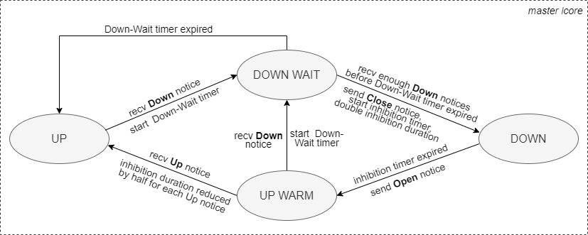
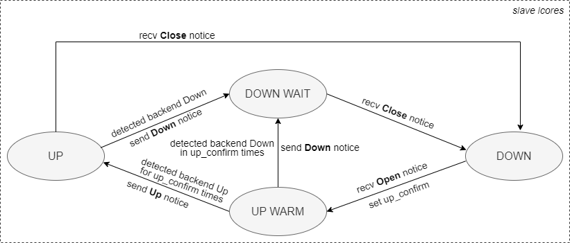

Backends Failure Detection and Inhibition
------

# Concepts

DPVS implements a simple backend failure detection and inhibition mechanism by examining the packet flow it forwards. We call it Passive Health Check because it doesn't send any probe request to the backends. It works for TCP by checking if SYN/ACK packet is replied from the backend, and if not, inhibit scheduling the backend for a period. The inhibiting period is gained or lost exponentially depending on subsequent checking is failure or success. As for UDP, it works only when the UDP flow is bidirectional, that is, the UDP backends with connections that forwarding inbound only or outbound only are always detcted to be failure. Thus "dest-check" should be never configured on the UDP services with monodirectional flow. In summury, DPVS Passive Health Check is applicable to the following scenarios:

* TCP FullNat/Nat64/DR/Tunnel/Nat fowarding mode.
* UDP FullNat/Nat64/Nat forwarding mode with bidirectional data flow.

It's noted that DPVS Passive Health Check has no way to detect the backend failure unless packet drop has already acctually occurred. A smaller session timeout may be preferred for TCP SYN_SENT/SYN_RECV and UDP ONEWAY states to accelerate backend fault discovery and remove it from available backend list quickly.

The state transition diagrams below explain the workflow in DPVS master and slave lcores for Passive Health Check.





Generally speaking, the slave lcores are responsible for failure detection, and the master lcore is responsible for backend inhibition. 

The backends are detected as DOWN in the following cases:
* TCP session state transfers from SYN_RECV to CLOSE
* TCP session state transfers from SYN_SENT to CLOSE
* TCP session expired from SYN_RECV state
* TCP session expired from SYN_SENT state
* TCP synproxy step 3 received RST when awaiting SYN/ACK from backend
* UDP session expired from ONEWAY state

The backends are detected as UP in the following cases:
* TCP session state tranfers to ESTABLISH
* TCP synproxy step 3 received SYN/ACK from backend
* UDP session state tranfers from ONEWAY to NORMAL

Backend inhibition is performed by setting the inhibition flag into the backend server and changing its weight to zero so that new sessions would not be scheduled to it.

Four types of lcore msg notice are used:

* **Down Notice**:  unicast msg, from slave to master, notify master a backend DOWN event is detected
* **Up Notice**:    unicast msg, from slave to master, notify master a backend UP event is detected
* **Close Notice**: multicast msg, from master to all slaves, inhibit scheduling a failed backend
* **Open Notice**:  multicast msg, from master to all slaves, restore scheduling an inhibited backend

DPVS allows to specify a per-service Passive Health Check configuration, each configuration including the 5 parameters below:

* **down_retry**: how many DOWNs are detected from a backend before inhibiting scheduling to it, default 1 (no retry).
* **up_confirm**: how many UP notices are sent to master lcore for each inhibited backend and each slave lcore after restoring scheduling, default 1.
* **down_wait**: the `down_retry` duration, in seconds, default 3s, no sense when `down_retry` is 1.
* **inhibit_min**: the minimum inhibition duration, in seconds, default 5s.
* **inhibit_max**: the maximum inhibition duraiton, in seconds, default 3600s.

DPVS Passive Health Check could be configured with `ipvsadm`, refer to its help message for the usage.

```sh
ipvsadm -h | grep dest-check -A3
```

# Examples

Before we begin, serveral configs in /etc/dpvs.conf are changed from defaults.

* global_defs/log_level debug
* ipvs_defs/tcp/timeout/syn_recv 3 
* ipvs_defs/tcp/timeout/syn_sent 3 

Firstly, we configure a test service 192.168.88.1:80. 

```sh
dpip vlan add dpdk0.102 link dpdk0 id 102
dpip addr add 192.168.88.28/24 dev dpdk0.102
dpip addr add 192.168.88.1/32 dev dpdk0.102
ipvsadm -A -t 192.168.88.1:80 --dest-check default
ipvsadm -at 192.168.88.1:80 -r 192.168.88.30:80 -b
ipvsadm -at 192.168.88.1:80 -r 192.168.88.68:80 -b
ipvsadm -Pt 192.168.88.1:80 -z 192.168.88.241 -F dpdk0.102
```
The test service uses the default dest-check configs, i.e., no down retry, 1 up confirm notice for each slave, and inhibition duration range is 5-3600s. Two backends 192.18.88.30:80 and 192.168.88.68:80 are initially UP. We can check the service configured just now.

```sh
# ipvsadm -ln
IP Virtual Server version 1.9.3 (size=0)
Prot LocalAddress:Port Scheduler Flags
  -> RemoteAddress:Port           Forward Weight ActiveConn InActConn
TCP  192.168.88.1:80 wlc dest-check internal:default
  -> 192.168.88.30:80             FullNat 1      0          0         
  -> 192.168.88.68:80             FullNat 1      0          0   
```

Then we run a script to send requests to our test service every 0.5 second, and check the response. It prints a character '.' if succeeds, and a character 'x' if fails for each request.

```sh
while true
do
    curl -g -s -m 1 192.168.88.1:80 -o /dev/null
    [ $? -eq 0 ] && printf . || printf x
    sleep 0.5
done
```
The request should always succeed at the beginning. After a while, we shutdown the server 192.168.88.30:80 and keep watching the output of the script.

```
# while true; do curl -g -s -m 1 192.168.88.1:80 -o /dev/null; [ $? -eq 0 ] && printf . || printf x; sleep 0.5; done
............................x.........x...................x.......................................x.................
.............................................................x......................................................
.....................................................................................................x..............
....................................................................................................................
....................................................................................................................
..................................................................x.................................................
....................................................................................................................
....................................................................................................................
....................................................................................................................
....................................................................................................................
.................................................................................................................x..
....................................................................................................................
....................................................................................................................
....................................................................................................................
....................................................................................................................
....................................................................................................................
....................................................................................................................
....................................................................................................................
..............x.....................................................................................................
....................................................................................................................
....................................................................................................................
....................................................................................................................
....................................................................................................................
....................................................................................................................
....................................................................................................................
....................................................................................................................
....................................................................................................................
....................................................................................................................
....................................................................................................................
....................................................................................................................
....................................................................................................................
....................................................................................................................
....................................................................................................................
....................................................................................................................
..........................................................
```

As the script output shows, after we shutdown one of the backend servers, the test service uses the failed server far less frequent than it would if health-check is not enabled. Besides, the DPVS logs show that the inhibition duration is gained exponentially when the backend detected to be failed successively.

```
# tail -f /var/log/messages| grep SERVICE
Apr 20 18:56:01 dpvs-devel-28 dpvs[54778]: SERVICE: [cid 00, tcp, svc 192.168.88.1:80, rs 192.168.88.30:80, weight 1, inhibited yes, down_notice_recvd 1, inhibit_duration 5s, origin_weight 0] notify slaves DOWN
Apr 20 18:56:06 dpvs-devel-28 dpvs[54778]: SERVICE: [cid 00, tcp, svc 192.168.88.1:80, rs 192.168.88.30:80, weight 0, inhibited yes, down_notice_recvd 1, inhibit_duration 10s, origin_weight 1] notify slaves UP
Apr 20 18:56:06 dpvs-devel-28 dpvs[54778]: SERVICE: [cid 00, tcp, svc 192.168.88.1:80, rs 192.168.88.30:80, weight 1, inhibited yes, down_notice_recvd 1, inhibit_duration 10s, origin_weight 0] notify slaves DOWN
Apr 20 18:56:16 dpvs-devel-28 dpvs[54778]: SERVICE: [cid 00, tcp, svc 192.168.88.1:80, rs 192.168.88.30:80, weight 0, inhibited yes, down_notice_recvd 1, inhibit_duration 20s, origin_weight 1] notify slaves UP
Apr 20 18:56:16 dpvs-devel-28 dpvs[54778]: SERVICE: [cid 00, tcp, svc 192.168.88.1:80, rs 192.168.88.30:80, weight 1, inhibited yes, down_notice_recvd 1, inhibit_duration 20s, origin_weight 0] notify slaves DOWN
Apr 20 18:56:36 dpvs-devel-28 dpvs[54778]: SERVICE: [cid 00, tcp, svc 192.168.88.1:80, rs 192.168.88.30:80, weight 0, inhibited yes, down_notice_recvd 1, inhibit_duration 40s, origin_weight 1] notify slaves UP
Apr 20 18:56:37 dpvs-devel-28 dpvs[54778]: SERVICE: [cid 00, tcp, svc 192.168.88.1:80, rs 192.168.88.30:80, weight 1, inhibited yes, down_notice_recvd 1, inhibit_duration 40s, origin_weight 0] notify slaves DOWN
Apr 20 18:57:17 dpvs-devel-28 dpvs[54778]: SERVICE: [cid 00, tcp, svc 192.168.88.1:80, rs 192.168.88.30:80, weight 0, inhibited yes, down_notice_recvd 1, inhibit_duration 80s, origin_weight 1] notify slaves UP
Apr 20 18:57:17 dpvs-devel-28 dpvs[54778]: SERVICE: [cid 00, tcp, svc 192.168.88.1:80, rs 192.168.88.30:80, weight 1, inhibited yes, down_notice_recvd 1, inhibit_duration 80s, origin_weight 0] notify slaves DOWN
Apr 20 18:58:36 dpvs-devel-28 dpvs[54778]: SERVICE: [cid 00, tcp, svc 192.168.88.1:80, rs 192.168.88.30:80, weight 0, inhibited yes, down_notice_recvd 1, inhibit_duration 160s, origin_weight 1] notify slaves UP
Apr 20 18:58:37 dpvs-devel-28 dpvs[54778]: SERVICE: [cid 00, tcp, svc 192.168.88.1:80, rs 192.168.88.30:80, weight 1, inhibited yes, down_notice_recvd 1, inhibit_duration 160s, origin_weight 0] notify slaves DOWN
Apr 20 19:01:16 dpvs-devel-28 dpvs[54778]: SERVICE: [cid 00, tcp, svc 192.168.88.1:80, rs 192.168.88.30:80, weight 0, inhibited yes, down_notice_recvd 1, inhibit_duration 320s, origin_weight 1] notify slaves UP
Apr 20 19:01:17 dpvs-devel-28 dpvs[54778]: SERVICE: [cid 00, tcp, svc 192.168.88.1:80, rs 192.168.88.30:80, weight 1, inhibited yes, down_notice_recvd 1, inhibit_duration 320s, origin_weight 0] notify slaves DOWN
Apr 20 19:06:37 dpvs-devel-28 dpvs[54778]: SERVICE: [cid 00, tcp, svc 192.168.88.1:80, rs 192.168.88.30:80, weight 0, inhibited yes, down_notice_recvd 1, inhibit_duration 640s, origin_weight 1] notify slaves UP
Apr 20 19:06:37 dpvs-devel-28 dpvs[54778]: SERVICE: [cid 00, tcp, svc 192.168.88.1:80, rs 192.168.88.30:80, weight 1, inhibited yes, down_notice_recvd 1, inhibit_duration 640s, origin_weight 0] notify slaves DOWN
Apr 20 19:12:40 dpvs-devel-28 dpvs[54778]: SERVICE: [cid 00, tcp, svc 192.168.88.1:80, rs 192.168.88.30:80, weight 0, inhibited yes, down_notice_recvd 1, inhibit_duration 1280s, origin_weight 1] notify slaves UP
Apr 20 19:12:41 dpvs-devel-28 dpvs[54778]: SERVICE: [cid 00, tcp, svc 192.168.88.1:80, rs 192.168.88.30:80, weight 1, inhibited yes, down_notice_recvd 1, inhibit_duration 1280s, origin_weight 0] notify slaves DOWN
```

Now we change the dest-check configs to be 3 down_retry in 3s down delay, 3 up_confirm notice for each slave, and inhibition duration range is 60-3600s.

```
# ipvsadm -dt 192.168.88.1:80 -r 192.168.88.30:80
# ipvsadm -at 192.168.88.1:80 -r 192.168.88.30:80 -b
# ipvsadm -Et 192.168.88.1:80 --dest-check 3,3,3s,60-3600s 
# ipvsadm -ln
IP Virtual Server version 1.9.3 (size=0)
Prot LocalAddress:Port Scheduler Flags
  -> RemoteAddress:Port           Forward Weight ActiveConn InActConn
TCP  192.168.88.1:80 wlc dest-check internal:3,3,3s,60-3600s
  -> 192.168.88.30:80             FullNat 1      0          9         
  -> 192.168.88.68:80             FullNat 1      0          5    
```

Run the script above and we get the outputs below.

```
# while true; do curl -g -s -m 1 192.168.88.1:80 -o /dev/null; [ $? -eq 0 ] && printf . || printf x; sleep 0.5; done
..............x.x..x................................................................................................
.....................xxx............................................................................................
....................................................................................................................
.........................x..xx......................................................................................
....................................................................................................................
....................................................................................................................
....................................................................................................................
....................................xxx.............................................................................
....................................................................................................................
....................................................................................................................
...................................................
```
Corresponding DPVS logs are listed below.

```
Apr 20 20:37:16 dpvs-devel-28 dpvs[54778]: SERVICE: [cid 00, tcp, svc 192.168.88.1:80, rs 192.168.88.30:80, weight 1, inhibited yes, down_notice_recvd 3, inhibit_duration 60s, origin_weight 0] notify slaves DOWN
Apr 20 20:38:16 dpvs-devel-28 dpvs[54778]: SERVICE: [cid 00, tcp, svc 192.168.88.1:80, rs 192.168.88.30:80, weight 0, inhibited yes, down_notice_recvd 3, inhibit_duration 120s, origin_weight 1] notify slaves UP
Apr 20 20:38:17 dpvs-devel-28 dpvs[54778]: SERVICE: [cid 00, tcp, svc 192.168.88.1:80, rs 192.168.88.30:80, weight 1, inhibited yes, down_notice_recvd 3, inhibit_duration 120s, origin_weight 0] notify slaves DOWN
Apr 20 20:40:17 dpvs-devel-28 dpvs[54778]: SERVICE: [cid 00, tcp, svc 192.168.88.1:80, rs 192.168.88.30:80, weight 0, inhibited yes, down_notice_recvd 3, inhibit_duration 240s, origin_weight 1] notify slaves UP
Apr 20 20:40:19 dpvs-devel-28 dpvs[54778]: SERVICE: [cid 00, tcp, svc 192.168.88.1:80, rs 192.168.88.30:80, weight 1, inhibited yes, down_notice_recvd 3, inhibit_duration 240s, origin_weight 0] notify slaves DOWN
Apr 20 20:44:20 dpvs-devel-28 dpvs[54778]: SERVICE: [cid 00, tcp, svc 192.168.88.1:80, rs 192.168.88.30:80, weight 0, inhibited yes, down_notice_recvd 3, inhibit_duration 480s, origin_weight 1] notify slaves UP
Apr 20 20:44:21 dpvs-devel-28 dpvs[54778]: SERVICE: [cid 00, tcp, svc 192.168.88.1:80, rs 192.168.88.30:80, weight 1, inhibited yes, down_notice_recvd 3, inhibit_duration 480s, origin_weight 0] notify slaves DOWN
```
It shows that at least 3 failure are detected before inhibiting the failed backend, and the inhibition duration starts from 60s.

# External Backend Health Check

DPVS supports external backend health check with an auxiliary program called `healthcheck`. Three checker methods are available up to now.

* TCP Checker
* UDP Checker
* Ping Checker

They shall work independently or together with Passive Health Check. Notes that external checkers rely on dpvs-agent to communicate with DPVS.

* Enable external TCP Checker.

```
# ipvsadm -Et 192.168.88.1:80 --dest-check tcp
# ipvsadm -ln
IP Virtual Server version 1.9.4 (size=0)
Prot LocalAddress:Port Scheduler Flags
  -> RemoteAddress:Port           Forward Weight ActiveConn InActConn
TCP  192.168.88.1:80 wlc dest-check external:tcp
  -> 192.168.88.30:80             FullNat 1      0          8
  -> 192.168.88.68:80             FullNat 1      0          7
```

* Enable external UDP Checker and Ping Checker.

```
# ipvsadm -Et 192.168.88.1:80 --dest-check udp --dest-check ping
# ipvsadm -ln
IP Virtual Server version 1.9.4 (size=0)
Prot LocalAddress:Port Scheduler Flags
  -> RemoteAddress:Port           Forward Weight ActiveConn InActConn
TCP  192.168.88.1:80 wlc dest-check external:udp,ping
  -> 192.168.88.30:80             FullNat 1      0          9
  -> 192.168.88.68:80             FullNat 1      0          7
```

* Enable Passive Checker and TCP Checker.

```
# ipvsadm -Et 192.168.88.1:80 --dest-check 3,5s --dest-check tcp
# ipvsadm -ln
IP Virtual Server version 1.9.4 (size=0)
Prot LocalAddress:Port Scheduler Flags
  -> RemoteAddress:Port           Forward Weight ActiveConn InActConn
TCP  192.168.88.1:80 wlc dest-check internal:3,5s external:tcp
  -> 192.168.88.30:80             FullNat 1      0          8
  -> 192.168.88.68:80             FullNat 1      0          8
```
