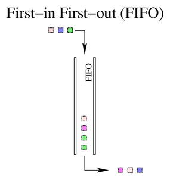
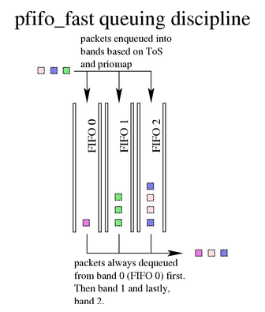
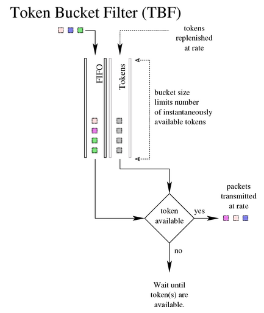

DPVS Traffic Control (TC)
------

* [Concepts](#concepts)
  - [Qsch Objects](#qsch)
  - [Cls Objects](#cls)
* [Steps to use DPVS TC](#usage)
* [Examples](#examples)
  - [Example 1. Device traffic shaping (Egress)](#example1)
  - [Example 2. Traffic classification and flow control (Egress)](#example2)
  - [Example 3. Access control with TC (Ingress)](#example3)
  - [Example 4. Traffic policing for services (Ingress)](#example4)
  - [Example 5. Dynamic allow/deny access list using TC ipset classifier](#example5)

<a id='concepts'/>

# Concepts

DPVS TC derives from [Linux Traffic Control](https://tldp.org/HOWTO/Traffic-Control-HOWTO/index.html), which encompasses the sets of mechanisms and operations by which packets are queued for transmission/reception on a network interface. The operations include enqueuing, policing, classifying, scheduling, shaping and dropping.

- Policing: the mechanism by which traffic can be limited. Policing is most frequently used on the network border to ensure that a peer is not consuming more than its allocated bandwidth.
- Classifying: the mechanism by which packets are separated for different treatment, possibly different output queues.
- Scheduling: the mechanism by which packets are arranged (or rearranged) between input and output of a particular queue.
- Shaping: the mechanism by which packets are delayed before transmission in an output queue to meet a desired output rate.
- Dropping: the  mechanism by which a packet is discarded entirely.

> Note: Refer to [Traditional Elements of Traffic Control](https://tldp.org/HOWTO/Traffic-Control-HOWTO/elements.html#e-shaping) for more details.

DPVS implements the above-mentioned traffic control mechanisms with two kinds of TC objects -- **QSch** and **Cls**. The framework of DPVS TC is per-lcore to avoid performance loss caused by multi-thread racing conditions. Each Qsch must be either a root Qsch or a child Qsch of an existing Qsch, and the root Qsch must be attached to a DPVS device.  DPVS TC supports the following device types:

* physical devices
* bonding devices
* vlan devices

Tunnel devices are not supported now. Both egress traffic and ingress traffic are supported, but it should note that ingress traffic can hardly be restricted because it is mainly determined by the peer end of the network communication.

Basically, **Qsch** consists of one or more queues, a set of operations for the queues, and some traffic statistics members. A Qsch can be installed into a DPVS interface device as the root Qsch, or into an existing Qsch as its child Qsch. The root Qsch receives all incoming/outgoing traffic from its attached device, while non-root Qsch can only get traffic from its parent Qsch. Qsch can be divided to two definite different types -- the *Egress Qsch* and the *Ingress Qsch* -- to perform traffic control strategies for packets transmitted out of or received into DPVS devices, respectively.

**Cls** is classifier, which consists of a set of operations to classify traffic into different Qsch. A Cls must be attached to an existing Qsch, and it determines the fate of the matched packets from the Qsch. DPVS supports two classification target actions: drop, or enqueue into a child Qsch. Classifying into a non-child Qsch (e.g a grandchild Qsch) is not allowed. As a consideration of performance, the packets are only enqueued into the last matched Qsch, rather than falling through every matched Qsch. It means that if Qsch are configured hierarchically, and a network packet matches all the Cls from root Qsch to leaf Qsch, then the packet is enqueued to the leaf Qsch directly without goging through every Qsch one after another. Each Cls can only process a specified packet type. DPVS Cls supports three packet types -- IPv4, IPv6, and Vlan. Priority is supported by Cls. If two or more Cls are attached to a Qsch, and they all match the packet from the Qsch, then classifying result of the Cls with highest priority is adpoted.

<a id='qsch'/>

## Qsch Objects

DPVS TC implements four Qsch objects -- pfifo, bfifo, pfifo_fast, and tbf. In principle, they are almost the same with the counterparts of Linux TC.

- **pfifo**, **bfifo**

`FIFO` means "First-In, First-Out", it simply transmits packets as soon as it can after receiving and queuing them in the same order as packets are received.



A real FIFO Qsch must, however, have a size limit (a buffer size) to prevent it from overflowing in case it is unable to dequeue packets as quickly as it receives them. DPVS implements two basic FIFO Qsch, one based on bytes, and one on packets. Regardless of the type of FIFO used, the size of the queue is defined by the parameter `limit`. For a pfifo the unit is understood to be packets and for a bfifo the unit is understood to be bytes.

- **pfifo_fast**

Based on a conventional FIFO Qsch, pfifo_fast Qsch also provides some prioritization. It provides three different bands (individual FIFOs) for separating traffic. The highest priority traffic (interactive flows) are placed into band 0 and are always serviced first. Similarly, band 1 is always emptied of pending packets before band 2 is dequeued. It's advised to use pfifo_fast as the root Qsch.



There is nothing configurable to the end user about the pfifo_fast Qsch. For exact details on the priomap and use of the ToS bits, see the pfifo-fast section from [this doc](https://lartc.org/howto/lartc.qdisc.classless.html).

- **tbf**

`TBF` stands for "token bucket filter", because it is built on tokens and buckets. It simply shapes traffic transmitted on an interface. To limit the speed at which packets will be dequeued from a particular interface, the TBF Qsch is the perfect solution. It simply slows down transmitted traffic to the specified rate. Packets are only transmitted if there are sufficient tokens available. Otherwise, packets are deferred. Delaying packets in this fashion will introduce an artificial latency into the packet's round trip time.



TBF QSch can have the following parameters.

* rate: the speed knob, in bps(possible prepended with a SI unit k, m, g), upmost to 4 Gbps.
* burst: size of the bucket, in bytes. This is the maximum amount of bytes that tokens can be available for instantaneously. In general, larger shaping rates require a larger burst value.
* limit/latency: the number of bytes that can be queued waiting for tokens to become available/the maximum amount  of time a packet can sit in the TBF, in bytes/milliseconds.
* peakrate: optional, the mximum depletion rate of the bucket, in bps(possible prepended with a SI unit k, m, g).
* mtu: optional, size of the peakrate bucket, in bytes.

<a id='cls'/>

## Cls Objects

- **match**

Cls `match` consists of two components: a pattern and a target. Packets from Qsch compare with the pattern, and if matched, the fate of them is determined by the target.

Pattern considers five attributes in a flow:

* Protocol: TCP, UDP, ICMP.
* Source ip-port range: The acceptable range of packets' source IP address and port.
* Dest ip-port range: The acceptable range of packets' dest IP address and port.
* Ingress device: The device the packet is received from, for ingress traffic only.
* Egress device: The device the packet is sent to, for egress traffic only.

One or more attributes of the pattern can be omitted. The omitted attributes are ignored when matching. For example, pattern `tcp,from-192.168.0.1:1-1024,oif-eth1 means to match TCP packets sent out on interface eth1 with source IP address of 192.168.0.1 and source port between 1 and 1024.

There are two kinds of Cls target: Qsch or Drop. The former classifies matched packets into the queue of specified QSch, and the latter simply discards matched packets. The target Qsch must be a child of the Qsch the Cls is attached to.

<a id='usage'/>

# Steps to use DPVS TC

**1. Turn on TC switch of the device.**

```bash
dpip link set dpdk0 tc-egress on     # enable tc-egress for dpdk0
dpip link set dpdk0 tc-ingress on    # enable tc-ingress for dpdk0
```
You can verify if TC for dpdk0 is enabled by checking if "tc-egress" or "tc-ingress" flag exists in the output of the command `dpip link show dpdk0`.

> It's safe to enable or disable TC of a device whenever you like, even if when TC is processing packets.

**2. Add a root Qsch object.**

```bash
dpip qsch add dev dpdk0 root pfifo_fast             # use pfifo_fast Qsch as tc-egress root
dpip qsch add dev dpdk0 ingress pfifo limit 65536   # use pfifo Qsch as tc-ingress root
```

**3. Add other Qsch objects as needed.**

```bash
dpip qsch add dev dpdk0 handle 1: parent root tbf rate 10m burst 10000 latency 2ms  # add a tbf for egress
dpip qsch add dev dpdk0 handle 2: parent ingress bfifo limit 100000                 # add a bfifo for ingress
```

**4. Add Cls objects as needed.**

```bash
dpip cls add dev dpdk0 qsch root match pattern 'tcp,oif=dpdk0' target 1:
dpip cls add dev dpdk0 qsch ingress match pattern 'icmp,iif=dpdk0' target 2:
```

**5. Check configurations and statistics.**

```
# Check Qsch on dpdk0
[root@dpvs-test]# dpip qsch show dev dpdk0
qsch pfifo_fast root dev dpdk0 parent 0: flags 0x0 cls 1 bands 3 priomap 1 2 2 2 1 2 0 0 1 1 1 1 1 1 1 1
qsch pfifo ingress dev dpdk0 parent 0: flags 0x1 cls 1 limit 65536
qsch bfifo 2: dev dpdk0 parent ingress flags 0x1 cls 0 limit 100000
qsch tbf 1: dev dpdk0 parent root flags 0x0 cls 0 rate 10.00Mbps burst 10000B limit 2500B

# Check Cls on Qsch root
[root@dpvs-test]# dpip cls show dev dpdk0 qsch root
cls match 8001: dev dpdk0 qsch root pkttype 0x0800 prio 0 TCP,oif=dpdk0 target 1:

# Check Cls on Qsch ingress
[root@dpvs-test]# dpip cls show dev dpdk0 qsch ingress
cls match 8002: dev dpdk0 qsch ingress pkttype 0x0800 prio 0 ICMP,iif=dpdk0 target 2:

# Get statistics of Qsch
[root@dpvs-test]# dpip qsch -s show dev dpdk0 handle  1:
qsch tbf 1: dev dpdk0 parent root flags 0x0 cls 0 rate 10.00Mbps burst 10000B limit 2500B
 Sent 4050639 bytes 46334 pkts (dropped 0, overlimits 0 requeues 0)
     Backlog 0 bytes 0 pkts
[root@dpvs-test]# dpip qsch -s show dev dpdk0 handle  2:
qsch bfifo 2: dev dpdk0 parent ingress flags 0x1 cls 0 limit 100000
 Sent 980 bytes 10 pkts (dropped 0, overlimits 0 requeues 0)
 Backlog 0 bytes 0 pkts

# Get per-lcore config of Cls 8001:
[root@dpvs-test]# dpip cls -v show dev dpdk0 qsch root handle 8001:
[00] cls match 8001: dev dpdk0 qsch root pkttype 0x0800 prio 0 TCP,oif=dpdk0 target 1:
[01] cls match 8001: dev dpdk0 qsch root pkttype 0x0800 prio 0 TCP,oif=dpdk0 target 1:
[02] cls match 8001: dev dpdk0 qsch root pkttype 0x0800 prio 0 TCP,oif=dpdk0 target 1:
[04] cls match 8001: dev dpdk0 qsch root pkttype 0x0800 prio 0 TCP,oif=dpdk0 target 1:
[03] cls match 8001: dev dpdk0 qsch root pkttype 0x0800 prio 0 TCP,oif=dpdk0 target 1:
[05] cls match 8001: dev dpdk0 qsch root pkttype 0x0800 prio 0 TCP,oif=dpdk0 target 1:
[06] cls match 8001: dev dpdk0 qsch root pkttype 0x0800 prio 0 TCP,oif=dpdk0 target 1:
[07] cls match 8001: dev dpdk0 qsch root pkttype 0x0800 prio 0 TCP,oif=dpdk0 target 1:
[08] cls match 8001: dev dpdk0 qsch root pkttype 0x0800 prio 0 TCP,oif=dpdk0 target 1:
```

<a id='examples'/>

# Examples

<a id='example1'/>

## Example 1. Device traffic shaping (Egress)

In this example, we want to restrict the egress traffic bandwidth of NIC dpdk0
to be within 2 Gbps. A root TBF Qsch can be applied to device dpdk0 to achieve
the goal, shown as the diagram below.

```
-+--+--+--+--+--+--+--+--+--+--+--+--+--+--+--+--+--+--+--+--+--+--+--+--+--+-
        root (tbf: rate 2Gbps)
-+--+--+--+--+--+--+--+--+--+--+--+--+--+--+--+--+--+--+--+--+--+--+--+--+--+-
```

Firstly, we enable tc-egress and setup a root tbf Qsch on dpdk0.

```bash
dpip link set dpdk0 tc-egress on
dpip qsch add dev dpdk0 root tbf rate 2g burst 2000000 latency 1ms
```

Then we construct a test service 192.168.88.1:80, which forwards client's HTTP requests to a backend nginx web server 192.168.88.215.

```bash
[root@dpvs-test]# ipvsadm -ln
IP Virtual Server version 0.0.0 (size=0)
Prot LocalAddress:Port Scheduler Flags
  -> RemoteAddress:Port           Forward Weight ActiveConn InActConn
TCP  192.168.88.1:80 wlc
  -> 192.168.88.215:80            FullNat 1      0          0 
```

Lastly, we generate some traffic using `iperf` to service 192.168.88.1:80 from client 192.168.88.115(actually the same machine with the backend). It's noted that `iperf` reports a bandwidth of 1.93 Gbits/sec when the test is done.

```
[root@192.168.88.115]# iperf  -t 10 -c 192.168.88.1 -p 80
------------------------------------------------------------
Client connecting to 192.168.88.1, TCP port 80
TCP window size:  230 KByte (default)
------------------------------------------------------------
[  3] local 192.168.88.115 port 56296 connected with 192.168.88.1 port 80
[ ID] Interval       Transfer     Bandwidth
[  3]  0.0-10.0 sec  2.24 GBytes  1.93 Gbits/sec
```

Meanwhile, we should watch the egress traffic on device `dpdk0` using command `dpip link show dpdk0 -s -i 1 -C`. It's expected that the obytes of dpdk0 is about 2Gbps or 250 MBps.

```
[root@dpvs-test]# dpip link show dpdk0 -s -C -i 1
1: dpdk0: socket 0 mtu 1500 rx-queue 4 tx-queue 4
    UP 10000 Mbps full-duplex auto-nego tc-egress 
    addr A0:36:9F:74:EC:F0 OF_RX_IP_CSUM OF_TX_IP_CSUM OF_TX_TCP_CSUM OF_TX_UDP_CSUM 
    ipackets/pps    opackets/pps    ibytes/Bps      obytes/Bps      
    176156          176138          250339018       250310404       
    ierrors/pps     oerrors/pps     imissed/pps     rx_nombuf/pps   
    0               0               0               0               
    ipackets/pps    opackets/pps    ibytes/Bps      obytes/Bps      
    176185          176030          250288686       250059594       
    ierrors/pps     oerrors/pps     imissed/pps     rx_nombuf/pps   
    0               0               0               0               
^C
```

We can adjust the bandwidth from 2 Gbps to 800 Mbps with the following command.

```bash
dpip qsch change dev dpdk0 root tbf rate 800m burst 800000 latency 1ms
```

Then do the test again and the results are shown below. Obviously, `iperf` reports a bandwidth of 771 Mbits/sec, and DPVS dpdk0 obytes bandwidth also decreases to about 100 MBps, i.e. 800 Mbps.

```
[root@client]# iperf  -t 10 -c 192.168.88.1 -p 80
------------------------------------------------------------
Client connecting to 192.168.88.1, TCP port 80
TCP window size: 1.08 MByte (default)
------------------------------------------------------------
[  3] local 192.168.88.115 port 56351 connected with 192.168.88.1 port 80
[ ID] Interval       Transfer     Bandwidth
[  3]  0.0-10.0 sec   919 MBytes   771 Mbits/sec

[root@dpvs-test]# dpip link show dpdk0 -s -C -i 1
1: dpdk0: socket 0 mtu 1500 rx-queue 4 tx-queue 4
    UP 10000 Mbps full-duplex auto-nego tc-egress 
    addr A0:36:9F:74:EC:F0 OF_RX_IP_CSUM OF_TX_IP_CSUM OF_TX_TCP_CSUM OF_TX_UDP_CSUM 
    ipackets/pps    opackets/pps    ibytes/Bps      obytes/Bps      
    70988           70618           100573260       100024836       
    ierrors/pps     oerrors/pps     imissed/pps     rx_nombuf/pps   
    0               0               0               0               
    ipackets/pps    opackets/pps    ibytes/Bps      obytes/Bps      
    71011           70743           100530072       100025166       
    ierrors/pps     oerrors/pps     imissed/pps     rx_nombuf/pps   
    0               0               0               0               
^C
```

<a id='example2'/>

## Example 2. Traffic classification and flow control (Egress)

This example shows how to classify traffic with DPVS TC. Suppose that our server needs to visit three services: a ssh service(tcp:22), a web service(tcp:80), and a udp service. We want to restrict the bandwidth of web service within 800 Mbps, and udp service within 80 Mbps with a tolerance of transient peak traffic of 100 Mbps. Don't restrict the bandwidth of ssh service.

The diagram below shows our TC scheme for this case. Traffic is classified to TCP and UDP, and then TCP traffic is classified to ssh(:22) and web(:80).

```
-+--+--+--+--+--+--+--+--+--+--+--+--+--+--+--+--+--+--+--+--+--+--+--+--+--+-
                             qsch root
                            (pfifo_fast)
                                 |
                                 |
                       -------------------
                       |                 |
                cls 0:1|                 |cls 0:2
                 (tcp) |                 | (udp)
                       |                 |
                    qsch 1:           qsch 2:
                    (bfifo)    (tbf: rate 80Mbps, peak 100Mbps)
                       |
               ------------------
               |                |
     cls 1:1   |                |cls 1:2
  (tcp:22,ssh) |                |(tcp:80,web)
               |                |
           qsch 10:           qsch 20:
           (pfifo)      (tbf: rate 800Mbps)
-+--+--+--+--+--+--+--+--+--+--+--+--+--+--+--+--+--+--+--+--+--+--+--+--+--+-
```

Firstly, we setup the Qsch and Cls objects.

```bash
dpip link set dpdk0 tc-egress on           # enable tc-egress of dpdk0
dpip qsch add dev dpdk0 root pfifo_fast    # qsch root
dpip qsch add dev dpdk0 handle 1:0 parent root bfifo limit 10000000    # qsch tcp (!:80,!:22)
dpip qsch add dev dpdk0 handle 2:0 parent root tbf rate 80m burst 80000 latency 2ms peakrate 100m mtu 20000    # qsch udp
dpip qsch add dev dpdk0 handle 10:0 parent 1:0 pfifo limit 100000      # qsch tcp:22,ssh
dpip qsch add dev dpdk0 handle 20:0 parent 1:0 tbf rate 800m burst 800000 latency 2ms     # qsch tcp:80,web
dpip cls add dev dpdk0 qsch root handle 0:1 match pattern 'tcp,oif=dpdk0' target 1:       # cls tcp
dpip cls add dev dpdk0 qsch root handle 0:2 match pattern 'udp,oif=dpdk0' target 2:       # cls udp
dpip cls add dev dpdk0 qsch 1: handle 1:1 match pattern 'tcp,to=:22,oif=dpdk0' target 10: # cls tcp:22,ssh
dpip cls add dev dpdk0 qsch 1: handle 1:2 match pattern 'tcp,to=:80,oif=dpdk0' target 20: # cls tcp:80,web
```

If the setup is successful, you can get the Qsch and Cls configurations as below.

```
[root@dpvs-test]# dpip qsch show dev dpdk0
qsch pfifo_fast root dev dpdk0 parent 0: flags 0x0 cls 2 bands 3 priomap 1 2 2 2 1 2 0 0 1 1 1 1 1 1 1 1
qsch tbf 20: dev dpdk0 parent 1: flags 0x0 cls 0 rate 800.00Mbps burst 800000B limit 200000B
qsch pfifo 10: dev dpdk0 parent 1: flags 0x0 cls 0 limit 100000
qsch tbf 2: dev dpdk0 parent root flags 0x0 cls 0 rate 80.00Mbps burst 80000B peakrate 100.00Mbps minburst 20000B limit 20000B
qsch bfifo 1: dev dpdk0 parent root flags 0x0 cls 2 limit 10000000
[root@dpvs-test]# dpip cls show dev dpdk0 qsch root
cls match 0:1 dev dpdk0 qsch root pkttype 0x0800 prio 0 TCP,oif=dpdk0 target 1:
cls match 0:2 dev dpdk0 qsch root pkttype 0x0800 prio 0 UDP,oif=dpdk0 target 2:
[root@dpvs-test]# dpip cls show dev dpdk0 qsch 1:
cls match 1:1 dev dpdk0 qsch 1: pkttype 0x0800 prio 0 TCP,to=0.0.0.0-0.0.0.0:22-22,oif=dpdk0 target 10:
cls match 1:2 dev dpdk0 qsch 1: pkttype 0x0800 prio 0 TCP,to=0.0.0.0-0.0.0.0:80-80,oif=dpdk0 target 20:
[root@dpvs-test]# dpip cls show dev dpdk0 qsch 2:
[root@dpvs-test]# 
```

Next, we construct three services for our test. DPVS forwards traffic from client (192.168.88.115) to backend server (192.168.88.215, actually the same machine as client) with FNAT forwarding mode. Both inbound and outbound traffic routes are shown as below. Note that the tc scheme of this test works at the inbound route of "DPVS Service -> Backend Server".

    Inbound:  Client(192.168.88.115) -> DPVS Service(192.168.88.[1-3]) -> Backend Server(192.168.88.215)
    Outbound: Client(192.168.88.115) <- DPVS Service(192.168.88.[1-3]) <- Backend Server(192.168.88.215)

```bash
dpip addr add 192.168.88.12/24 dev dpdk0
dpip addr add 192.168.88.1/32 dev dpdk0
dpip addr add 192.168.88.2/32 dev dpdk0
dpip addr add 192.168.88.3/32 dev dpdk0 
ipvsadm -A -t 192.168.88.1:80
ipvsadm -at 192.168.88.1:80 -r 192.168.88.215:80 -b
ipvsadm -Pt 192.168.88.1:80 -z 192.168.88.241 -F dpdk0
ipvsadm -A -t 192.168.88.2:22
ipvsadm -at 192.168.88.2:22 -r 192.168.88.215:22 -b
ipvsadm -Pt 192.168.88.2:22 -z 192.168.88.241 -F dpdk0
ipvsadm -A -u 192.168.88.3:6000 
ipvsadm -au 192.168.88.3:6000 -r 192.168.88.215:6000 -b 
ipvsadm -Pu 192.168.88.3:6000 -z 192.168.88.241 -F dpdk0
```

Check the services we have constructed, and make sure the backend services are up.

```
[root@dpvs-test]# ipvsadm -ln
IP Virtual Server version 0.0.0 (size=0)
Prot LocalAddress:Port Scheduler Flags
  -> RemoteAddress:Port           Forward Weight ActiveConn InActConn
TCP  192.168.88.1:80 wlc
  -> 192.168.88.215:80            FullNat 1      0          0         
TCP  192.168.88.2:22 wlc
  -> 192.168.88.215:22            FullNat 1      0          0         
UDP  192.168.88.3:6000 wlc
  -> 192.168.88.215:6000          FullNat 1      0          0
```

Then we start our tests to check whether our TC strategies work.

**Test 1. Ssh traffic should be routed to Qsch 10:0.**

Try the command following command from Client serveral times,

```bash
ssh root@192.168.88.2
```

and watch the statistics of Qsch 10:0 from DPVS. Hopefully, we can see a increase of the statistics.

```
Every 2.0s: dpip qsch show dev dpdk0 handle 10: -s

qsch pfifo 10: dev dpdk0 parent 1: flags 0x0 cls 0 limit 100000
 Sent 10508 bytes 142 pkts (dropped 0, overlimits 0 requeues 0)
 Backlog 0 bytes 0 pkts
```

> The `ssh` command may fail depending on the setting of the ssh service's config. But it doesn't matter for the test.

**Test 2. Web traffic bandwidth should be bounded with 800 Mbps.**

We generate web traffic with `iperf` tool,

```
[root@client]# iperf -t 30 -c 192.168.88.1 -p 80
------------------------------------------------------------
Client connecting to 192.168.88.1, TCP port 80
TCP window size:  158 KByte (default)
------------------------------------------------------------
[  3] local 192.168.88.115 port 5578 connected with 192.168.88.1 port 80
write failed: Broken pipe
[ ID] Interval       Transfer     Bandwidth
[  3]  0.0-29.8 sec  2.66 GBytes   767 Mbits/sec
```

and in the meanwhile, watch outbound traffic of device `dpdk0`

```
[root@dpvs-test]# dpip link show dpdk0 -i 1 -C -s
1: dpdk0: socket 0 mtu 1500 rx-queue 4 tx-queue 4
    UP 10000 Mbps full-duplex auto-nego tc-egress 
    addr A0:36:9F:74:EC:F0 OF_RX_IP_CSUM OF_TX_IP_CSUM OF_TX_TCP_CSUM OF_TX_UDP_CSUM 
    ipackets/pps    opackets/pps    ibytes/Bps      obytes/Bps      
    69922           69885           100264510       100210234       
    ierrors/pps     oerrors/pps     imissed/pps     rx_nombuf/pps   
    0               0               0               0               
    ipackets/pps    opackets/pps    ibytes/Bps      obytes/Bps      
    69937           69898           100368080       100307780       
    ierrors/pps     oerrors/pps     imissed/pps     rx_nombuf/pps   
    0               0               0               0               
^C
```

As expected, the `obytes` of `dpdk0` is limited to about 100 MBps(800 Mbps).

**Test 3. UDP traffic bandwidth should be limited to 80 Mbps.**

UDP protocol doesn't enforce any traffic control mechanism. In this test, we generate 400 Mbps steady UDP traffic(more than the expected 80 Mbps) with `iperf` tool, and see how much is forwarded to backend.

```
[root@client]# iperf -u -t 30 -b 400m -c 192.168.88.3 -p 6000
------------------------------------------------------------
Client connecting to 192.168.88.3, UDP port 6000
Sending 1470 byte datagrams, IPG target: 29.40 us (kalman adjust)
UDP buffer size: 8.00 MByte (default)
------------------------------------------------------------
[  3] local 192.168.88.115 port 3192 connected with 192.168.88.3 port 6000
[  3] WARNING: did not receive ack of last datagram after 10 tries.
[ ID] Interval       Transfer     Bandwidth
[  3]  0.0-30.0 sec  1.40 GBytes   400 Mbits/sec
[  3] Sent 1020410 datagrams
```

In the meanwhile, watch the outbound traffic of device `dpdk0`.

```
[root@dpvs-test]# dpip link show dpdk0 -i 1 -C -s
1: dpdk0: socket 0 mtu 1500 rx-queue 4 tx-queue 4
    UP 10000 Mbps full-duplex auto-nego tc-egress 
    addr A0:36:9F:74:EC:F0 OF_RX_IP_CSUM OF_TX_IP_CSUM OF_TX_TCP_CSUM OF_TX_UDP_CSUM 
    ipackets/pps    opackets/pps    ibytes/Bps      obytes/Bps      
    40640           6614            61444776        10000368        
    ierrors/pps     oerrors/pps     imissed/pps     rx_nombuf/pps   
    0               0               0               0               
    ipackets/pps    opackets/pps    ibytes/Bps      obytes/Bps      
    40642           6614            61444896        10000368        
    ierrors/pps     oerrors/pps     imissed/pps     rx_nombuf/pps   
    0               0               0               0               
^C
```

As expected, the `obytes` of `dpdk0` is limited to about 10 MBps(80 Mbps). Note that the inbound traffic on `dpdk0` is about 480 Mbps, far more larger than the 80 Mbps outbound traffic.

Finally, we check statistics of all Qsch and DPVS services.

```
[root@dpvs-test]# ipvsadm -ln --stats
IP Virtual Server version 0.0.0 (size=0)
Prot LocalAddress:Port               Conns   InPkts  OutPkts  InBytes OutBytes
  -> RemoteAddress:Port
TCP  192.168.88.1:80                     1  1969674   103645    2938M  4218283
  -> 192.168.88.215:80                   1  1969674   103645    2938M  4218283
TCP  192.168.88.2:22                   142      142      142     7384     5680
  -> 192.168.88.215:22                 142      142      142     7384     5680
UDP  192.168.88.3:6000                   1  1020420        0    1528M        0
  -> 192.168.88.215:6000                 1  1020420        0    1528M        0
[root@dpvs-test]# dpip qsch show dev dpdk0 -s
qsch pfifo_fast root dev dpdk0 parent 0: flags 0x0 cls 2 bands 3 priomap 1 2 2 2 1 2 0 0 1 1 1 1 1 1 1 1
 Sent 762 bytes 13 pkts (dropped 0, overlimits 0 requeues 0)
 Backlog 0 bytes 0 pkts
qsch tbf 20: dev dpdk0 parent 1: flags 0x0 cls 0 rate 800.00Mbps burst 800000B limit 200000B
 Sent 2964690786 bytes 1968589 pkts (dropped 1085, overlimits 72327167 requeues 0)
 Backlog 0 bytes 0 pkts
qsch pfifo 10: dev dpdk0 parent 1: flags 0x0 cls 0 limit 100000
 Sent 10508 bytes 142 pkts (dropped 0, overlimits 0 requeues 0)
 Backlog 0 bytes 0 pkts
qsch tbf 2: dev dpdk0 parent root flags 0x0 cls 0 rate 80.00Mbps burst 80000B peakrate 100.00Mbps minburst 20000B limit 20000B
 Sent 300110832 bytes 198486 pkts (dropped 821934, overlimits 74624250 requeues 0)
 Backlog 0 bytes 0 pkts
qsch bfifo 1: dev dpdk0 parent root flags 0x0 cls 2 limit 10000000
 Sent 5676981 bytes 103787 pkts (dropped 0, overlimits 0 requeues 0)
 Backlog 0 bytes 0 pkts
```

> Note that some packets are classified into Qsch 1:0. Can you figure out why?

<a id='example3'/>

## Example 3. Access control with TC (Ingress)

This example implements a simple ACL rule with DPVS TC. Suppose all clients other than 2001::/120 are allowed to access an IPv6 service configured on DPVS. TC can help solve the problem by constructing a ACL rule (i.e. a blacklist) with an ingress root Qsch and a Cls.

```
-+--+--+--+--+--+--+--+--+--+--+--+--+--+--+--+--+--+--+--+--+--+--+--+--+--+-
                               qsch ingress
                               (pfifo_fast)
                                     |
                                     |
                       -----------------------------
                       |                           |
            cls 0:1    |                           | any other
        src: 2001::/120|                           |
                       |                           |
                     Drop                       Accept
-+--+--+--+--+--+--+--+--+--+--+--+--+--+--+--+--+--+--+--+--+--+--+--+--+--+-
```

Firstly, setup the Qsch and Cls objects.

```bash
dpip qsch add dev dpdk0 ingress pfifo_fast
dpip cls add dev dpdk0 pkttype ipv6 qsch ingress handle 0:1 match pattern 'icmp6,from=2001::0-2001::ff,iif=dpdk0' target drop
dpip link set dpdk0 tc-ingress on
```

We only set ICMP Cls just for conveniences. Then add a IPv6 address on DPVS,

```bash
dpip addr add 2001::112/64 dev dpdk0
```

and add two IPv6 addresses on client.

```bash
ip addr add 2001::15/64 dev eth0
ip addr add 2001::1:15/64 dev eth0
```

Check what we have configured.

```
[root@dpvs-test]# dpip qsch show dev dpdk0
qsch pfifo_fast ingress dev dpdk0 parent 0: flags 0x1 cls 1 bands 3 priomap 1 2 2 2 1 2 0 0 1 1 1 1 1 1 1 1
[root@dpvs-test]# dpip cls show dev dpdk0 qsch ingress
cls match 0:1 dev dpdk0 qsch ingress pkttype 0x86dd prio 0 ICMPV6,from=[2001::-2001::ff]:0-0,iif=dpdk0 target drop
[root@dpvs-test]# dpip addr show
inet6 2001::112/64 scope global dpdk0
     valid_lft forever preferred_lft forever
```

Now try to ping 2001::112 from client using different source IP addresses.

```
[root@client]# ping6 -c 3 2001::112 -m 1 -I 2001::15
PING 2001::112(2001::112) from 2001::15 : 56 data bytes
From 2001::15 icmp_seq=1 Destination unreachable: Address unreachable
From 2001::15 icmp_seq=2 Destination unreachable: Address unreachable
From 2001::15 icmp_seq=3 Destination unreachable: Address unreachable

--- 2001::112 ping statistics ---
3 packets transmitted, 0 received, +3 errors, 100% packet loss, time 1999ms

[root@client]# ping6 -c 3 2001::112 -m 1 -I 2001::1:15
PING 2001::112(2001::112) from 2001::1:15 : 56 data bytes
64 bytes from 2001::112: icmp_seq=1 ttl=64 time=0.108 ms
64 bytes from 2001::112: icmp_seq=2 ttl=64 time=0.041 ms
64 bytes from 2001::112: icmp_seq=3 ttl=64 time=0.051 ms

--- 2001::112 ping statistics ---
3 packets transmitted, 3 received, 0% packet loss, time 1999ms
rtt min/avg/max/mdev = 0.041/0.066/0.108/0.030 ms
```

As expected, ping DPVS IPv6 address 2001::112 failed from 2001::15, and succeeded from 2001::1:15. 

Finally, disable `tc-ingress` for `dpdk0`, and ping from 2001::15, and succeed this time.

```
[root@dpvs-test]# dpip link set dpdk0 tc-ingress off

[root@client ~]# ping6 -c 3 2001::112 -m 1 -I 2001::15
PING 2001::112(2001::112) from 2001::15 : 56 data bytes
64 bytes from 2001::112: icmp_seq=1 ttl=64 time=0.178 ms
64 bytes from 2001::112: icmp_seq=2 ttl=64 time=0.054 ms
64 bytes from 2001::112: icmp_seq=3 ttl=64 time=0.038 ms

--- 2001::112 ping statistics ---
3 packets transmitted, 3 received, 0% packet loss, time 1999ms
rtt min/avg/max/mdev = 0.038/0.090/0.178/0.062 ms
```

<a id='example4'/>

## Example 4. Traffic policing for services (Ingress)

In this case, we have two TCP FNAT sersvices: 192.168.88.30:80 (Service A) and [2001::30]:8080 (Service B), each expecting a bandwidth limit of 200 Mbps. Besides, service A restricts access from 192.168.88.0/28 with a bandwidth limit of 800 Kbps and 1 Mbps transient peak traffic. Service B forbids access from clients in the IP address range 2001::/120.

The tc scheme is shown as the diagram below.

```
-+--+--+--+--+--+--+--+--+--+--+--+--+--+--+--+--+--+--+--+--+--+--+--+--+--+-
                                  qsch ingress
                                  (pfifo_fast)
                                       |
                                       |
                -----------------------------------------------
                |                                             |
                |cls 0:1                                      |cls 0:2
                |to service:                                  |to service:
                |  192.168.88.30 tcp 80                       |  2001::30 tcp 8080
                |                                             |
            qsch 1:                                        qsch 2:
        (tbf: rate 200Mbps)                          (tbf: rate 200Mbps)
                |                                             |
                |cls 1:1                                      |cls 2:1
                |from: 192.168.88.0/28                        |from: 2001::/120
                |                                             |
             qsch 10:                                       Drop
  (tbf: rate 800Kbps, peak 1Mbps)
-+--+--+--+--+--+--+--+--+--+--+--+--+--+--+--+--+--+--+--+--+--+--+--+--+--+-
```

Firstly, we create Qsch and Cls objects described in the diagram.

```bash
dpip link set dpdk0 tc-ingress on            # enable tc-ingress of dpdk0
dpip qsch add dev dpdk0 ingress pfifo_fast   # ingress root Qsch
dpip qsch add dev dpdk0 handle 1: parent ingress tbf rate 200m burst 200000 latency 2ms  # Qsch of service A
dpip qsch add dev dpdk0 handle 2: parent ingress tbf rate 200m burst 200000 latency 2ms  # Qsch of service B
dpip qsch add dev dpdk0 handle 10: parent 1: tbf rate 800k burst 4000 peakrate 1m mtu 2000 limit 8000  # Qsch of service A for specific users
dpip cls add dev dpdk0 pkttype ipv4 handle 0:1 qsch ingress match pattern 'tcp,to=192.168.88.30:80,iif=dpdk0' target 1:         # Cls 0:1
dpip cls add dev dpdk0 pkttype ipv6 handle 0:2 qsch ingress match pattern 'tcp,to=[2001::30]:8080,iif=dpdk0' target 2:          # Cls 0:2
dpip cls add dev dpdk0 pkttype ipv4 handle 1:1 qsch 1: match pattern 'tcp,from=192.168.88.0-192.168.88.15,iif=dpdk0' target 10: # Cls 1:1
dpip cls add dev dpdk0 pkttype ipv6 handle 2:1 qsch 2: match pattern 'tcp,from=2001::-2001::ff,iif=dpdk0' target drop           # Cls 2:1
```

Then we setup the two serivces.

```bash
dpip addr add 192.168.88.30/24 dev dpdk0
ipvsadm -A -t 192.168.88.30:80
ipvsadm -at 192.168.88.30:80 -r 192.168.88.215:80 -b
ipvsadm -Pt 192.168.88.30:80 -z 192.168.88.241 -F dpdk0
dpip addr add 2001::30/64 dev dpdk0
ipvsadm -A -t [2001::30]:8080
ipvsadm -at [2001::30]:8080 -r 192.168.88.215:80 -b
ipvsadm -Pt [2001::30]:8080 -z 192.168.88.241 -F dpdk0
```

Check the tc objects and services we have configured just now.

```
[root@dpvs-test]# dpip qsch show dev dpdk0
qsch pfifo_fast ingress dev dpdk0 parent 0: flags 0x1 cls 2 bands 3 priomap 1 2 2 2 1 2 0 0 1 1 1 1 1 1 1 1
qsch tbf 10: dev dpdk0 parent 1: flags 0x1 cls 0 rate 800.00Kbps burst 4000B peakrate 1.00Mbps minburst 2000B limit 8000B
qsch tbf 2: dev dpdk0 parent ingress flags 0x1 cls 1 rate 200.00Mbps burst 200000B limit 50000B
qsch tbf 1: dev dpdk0 parent ingress flags 0x1 cls 1 rate 200.00Mbps burst 200000B limit 50000B
[root@dpvs-test]# dpip cls show dev dpdk0 qsch ingress
cls match 0:1 dev dpdk0 qsch ingress pkttype 0x0800 prio 0 TCP,to=192.168.88.30-192.168.88.30:80-80,iif=dpdk0 target 1:
cls match 0:2 dev dpdk0 qsch ingress pkttype 0x86dd prio 0 TCP,to=[2001::30-2001::30]:8080-8080,iif=dpdk0 target 2:
[root@dpvs-test]# dpip cls show dev dpdk0 qsch 1:
cls match 1:1 dev dpdk0 qsch 1: pkttype 0x0800 prio 0 TCP,from=192.168.88.0-192.168.88.15:0-0,iif=dpdk0 target 10:
[root@dpvs-test]# dpip cls show dev dpdk0 qsch 2:
cls match 2:1 dev dpdk0 qsch 2: pkttype 0x86dd prio 0 TCP,from=[2001::-2001::ff]:0-0,iif=dpdk0 target drop
[root@dpvs-test]# dpip addr show dev dpdk0
inet6 2001::30/64 scope global dpdk0
     valid_lft forever preferred_lft forever
inet 192.168.88.241/32 scope global dpdk0
     valid_lft forever preferred_lft forever
inet 192.168.88.30/24 scope global dpdk0
     valid_lft forever preferred_lft forever
[root@dpvs-test]# ipvsadm -ln
IP Virtual Server version 0.0.0 (size=0)
Prot LocalAddress:Port Scheduler Flags
  -> RemoteAddress:Port           Forward Weight ActiveConn InActConn
TCP  192.168.88.30:80 wlc
  -> 192.168.88.215:80            FullNat 1      0          0
TCP  [2001::30]:8080 wlc
  -> 192.168.88.215:80            FullNat 1      0          0
```

Next, we configure four client IP addresses on the Client to simulate four users.

```bash
# Note: please run on Client.
ip addr add 192.168.88.15/24 dev eth0
ip addr add 192.168.88.115/24 dev eth0
ip addr add 2001::15/64 dev eth0
ip addr add 2001::1:15/64 dev eth0
```

Now let's begin the tests.

**Test 1. Requests from 192.168.88.115 to service A should be classified into Qsch 1:0 with a bandwidth limit of 200 Mbps.**

We should change route to network 192.168.88.0/24 on Client to use 192.168.88.115 as the source IP address before this test.

```
[root@client]# ip route change 192.168.88.0/24 dev eth0 src 192.168.88.115
[root@client]# ip route show 192.168.88.0/24 dev eth0
192.168.88.0/24  scope link  src 192.168.88.115
```

Then send traffic to service A with `iperf` tools,

```
[root@client]# iperf -t 10 -c 192.168.88.30 -p 80 
------------------------------------------------------------
Client connecting to 192.168.88.30, TCP port 80
TCP window size:  207 KByte (default)
------------------------------------------------------------
[  3] local 192.168.88.115 port 45544 connected with 192.168.88.30 port 80
[ ID] Interval       Transfer     Bandwidth
[  3]  0.0-10.0 sec   230 MBytes   193 Mbits/sec
```

and in the meanwhile watch the inbound traffic of `dpdk0`.

```
[root@dpvs-test]# dpip link show dpdk0 -i 1 -C -s
1: dpdk0: socket 0 mtu 1500 rx-queue 4 tx-queue 4
    UP 10000 Mbps full-duplex auto-nego tc-ingress 
    addr A0:36:9F:74:EC:F0 OF_RX_IP_CSUM OF_TX_IP_CSUM OF_TX_TCP_CSUM OF_TX_UDP_CSUM 
    ipackets/pps    opackets/pps    ibytes/Bps      obytes/Bps      
    18929           18825           25285652        25134812        
    ierrors/pps     oerrors/pps     imissed/pps     rx_nombuf/pps   
    0               0               0               0               
    ipackets/pps    opackets/pps    ibytes/Bps      obytes/Bps      
    18849           18764           25256206        25131088        
    ierrors/pps     oerrors/pps     imissed/pps     rx_nombuf/pps   
    0               0               0               0               
^C
```

As we expects, the results show both inbound and outbound traffic on `dpdk0` are about 25 MBps (200 Mbps), and `iperf` report a bandwidth of 193 Mbps after the test.

> Notes: The recipient cannot decide how much traffic flow into it, and `iperf` could have sent far more traffic than 200 Mbps to our service. However, due to congestion control mechanism of TCP protocol, the inbound traffic of dpdk0 is limited to 200 Mbps.

At last, let's have a look at the statistic of Qsch 1:0 to confirm that the test traffic is processed by it just now.

```
[root@dpvs-test]# dpip qsch show -s dev dpdk0 handle 1:
qsch tbf 1: dev dpdk0 parent ingress flags 0x1 cls 1 rate 200.00Mbps burst 200000B limit 50000B
 Sent 949593386 bytes 701852 pkts (dropped 4368, overlimits 108243831 requeues 0)
 Backlog 0 bytes 0 pkts
```

**Test 2. Requests from 192.168.88.15 to service A should be classified into Qsch 10:0 with a bandwidth limit of 800 Kbps.**

Change route to network 192.168.88.0/24 on Client to use 192.168.88.15 as the source IP address and redo the previous test.

```
[root@client]# ip route change 192.168.88.0/24 dev eth0 src 192.168.88.15
[root@client]# ip route show 192.168.88.0/24 dev eth0
192.168.88.0/24  scope link  src 192.168.88.15 
[root@client]# iperf -t 10 -c 192.168.88.30 -p 80
------------------------------------------------------------
Client connecting to 192.168.88.30, TCP port 80
TCP window size: 64.0 KByte (default)
------------------------------------------------------------
[  3] local 192.168.88.15 port 24095 connected with 192.168.88.30 port 80
[ ID] Interval       Transfer     Bandwidth
[  3]  0.0-10.1 sec  1.00 MBytes   830 Kbits/sec

[root@dpvs-test]# dpip link show dpdk0 -i 1 -C -s
1: dpdk0: socket 0 mtu 1500 rx-queue 4 tx-queue 4
    UP 10000 Mbps full-duplex auto-nego tc-ingress 
    addr A0:36:9F:74:EC:F0 OF_RX_IP_CSUM OF_TX_IP_CSUM OF_TX_TCP_CSUM OF_TX_UDP_CSUM 
    ipackets/pps    opackets/pps    ibytes/Bps      obytes/Bps      
    138             132             109668          103524          
    ierrors/pps     oerrors/pps     imissed/pps     rx_nombuf/pps   
    0               0               0               0               
    ipackets/pps    opackets/pps    ibytes/Bps      obytes/Bps      
    138             134             109626          105048          
    ierrors/pps     oerrors/pps     imissed/pps     rx_nombuf/pps   
    0               0               0               0               
^C
```

As we expect, traffic bandwidth reported by both `dpdk0` statistics and `iperf` command outputs are decreased to about 800 Kbps, the actual bandwidth we preset.

At last, let's have a look at the statistic of Qsch 10:0 to confirm that the traffic is processed by it.

```
[root@dpvs-test]# dpip qsch show -s dev dpdk0 handle 10:  
qsch tbf 10: dev dpdk0 parent 1: flags 0x1 cls 0 rate 800.00Kbps burst 4000B peakrate 1.00Mbps minburst 2000B limit 8000B
 Sent 1021620 bytes 687 pkts (dropped 64, overlimits 28738652 requeues 0)
 Backlog 0 bytes 0 pkts
```

**Test 3. Requests from 2001::1:15 to service B should be classified into Qsch 2:0 with a bandwidth limit of 200 Mbps.**

Similar to `Test 1`, we should set the route for network 2001::/64 on Client to use 2001::1:15 as the source IP address.

```
[root@client]# ip -6 route change 2001::/64 dev eth0 proto kernel src 2001::1:15  
[root@client]# ip -6 route show 2001::/64
2001::/64 dev eth0  proto kernel  src 2001::1:15  metric 1024 
```

Then generate traffic to service B and watch statistics of `dpdk0` in the meanwhile.

```
[root@client]# iperf -V -t 10 -c 2001::30 -p 8080         
------------------------------------------------------------
Client connecting to 2001::30, TCP port 8080
TCP window size:  680 KByte (default)
------------------------------------------------------------
[  3] local 2001::1:15 port 57871 connected with 2001::30 port 8080
[ ID] Interval       Transfer     Bandwidth
[  3]  0.0-10.0 sec   228 MBytes   191 Mbits/sec

[root@dpvs-test]# dpip link show dpdk0 -i 1 -C -s
1: dpdk0: socket 0 mtu 1500 rx-queue 4 tx-queue 4
    UP 10000 Mbps full-duplex auto-nego tc-ingress 
    addr A0:36:9F:74:EC:F0 OF_RX_IP_CSUM OF_TX_IP_CSUM OF_TX_TCP_CSUM OF_TX_UDP_CSUM 
    ipackets/pps    opackets/pps    ibytes/Bps      obytes/Bps      
    18729           18641           25279106        24853492        
    ierrors/pps     oerrors/pps     imissed/pps     rx_nombuf/pps   
    0               0               0               0               
    ipackets/pps    opackets/pps    ibytes/Bps      obytes/Bps      
    18675           18608           25251290        24851260        
    ierrors/pps     oerrors/pps     imissed/pps     rx_nombuf/pps   
    0               0               0               0               
^C
```

As the results show, the traffic bandwidth to service B is limited to 200 Mbps. Then check statistics of Qsch 2:0 to confirm the test traffic has been processed by it.

```
rootdpvs-test]# dpip qsch show -s dev dpdk0 handle 2:
qsch tbf 2: dev dpdk0 parent ingress flags 0x1 cls 1 rate 200.00Mbps burst 200000B limit 50000B
 Sent 250840912 bytes 165690 pkts (dropped 975, overlimits 28211449 requeues 0)
 Backlog 0 bytes 0 pkts
```

**Test 4. Requests from 2001::15 to service B should be rejected.**

Firstly, change the route for network 2001::/64 on Client to use 2001::15 as the source IP address.

```
[root@client]# ip -6 route change 2001::/64 dev eth0 proto kernel src 2001::15
[root@client]# ip -6 route show 2001::/64
2001::/64 dev eth0  proto kernel  src 2001::15  metric 1024
```

Then, try access service B with tool `curl`,

```
[root@client]# curl -m 2 -g [2001::30]:8080
curl: (28) Connection timed out after 2001 milliseconds
```
and get *failed* no surprisingly. Request from 2001::15 is rejected by service B.

As a contrast, we turn off the `tc-ingress` switch of `dpdk0`, and redo the test.

```
[root@dpvs-test]# dpip link set dpdk0 tc-ingress off

[root@client]# curl -m 2 -g [2001::30]:8080
nginx 192.168.88.215
```

As what we expect, request from 2001::15 is accepted by service B this time.


<a id='example5'/>

## Example 5. Dynamic allow/deny access list using TC ipset classifier

This example builds an IPv4 allow access list and an IPv6 deny access list using tc ipset classifiers. We can modify the access lists dynamically without changing the tc classifiers, and gain performance advantages over the match type classifier.

As the diagram below shows, the tc cls 0:1 uses ipset "allowset" of type hash:net, and matches against source address of IPv4 packets. A target network cidr which covers the whole test subject range should be added to the allowset firstly, and "nomatch" entries would be added later as the allow list member. On the other hand, the deny access list is much more straightforward. It uses tc cls 0:2 to classify IPv6 packets with ipset "denyset" of type hash:ip,port,net to match packets sent from specified network to target service ip:port, and the matched packets are dropped immediately.

```
-+--+--+--+--+--+--+--+--+--+--+--+--+--+--+--+--+--+--+--+--+--+--+--+--+--+-
                                     qsch ingress
                                    (pfifo_fast)
                                          |
                              ipv4        |          ipv6
                             -----------------------------
                             |                           |
          cls 0:1            |                           |     cls 0:2
    match allowset,src       |                           |  match denyset,dst
(hash:net, "nomatch" entries)|                           | (hash:ip,port,net)
                             |                           |
                           Accept                     Reject
-+--+--+--+--+--+--+--+--+--+--+--+--+--+--+--+--+--+--+--+--+--+--+--+--+--+-
```

Firstly, create the empty "allowset" and "denyset" ipsets.

```bash
dpip ipset create allowset hash:net comment
dpip ipset -6 create denyset hash:ip,port,net
```

Then, create a pfifo_fast qsch object to get all received packets from port dpdk0.

```bash
dpip qsch add dev dpdk0 ingress pfifo_fast
```

Next, create the qsch cls object 0:1 and 0:2, which are coresponding to the IPv4 allowset and IPv6 denyset respectively.

```bash
dpip cls add dev dpdk0 qsch ingress handle 0:1 pkttype ipv4 ipset match allowset target drop
dpip cls add dev dpdk0 qsch ingress handle 0:2 pkttype ipv6 ipset match denyset,dst target drop
```
> Notes: 
> 1. The target action of cls 0:1 is "drop" because the allow list is implemented by "nomatch" ipset entries. The idea is to add a large network that covers the whole test subjects and exclude the allowed ones with explicit nomatch ipset entries.
> 2. The "dst" in match configuration of cls 0:2 indicates that dst port number of packet is used in the denyset. In fact, the "ip", "port", "net" parts of denyset corespond to dst-ip, dst-port, src-ip in packets respectively.

Finally, enable tc-ingress on port dpdk0.

```bash
dpip link set dpdk0 tc-ingress on

```

Check what we configured just now.

```bash
[root@dpvs-test]# dpip link show dpdk0
1: dpdk0: socket 0 mtu 1500 rx-queue 8 tx-queue 8
    UP 10000 Mbps full-duplex auto-nego tc-ingress 
    addr A0:36:9F:74:EC:F0 OF_RX_IP_CSUM OF_TX_IP_CSUM OF_TX_TCP_CSUM OF_TX_UDP_CSUM 
[root@dpvs-test]# dpip ipset list
Name: allowset
Type: hash:net
Header: family inet  hashsize 1024  maxelem 65535  comment
Size in memory: 16384
References: 1
Number of entries: 0
Members:

Name: denyset
Type: hash:ip,port,net
Header: family inet6  hashsize 1024  maxelem 65535  
Size in memory: 16384
References: 1
Number of entries: 0
Members:

[root@dpvs-test]# dpip qsch show dev dpdk0
qsch pfifo_fast ingress dev dpdk0 parent 0: flags 0x1 cls 2 bands 3 priomap 1 2 2 2 1 2 0 0 1 1 1 1 1 1 1 1
[root@dpvs-test]# dpip cls show dev dpdk0 qsch ingress
cls ipset 0:1 dev dpdk0 qsch ingress pkttype 0x0800 prio 0 ipset match allowset,src target drop
cls ipset 0:2 dev dpdk0 qsch ingress pkttype 0x86dd prio 0 ipset match denyset,dst target drop
```

Now let's begin the tests.

**Test 1. IPv4 allow list test**

Envrionment setup:

- Add a test IP address 192.168.88.112/24 to DPVS.
- Add test IP addresses 192.168.88.15/24, 192.168.88.115/24 on Client to simulate two users.

```bash
[root@dpvs-test]# ./bin/dpip addr add 192.168.88.112/24 dev dpdk0
[root@client]# ip addr add 192.168.88.15/24 dev eth0
[root@client]# ip addr add 192.168.88.115/24 dev eth0
```

The allowset is empty now, so 192.168.88.112 is supposed to be accessible from both clients.

```bash
[root@client]# ping -c 3 192.168.88.112 -I 192.168.88.15
PING 192.168.88.112 (192.168.88.112) from 192.168.88.15 : 56(84) bytes of data.
64 bytes from 192.168.88.112: icmp_seq=1 ttl=64 time=0.129 ms
64 bytes from 192.168.88.112: icmp_seq=2 ttl=64 time=0.035 ms
64 bytes from 192.168.88.112: icmp_seq=3 ttl=64 time=0.036 ms

--- 192.168.88.112 ping statistics ---
3 packets transmitted, 3 received, 0% packet loss, time 1999ms
rtt min/avg/max/mdev = 0.035/0.066/0.129/0.045 ms
[root@client]# ping -c 3 192.168.88.112 -I 192.168.88.115
PING 192.168.88.112 (192.168.88.112) from 192.168.88.115 : 56(84) bytes of data.
64 bytes from 192.168.88.112: icmp_seq=1 ttl=64 time=0.078 ms
64 bytes from 192.168.88.112: icmp_seq=2 ttl=64 time=0.033 ms
64 bytes from 192.168.88.112: icmp_seq=3 ttl=64 time=0.031 ms

--- 192.168.88.112 ping statistics ---
3 packets transmitted, 3 received, 0% packet loss, time 2002ms
rtt min/avg/max/mdev = 0.031/0.047/0.078/0.022 ms
```

Suppose all clients are from network 192.168.0.0/16, we can block all clients access to DPVS by adding the network cidr to allowset.

```bash
[root@dpvs-test]# ./bin/dpip ipset add allowset 192.168.0.0/16 comment "target subjects"
[root@dpvs-test]# ./bin/dpip ipset list allowset
Name: allowset
Type: hash:net
Header: family inet  hashsize 1024  maxelem 65535  comment
Size in memory: 16536
References: 1
Number of entries: 1
Members:
192.168.0.0/16  comment "target subjects"
```

Check the two clients again, and find both cannot ping DPVS now.

```bash
[root@client]# ping -c 3 192.168.88.112 -I 192.168.88.15
PING 192.168.88.112 (192.168.88.112) from 192.168.88.15 : 56(84) bytes of data.

--- 192.168.88.112 ping statistics ---
3 packets transmitted, 0 received, 100% packet loss, time 1999ms

[root@client]# ping -c 3 192.168.88.112 -I 192.168.88.115
PING 192.168.88.112 (192.168.88.112) from 192.168.88.115 : 56(84) bytes of data.

--- 192.168.88.112 ping statistics ---
3 packets transmitted, 0 received, 100% packet loss, time 2003ms

```

Actually, all clients from network 192.168.0.0/16 are rejected by DPVS. Then we can allow some clients by adding them to the allowset with nomatch option. For example, the following command allows client 192.168.88.115 to access DPVS.

```bash
[root@dpvs-test]# ./bin/dpip ipset add allowset 192.168.88.115/32 nomatch
[root@dpvs-test]# ./bin/dpip ipset list allowset
Name: allowset
Type: hash:net
Header: family inet  hashsize 1024  maxelem 65535  comment
Size in memory: 16688
References: 1
Number of entries: 2
Members:
192.168.0.0/16  comment "target subjects"
192.168.88.115/32 nomatch
```
As expected, ping DPVS 192.168.88.112 from client 192.168.88.115 is OK, while client 192.168.88.15 is still rejected.

```bash
[root@client]# ping -c 3 192.168.88.112 -I 192.168.88.115
PING 192.168.88.112 (192.168.88.112) from 192.168.88.115 : 56(84) bytes of data.
64 bytes from 192.168.88.112: icmp_seq=1 ttl=64 time=0.103 ms
64 bytes from 192.168.88.112: icmp_seq=2 ttl=64 time=0.036 ms
64 bytes from 192.168.88.112: icmp_seq=3 ttl=64 time=0.032 ms

--- 192.168.88.112 ping statistics ---
3 packets transmitted, 3 received, 0% packet loss, time 2002ms
rtt min/avg/max/mdev = 0.032/0.057/0.103/0.032 ms
```

Benefited from hash:net ipset types, it's also possible to add network members. For example, the command below adds the whole subnet 192.168.88.0/28 to allowset.

```bash
[root@dpvs-test]# ./bin/dpip ipset add allowset 192.168.88.0/28 nomatch
[root@dpvs-test]# ./bin/dpip ipset show allowset
Name: allowset
Type: hash:net
Header: family inet  hashsize 1024  maxelem 65535  comment
Size in memory: 16840
References: 1
Number of entries: 3
Members:
192.168.0.0/16  comment "target subjects"
192.168.88.0/28 nomatch  
192.168.88.115/32 nomatch 
```
No suprisingly, all clients from subnet 192.168.88.0/28 can ping DPVS now.


```bash
[root@client]# ping -c 3 192.168.88.112 -I 192.168.88.15
PING 192.168.88.112 (192.168.88.112) from 192.168.88.15 : 56(84) bytes of data.
64 bytes from 192.168.88.112: icmp_seq=1 ttl=64 time=0.102 ms
64 bytes from 192.168.88.112: icmp_seq=2 ttl=64 time=0.036 ms
64 bytes from 192.168.88.112: icmp_seq=3 ttl=64 time=0.039 ms

--- 192.168.88.112 ping statistics ---
3 packets transmitted, 3 received, 0% packet loss, time 1999ms
rtt min/avg/max/mdev = 0.036/0.059/0.102/0.030 ms
```

**Test 2. IPv6 deny list test**

Envrionment setup:

- Flush the allowset in Test 1, or fullnat outbound packets to local IP in this test would be blocked.
- Add a test IP address 192.168.88.112/24 to DPVS (already done in Test 1).
- Add test IP addresses 192.168.88.15/24, 192.168.88.115/24 on Client to simulate two users (already done in Test 1).
- Set up two fullnat services -- [2001::1]:80, [2001::1]:8080

```bash
[root@dpvs-test]# ./bin/dpip ipset flush allowset
[root@dpvs-test]# #dpip addr add 192.168.88.112/24 dev dpdk0
[root@dpvs-test]# dpip -6 addr add 2001::1/64 dev dpdk0
[root@dpvs-test]# ipvsadm -At [2001::1]:80 -s wrr
[root@dpvs-test]# ipvsadm -at [2001::1]:80 -r 192.168.88.215:80 -b
[root@dpvs-test]# ipvsadm -Pt [2001::1]:80 -z 192.168.88.241 -F dpdk0
[root@dpvs-test]# ipvsadm -At [2001::1]:8080 -s wrr
[root@dpvs-test]# ipvsadm -at [2001::1]:8080 -r 192.168.88.215:80 -b
[root@dpvs-test]# ipvsadm -Pt [2001::1]:8080 -z 192.168.88.241 -F dpdk0
[root@client]# #ip addr add 192.168.88.15/24 dev eth0
[root@client]# #ip addr add 192.168.88.115/24 dev eth0
[root@dpvs-test]# ./bin/dpip addr show
inet 192.168.88.112/24 scope global dpdk0
     valid_lft forever preferred_lft forever
inet6 2001::1/64 scope global dpdk0
     valid_lft forever preferred_lft forever
inet 192.168.88.241/32 scope global dpdk0
     valid_lft forever preferred_lft forever
[root@dpvs-test]# ./bin/dpip -6 route show
inet6 2001::1/128 dev dpdk0 mtu 1500 scope host
inet6 2001::/64 src 2001::1 dev dpdk0 mtu 1500 scope link
[root@dpvs-test]# ./bin/ipvsadm -ln
IP Virtual Server version 0.0.0 (size=0)
Prot LocalAddress:Port Scheduler Flags
  -> RemoteAddress:Port           Forward Weight ActiveConn InActConn
TCP  [2001::1]:80 wrr
  -> 192.168.88.215:80            FullNat 1      0          0
TCP  [2001::1]:8080 wrr
  -> 192.168.88.215:80            FullNat 1      0          0
```

The denyset is empty, so both fullnat services can be accessed by both clients. Note that we can switch between the two simulated clients by changing the route source.

```bash
[root@client]# ip route change 2001::1/128 dev eth0 src 2001::15
[root@client]# ip -6 route show 2001::1
2001::1 dev eth0  src 2001::15  metric 1024 
[root@client]# curl -g http://[2001::1]:80/
nginx 192.168.88.215
[root@client]# curl -g http://[2001::1]:8080/
nginx 192.168.88.215
[root@client]# ip route change 2001::1/128 dev eth0 src 2001::1:15
[root@client]# ip -6 route show 2001::1
2001::1 dev eth0  src 2001::1:15  metric 1024 
[root@client]# curl -g http://[2001::1]:80/
nginx 192.168.88.215
[root@client]# curl -g http://[2001::1]:8080/
nginx 192.168.88.215
```

As shown above, http requests from clients 2001::1 and 2001::1:15 to services [2001::1]:80 and [2001::1]:8080 are allowed and responsed by default.

Now let's add a deny member to the denyset, which blocks clients from subnet 2001::1:0/112 to request service [2001::1]:80.

```bash
[root@dpvs-test]# ./bin/dpip ipset add denyset 2001::1,tcp:80,2001::1:0/112
[root@dpvs-test]# ./bin/dpip ipset list denyset
Name: denyset
Type: hash:ip,port,net
Header: family inet6  hashsize 1024  maxelem 65535
Size in memory: 16536
References: 1
Number of entries: 1
Members:
2001::1,tcp:80,2001::1:0/112
```

Do the previous tests again, and we can see that http request from client 2001::1:15 to service [2001::1]:80 is refused, but to service [2001::1]:8080 is still OK, while http requests from client 2001::15 to both services also remains OK.

```bash
[root@client]# ip route change 2001::1/128 dev eth0 src 2001::15
[root@client]# ip -6 route show 2001::1
2001::1 dev eth0  src 2001::15  metric 1024
[root@client]# curl -g http://[2001::1]:80/
nginx 192.168.88.215
[root@client]# curl -g http://[2001::1]:8080/
nginx 192.168.88.215
[root@client]# ip route change 2001::1/128 dev eth0 src 2001::1:15
[root@client]# curl -g http://[2001::1]:80/
curl: (7) Failed connect to 2001::1:80; Connection timed out
[root@client]# curl -g http://[2001::1]:8080/
nginx 192.168.88.215
```
