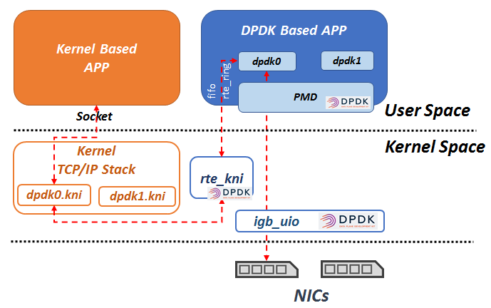
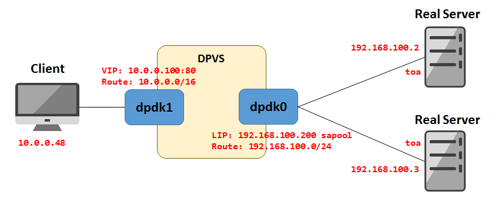
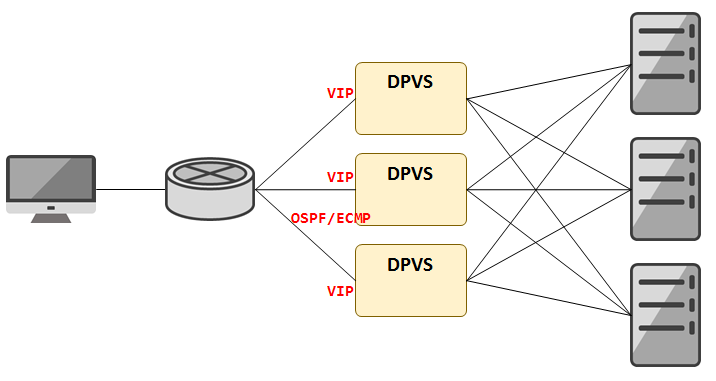
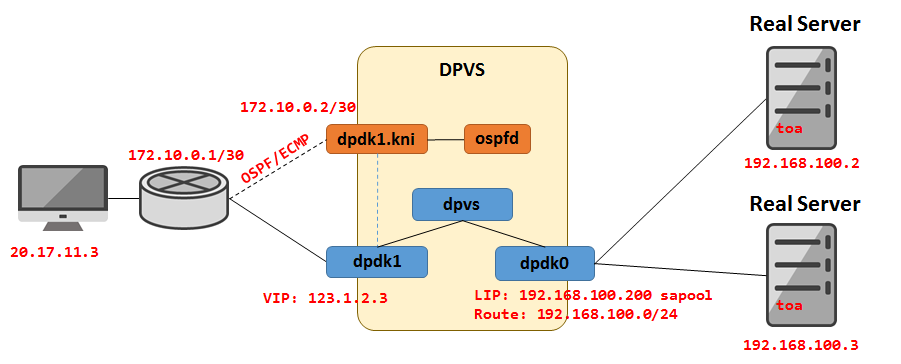
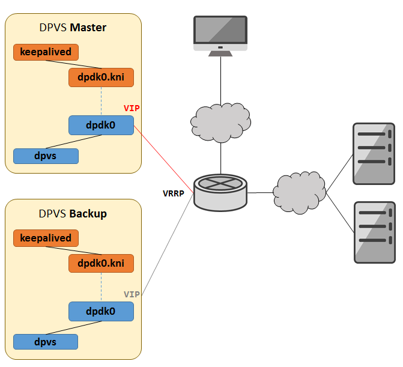
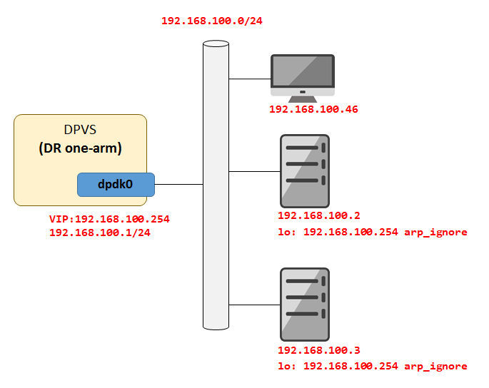
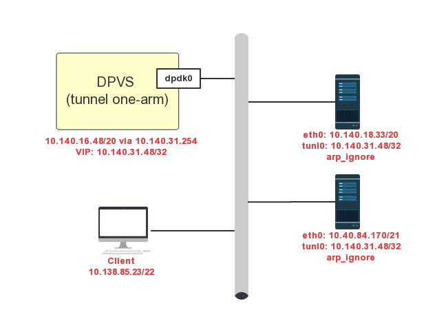
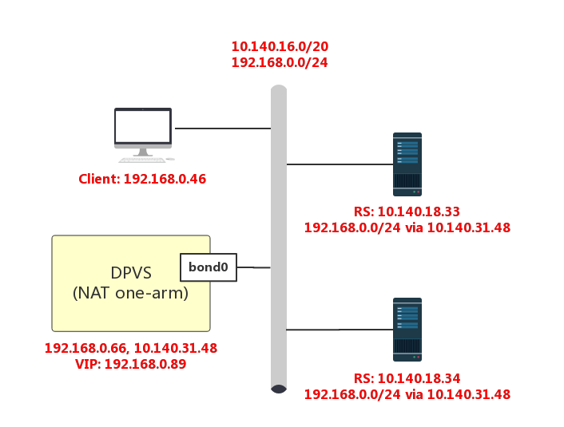
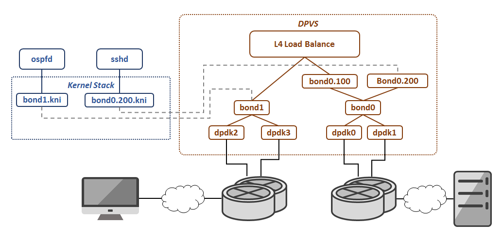

DPVS Tutorial
=============

* [Terminology](#term)
  - [*One-arm* and *two-arm*](#one-two-arm)
  - [*KNI* Device](#kni)
* [Full-NAT Mode](#fnat)
  - [Simple Full-NAT (two-arm)](#simple-fnat)
    - [Something about *LIP*, *routes* and *TOA*](#lip-routes-toa)
  - [Full-NAT with OSPF/ECMP (two-arm)](#fnat-ospf)
  - [Full-NAT with Keepalived (one-arm)](#fnat-keepalive)
* [DR Mode (one-arm)](#dr)
* [Tunnel Mode(one-arm)](#tunnel)
* [NAT Mode(one-arm)](#nat)
* [SNAT Mode (two-arm)](#snat)
* [IPv6 Support](#ipv6_support)
* [Virtual devices](#virt-dev)
  - [Bonding Device](#vdev-bond)
  - [VLAN Device](#vdev-vlan)
  - [Tunnel Device](#vdev-tun)
  - [KNI for virtual device](#vdev-kni)
* [UDP Option of Address (UOA)](#uoa)
* [Launch DPVS in Virtual Machine (Ubuntu)](#Ubuntu16.04)
* [Traffic Control(TC)](#tc)
* [Multiple Instances](#multi-instance)
* [Debug DPVS](#debug)
  - [Debug with Log](#debug-with-log)
  - [Packet Capture and Tcpdump](#packet-capture)

> To compile and launch DPVS, please check [README.md](../README.md) for this project.

<a id='term'/>

# Terminology

About the concepts of *Full-NAT* (`FNAT`), `DR`, `Tunnel`, `TOA`, `OSPF`/`ECMP` and `keepalived`, please refer [LVS](http://www.linuxvirtualserver.org) and [Alibaba/LVS](https://github.com/alibaba/LVS/tree/master/docs).

Note that `DPVS` supports `FNAT`, `DR`, `Tunnel`, `NAT`, `SNAT` forwarding modes, and each mode can be configured as `one-arm` or `two-arm` topology, with or without `OSFP/ECMP`/`keepalived`. There're too many combinations, I cannot list all the examples here. Let's just give some popular working models used in our daily work.

<a id='one-two-arm'/>

## *One-arm* and *two-arm*

The term *two-arm* means, you have clients in one side of *load-balancer* (`LB`) and servers (`RS`) in another side, then `LB` forwards packets between its two logical network interfaces. For example, *WAN-to-LAN* load balancing.

On the other hand, *one-arm* means all clients and servers are in same side of `load-balancer`, `LB` forwards traffic through the same logical network interface.

> *Logical interface* (or *device*) could be physical `DPDK` interface, or `DPVS` virtual devices like *bonding*, *vlan* and *tunnel* devices.

To make things easier, we do not consider virtual devices for now. Thus, *two-arm* topology need

* two DPDK interfaces loaded with PMD driver(i.e. igb_uio), and
* `/etc/dpvs.conf` should also be configured with two interfaces. Please refer the file [conf/dpvs.conf.sample](../conf/dpvs.conf.sample).

```
$ dpdk-devbind --status

Network devices using DPDK-compatible driver
============================================
0000:06:00.0 'Ethernet Controller 10-Gigabit X540-AT2' drv=igb_uio unused=uio_pci_generic
0000:06:00.1 'Ethernet Controller 10-Gigabit X540-AT2' drv=igb_uio unused=uio_pci_generic
```

For *one-arm*, only one DPDK intreface is needed, and you can refer [conf/dpvs.conf.single-nic.sample](../conf/dpvs.conf.single-nic.sample).

<a id='kni'/>

## KNI Device

Like `LVS`, `DPVS` can be deployed as different sort of *Cluster* models for High-Available (HA) purpose. Both *OSPF/ECMP* and *Master/Backup* models are supported. *OSPF/ECMP* model need package `quagga` and its `zebra` and `ospfd` programs. And *master/back* model need `Keepalived`.

Considering `DPDK` application manages the networking interface completely (except the extra control NIC if exist), Linux Kernel and programs run on Kernel TCP/IP stack cannot receive packets from `DPDK` interface directly. To make Linux programs like `sshd`, `zebra/ospfd` and `keepalived` work, DPDK `kni` device is used. Then the Linux programs can working on `kni` device with Linux TCP/IP stack. Actually, `DPVS` passes the packets, which it's not interested in, to `kni` device. For instance, *OSPF/VRRP/ssh* packets. So that the programs "working" on Linux stack are able to handle them.

> We do not want to port `ospfd`/`keepalieved`/`sshd` to DPDK environment, beacause TCP and Socket layer is needed. And the work load is another reason.



It should not that `keepalived` is modified by `DPVS` project to support some specific parameters. The codes is resident in [tools/keepalived](../tools/keepalived) and the executable file is `bin/keepalived`. And `ospfd`/`sshd` is the standard version.

Let's start from *Full-NAT* example first, it's not the easiest but really popular.

<a id='fnat'/>

# Full-NAT Mode

<a id='simple-fnat'/>

## Simple Full-NAT (two-arm)

This is a simple example for FullNAT (`FNAT`), forwarding between two interfaces. Assuming one is WAN interface (`dpdk1`) and another is LAN interface (`dpdk0`).



The setting including:

* *ip-addresses* and *routes* for DPDK LAN/WAN network.
* *VIP* on WAN interface (`dpdk1`)
* `FNAT` service (vip:vport) and related `RS`
* `FNAT` mode need at least one *LIP* on LAN interface (`dpdk0`)

```bash
#!/bin/sh -

# add VIP to WAN interface
./dpip addr add 10.0.0.100/32 dev dpdk1

# route for WAN/LAN access
# add routes for other network or default route if needed.
./dpip route add 10.0.0.0/16 dev dpdk1
./dpip route add 192.168.100.0/24 dev dpdk0

# add service <VIP:vport> to forwarding, scheduling mode is RR.
# use ipvsadm --help for more info.
./ipvsadm -A -t 10.0.0.100:80 -s rr

# add two RS for service, forwarding mode is FNAT (-b)
./ipvsadm -a -t 10.0.0.100:80 -r 192.168.100.2 -b
./ipvsadm -a -t 10.0.0.100:80 -r 192.168.100.3 -b

# add at least one Local-IP (LIP) for FNAT on LAN interface
./ipvsadm --add-laddr -z 192.168.100.200 -t 10.0.0.100:80 -F dpdk0
```

And you can use the commands below to check what's just set:

```bash
$ ./dpip addr show
inet 10.0.0.100/32 scope global dpdk1
     valid_lft forever preferred_lft forever
inet 192.168.100.200/32 scope global dpdk0
     valid_lft forever preferred_lft forever sa_used 0 sa_free 1032176 sa_miss 0
```

```bash
$ ./dpip route show
inet 10.0.0.100/32 via 0.0.0.0 src 0.0.0.0 dev dpdk1 mtu 1500 tos 0 scope host metric 0 proto auto
inet 192.168.100.200/32 via 0.0.0.0 src 0.0.0.0 dev dpdk0 mtu 1500 tos 0 scope host metric 0 proto auto
inet 192.168.100.0/24 via 0.0.0.0 src 0.0.0.0 dev dpdk0 mtu 1500 tos 0 scope link metric 0 proto auto
inet 10.0.0.0/16 via 0.0.0.0 src 0.0.0.0 dev dpdk1 mtu 1500 tos 0 scope link metric 0 proto auto
```

```bash
$ ./ipvsadm  -ln
IP Virtual Server version 0.0.0 (size=0)
Prot LocalAddress:Port Scheduler Flags
  -> RemoteAddress:Port           Forward Weight ActiveConn InActConn
TCP  10.0.0.100:80 rr
  -> 192.168.100.2:80             FullNat 1      0          0
  -> 192.168.100.3:80             FullNat 1      0          0
```

```bash
$ ./ipvsadm  -G
VIP:VPORT            TOTAL    SNAT_IP              CONFLICTS  CONNS
10.0.0.100:80        1
                              192.168.100.200      0          0
```

And now to verify if FNAT (two-arm) works. I've setup Nginx server on RS (with TOA module) to response the HTTP request with Client's real IP and port. The response format is plain text (not html).

```bash
client$ curl 10.0.0.100
Your ip:port : 10.0.0.48:37177
```

<a id='lip-routes-toa'/>

##### Something about *LIP*, *routes* and *TOA*

`LIP` or *Local-IP* is needed for FNAT translation, clients' *CIP:cport* will be replaced with *LIP:lport*, while *VIP:vport* will be translated to RS's *RIP:rport*. That's why the mode called "Full-NAT" I think.

Please use `ipvsadm --add-laddr` to set `LIP` instead of `dpip addr add ...`. Because the both *ipvs* and *inet* module need `LIP` address, and *sapool* option will be set automatically.

Another tip is you can use `dpip addr add 10.0.0.100/16 dev dpdk1` to set VIP and WAN route simultaneously. But let's use two commands to make it clear.

Optionally, if `RS` need to obtain client's real *IP:port* by socket API, e.g., `getpeername` or `accept`, instead of some application manner. `TOA` kernel module should be installed on `RS`. `TOA` is developped for some version of Linux kernel, and porting may needed for other versions or other OS Kernel like *BSD* or *mTCP*.

You could refer to following links to get `TOA` source code and porting to your `RS` if needed.

* [Alibaba LVS](https://github.com/alibaba/LVS/blob/master/docs/LVS_user_manual.pdf)
* [UCloud TOA](https://docs.ucloud.cn/security/uads/faq/game)
* [Huawei TOA](https://github.com/Huawei/TCP_option_address)
* [IPVS CA](https://github.com/yubo/ip_vs_ca)

TOA source code is included into DPVS project(in directory [kmod/toa](../kmod/toa)) since v1.7 to support IPv6 and NAT64. It is derived from the Alibaba TOA. For IPv6 applications which need client's real IP address, we suggest to use this TOA version.

Be aware that **application may need some changes** if you are using NAT64. An extra `getsockopt` should be called to obtain the client's real IPv6 address from the IPv4 socket on RS. As an example, we give a [NAT64 patch for nginx-1.14](../kmod/toa/example_nat64/nginx/nginx-1.14.0-nat64-toa.patch). By the way, if you do not need client's real IP address, application needs no changes.

<a id='fnat-ospf'/>

## Full-NAT with OSPF/ECMP (two-arm)

To work with *OSPF*, the patch in `patch/dpdk-xxx/` must be applied to the corresponding DPDK source codes and the correct `rte_kni.ko` should be installed.

`DPVS` OSPF-cluster model looks like this, it leverages `OSPF/ECMP` for HA and high-scalability. This model is widely used in practice.



For `DPVS`, things become more complicated. As mentioned above, `DPDK` program (here is `dpvs`) have full control of DPDK NICs, so Linux program (`ospfd`) needs receive/send packets through `kni` device (`dpdk1.kni`) related to DPDK device (`dpdk1`).

> DPDK apps based on whole TCP/IP stack like user-space Linux/BSD do not have this kind of configuration complexity, but more developing efforts are needed to porting `ospfd` and `keepalived` to the TCP/IP stack used by DPDK. Anyway, that's another solution.

Thus, the internal relationship among interfaces and programs looks like below,



Now the configuration has two parts, one is for `dpvs` and another is for `zebra/ospfd`.

`dpvs` part is almost the same with the example in [simple fnat](#simple-fnat), except

* one more address/route is needed to communicate between dpvs and wan-side L3-switch. For ospf packets, dpvs will just send them to kernel.
* VIP should not only set to `dpvs` by `dpip addr`, but also need to set to `kni`, so that `ospfd` can be aware of it and then to publish.

> If you add any kni_host route which means all packets will be sent to kernel by dpvs, the prefix length of `kni_host` must be 32.

```bash
#!/bin/sh -

# routes for LAN access
./dpip route add 192.168.100.0/24 dev dpdk0

# add service <VIP:vport> to forwarding, scheduling mode is RR.
# use ipvsadm --help for more info.
./ipvsadm -A -t 123.1.2.3:80 -s rr

# add two RS-es for service, forwarding mode is FNAT (-b)
./ipvsadm -a -t 123.1.2.3:80 -r 192.168.100.2 -b
./ipvsadm -a -t 123.1.2.3:80 -r 192.168.100.3 -b

# add at Local-IPs (LIPs) for FNAT on LAN interface
./ipvsadm --add-laddr -z 192.168.100.200 -t 123.1.2.3:80 -F dpdk0
./ipvsadm --add-laddr -z 192.168.100.201 -t 123.1.2.3:80 -F dpdk0

# add addr/route for dpvs.
./dpip addr add 123.1.2.3/32 dev dpdk1
./dpip addr add 172.10.0.2/30 dev dpdk1
./dpip route add default via 172.10.0.1 dev dpdk1
```

Then, the `zebra/ospfd` part. Firstly, run the OSPF protocol between `DPVS` server and wan-side L3-switch, with the "inter-connection network" (here is `172.10.0.2/30`). For `DPVS`, we set the inter-connection IP on `dpdk1.kni`.

> Assuming `quagga` package is installed, if not, please use 'yum' (CentOS) or 'apt-get' (Ubuntu) to install it. After installed, you should have `zebra` and `ospfd`, as well as their config files.

```bash
$ ip link set dpdk1.kni up
$ ip addr add 172.10.0.2/30 dev dpdk1.kni
$ ip addr add 123.1.2.3/32 dev dpdk1.kni # add VIP to kni for ospfd
$ ip route add default via 172.10.0.1 dev dpdk1.kni
```

> VIP should be add to kni device, to let ospfd to publish it.

Check if inter-connection works by `ping` switch.

```bash
$ ping 172.10.0.1
PING 172.10.0.1 (172.10.0.1) 56(84) bytes of data.
64 bytes from 172.10.0.1: icmp_seq=1 ttl=255 time=2.19 ms
```

Now let's config `zebra` and `ospfd`. Nothing special for `zebra`, just use it with the default configuration.

```bash
$ cat /etc/quagga/zebra.conf  # may installed to other path
! -*- zebra -*-
!
! zebra sample configuration file
!
! Id: zebra.conf.sample,v 1.1 2002/12/13 20:15:30 paul Exp $
!
hostname localhost.localdomain # change to it real hostname
password ****
enable password ****

log file /var/log/quagga/zebra.log
service password-encryption
```

For `ospfd`, these parameters need be set:

* interface: it's WAN interface `dpdk1.kni`
* route-id: not that significant, just use the LAN IP.
* network: which network to advertise
  - the inter-connection network `172.10.0.0/30`, and
  - the VIP `123.1.2.3/32`.
* area-ID: should be the same with switch, here is `0.0.0.0` for example.
* Other parameters, like "p2p", "authentication", ... they must be consistent with Switch.

```bash
$ cat /etc/quagga/ospfd.conf       # may installed to other path
log file /var/log/quagga/ospf.log
log stdout
log syslog
password ****
enable password ****
interface dpdk1.kni                # should be wan-side kni device
ip ospf hello-interval 10
ip ospf dead-interval 40
router ospf
ospf router-id 192.168.100.200     # just use LAN IP
log-adjacency-changes
auto-cost reference-bandwidth 1000
network 172.10.0.0/30 area 0.0.0.0 # announce inter-connection network
network 123.1.2.3/32 area 0.0.0.0  # announce VIP
```

Considering the VIP's route is configured on KNI interface, an alternative way to publish VIP is to let ospfd redistribute the connected routes that match VIP. In this way, you don't need to modify the `ospfd.conf` file and reolad `ospfd` every time when you want to add more VIPs.

```bash
$ cat /etc/quagga/ospfd.conf               # may installed to other path
log file /var/log/quagga/ospf.log
log stdout
log syslog
password ****
enable password ****

access-list 1 permit 123.1.2.0 0.0.0.255   # access-list 1 permits VIP segment 123.1.2.0/24
route-map ecmp permit 10                   # route-map "ecmp" matches ip address from access-list 1
match ip address 1

interface dpdk1.kni                        # should be wan-side kni device
ip ospf hello-interval 10
ip ospf dead-interval 40
router ospf
ospf router-id 192.168.100.200             # just use LAN IP
log-adjacency-changes
auto-cost reference-bandwidth 1000
network 172.10.0.0/30 area 0.0.0.0         # announce inter-connection network
redistribute connected route-map ecmp      # redistribute VIPs in route-map "ecmp", route-map is not mandatory but advised
```

Note that `OSPF` must also be configured on l3-switch. This Tutorial is not about OSPF's configuration, so no more things about switch here.

Now start `zebra` and `ospfd`:

```bash
service restart zebra
service restart ospfd
```

Hopefully (if `OSPF` works), the VIP is accessible by client:

```bash
client: curl 123.1.2.3
```

> There exists other solutions to acheive the OSPF-cluster model and the like. For example, OSPF and quagga can be replaced with BGP and [bird](https://bird.network.cz/), respectively. If you are interested, please refer to related docs or consult the network administrator.

<a id='fnat-keepalive'/>

## Full-NAT with Keepalived (one-arm)

This is an example for FullNAT used in internal network (LAN). `Keepalived`  (*`DPVS` modified version*) is used for to make DPVS works as *Master/Backup* model.



By using `keepalived`, routes, `LIP`, `VIP` and `RS` can be configured through `keepalived` config file. **Note** the configure parameters for `DPVS` modified `keepalived` is slight **different** from original `keepalived`.

```
$ cat /etc/keepalived/keepalived.conf
! Configuration File for keepalived

global_defs {
    notification_email {
        foo@example.com
    }
    notification_email_from bar@example.com
    smtp_server 1.2.3.4
    smtp_connect_timeout 60
    router_id DPVS_DEVEL
}

local_address_group laddr_g1 {
    192.168.100.200 dpdk0    # use DPDK interface
    192.168.100.201 dpdk0    # use DPDK interface
}

#
# VRRP section
#
vrrp_instance VI_1 {
    state MASTER                  # master
    interface dpdk0.kni           # should be kni interface
    dpdk_interface dpdk0          # should be DPDK interface
    virtual_router_id 123         # VID should be unique in network
    priority 100                  # master's priority is bigger than worker
    advert_int 1
    authentication {
        auth_type PASS
        auth_pass ****
    }

    virtual_ipaddress {
        192.168.100.254
    }
}

#
# Virtual Server Section
#
virtual_server_group 192.168.100.254-80 {
    192.168.100.254 80
}

virtual_server group 192.168.100.254-80 {
    delay_loop 3
    lb_algo rr         # scheduling algorithm Round-Robin
    lb_kind FNAT       # Forwarding Mode Full-NAT
    protocol TCP       # Protocol TCP

    laddr_group_name laddr_g1   # Local IP group-ID

    real_server 192.168.100.2 80 { # real-server
        weight 100
        inhibit_on_failure
        TCP_CHECK {    # health check
            nb_sock_retry 2
            connect_timeout 3
            connect_port 80
        }
    }

    real_server 192.168.100.3 80 { # real-server
        weight 100
        inhibit_on_failure
        TCP_CHECK { # health check
            nb_sock_retry 2
            connect_timeout 3
            connect_port 80
        }
    }
}
```

The keepalived config for backup is the same with Master, except

* local address is not the same with MASTER,
* vrrp_instance `state` should be 'BACKUP',
* vrrp_instance `priority` should be lower.

```
local_address_group laddr_g1 {
    192.168.100.202 dpdk0    # use DPDK interface
    192.168.100.203 dpdk0    # use DPDK interface
}

... ...

vrrp_instance VI_1 {
    state BACKUP
    priority 80
    ... ...
}
```

Start `keepalived` on both Master and Backup.

```bash
./keepalived -f /etc/keepalived/keepalived.conf
```

Then, add *routes* to DPDK interface manually on both MASTER and BACKUP.

```bash
./dpip route add 192.168.100.0/24 dev dpdk0
```
Lastly, configure dpdk0.kni to make keepalived's vrrp and health-check work properly.

```bash
ip link set dpdk0.kni up
ip addr add 192.168.100.28/24 dev dpdk0.kni               # assign an IP to dpdk0.kni
dpip route add 192.168.100.28/32 scope kni_host dev dpdk0 # route packets target at 192.168.100.28 to dpdk0.kni
```
Note the dpdk0.kni's IP addresses should be different for MASTER and BACKUP.

Check if parameters just set are correct:

```bash
$ ./ipvsadm  -ln
IP Virtual Server version 0.0.0 (size=0)
Prot LocalAddress:Port Scheduler Flags
  -> RemoteAddress:Port           Forward Weight ActiveConn InActConn
TCP  192.168.100.254:80 rr
  -> 192.168.100.2:80             FullNat 100    0          0
  -> 192.168.100.3:80             FullNat 100    0          0

$ ./dpip addr show -s
inet 192.168.100.254/32 scope global dpdk0
     valid_lft forever preferred_lft forever
inet 192.168.100.201/32 scope global dpdk0
     valid_lft forever preferred_lft forever sa_used 0 sa_free 1032176 sa_miss 0
inet 192.168.100.200/32 scope global dpdk0
     valid_lft forever preferred_lft forever sa_used 0 sa_free 1032176 sa_miss 0

$ ./dpip route show
inet 192.168.100.28/32 via 0.0.0.0 src 0.0.0.0 dev dpdk0 mtu 1500 tos 0 scope kni_host metric 0 proto auto
inet 192.168.100.200/32 via 0.0.0.0 src 0.0.0.0 dev dpdk0 mtu 1500 tos 0 scope host metric 0 proto auto
inet 192.168.100.201/32 via 0.0.0.0 src 0.0.0.0 dev dpdk0 mtu 1500 tos 0 scope host metric 0 proto auto
inet 192.168.100.254/32 via 0.0.0.0 src 0.0.0.0 dev dpdk0 mtu 1500 tos 0 scope host metric 0 proto auto
inet 192.168.100.0/24 via 0.0.0.0 src 0.0.0.0 dev dpdk0 mtu 1500 tos 0 scope link metric 0 proto auto

$ ./ipvsadm  -G
VIP:VPORT            TOTAL    SNAT_IP              CONFLICTS  CONNS
192.168.100.254:80   2
                              192.168.100.200      0          0
                              192.168.100.201      0          0
```

Seems good, then try access the VIP from client.

```bash
client$ curl 192.168.100.254
Your ip:port : 192.168.100.146:42394
```

> Note:
> 1. We just explain how DPVS works with keepalived, and not verify if the master/backup feature provided by keepalived works. Please refer LVS docs if needed.
> 2. Keepalived master/backup failover may fail if switch enabled the ARP broadcast suppression (unfortunately often is the case). If you don't want to change configurations of your switch, decrease the number of gratuitous ARP packets sent by keepalived (dpvs) on failover may help.

```
global_defs {
    ... ...
   vrrp_garp_master_repeat          1   # repeat counts for master state gratuitous arp
   vrrp_garp_master_delay           1   # time to relaunch gratuitous arp after failover for master, in second
   vrrp_garp_master_refresh         600 # time interval to refresh gratuitous arp periodically(0 = none), in second
   vrrp_garp_master_refresh_repeat  1   # repeat counts to refresh gratuitous arp periodically
   ... ...
}
```

<a id='dr'/>

# DR Mode (one-arm)

Let's make a simple example for DR mode, some users may need it.



To use DR:

* dpvs needs a LAN IP first. (for one-arm, it must be different from VIP).
* the `RS` and `DPVS` must in same sub-network (*on-link*).
* On `RS`: `VIP` must be added to its *lo* interface.
* On `RS`: `arp_ignore` must be set to *lo* interface.

> `DPVS` needs a *RS-faced* IP itself (here means "LAN-side" IP, it's not the same conception as Local-IP (LIP) used by FNAT, just a normal IP address). Because `DPVS` need communicated with `RS`es. For *one-arm*, this LAN IP and VIP are on same DPDK interface. But they cannot be same, because `VIP` will also be set on `RS`es, if we do not use a separated LAN-IP, `RS`es will not reply the ARP request. Furthermore, the LAN-IP of `DPVS` must be added **before** VIP.
> For *tow-arm* DR, `DPVS` also need a LAN side IP to talk with LAN-side hosts, while VIP is configured on client-faced (WAN) interface.

On `DPVS`, The `DR` configuration can be,

```bash
# on DPVS

# add LAN IP for DPVS, it must be different from VIP
# and must be added before VIP.
./dpip addr add 192.168.100.1/24 dev dpdk0
# add VIP and the route will generate automatically.
./dpip addr add 192.168.100.254/32 dev dpdk0

# route for LAN network, just a hint.
#./dpip route add 192.168.100.0/24 dev dpdk0

# add service <VIP:vport> to forwarding, scheduling mode is RR.
# use ipvsadm --help for more info.
./ipvsadm -A -t 192.168.100.254:80 -s rr

# add two RS for service, forwarding mode is DR
./ipvsadm -a -t 192.168.100.254:80 -r 192.168.100.2 -g
./ipvsadm -a -t 192.168.100.254:80 -r 192.168.100.3 -g
```

And then on `RS`es,

```bash
# for each Real Server
rs$ ip addr add 192.168.100.254/32 dev lo    # add VIP to each RS's lo
rs$ sysctl -w net.ipv4.conf.lo.arp_ignore=1  # ignore ARP on lo
net.ipv4.conf.lo.arp_ignore = 1
```

Try if client can access VIP with DR mode.

```bash
client$ curl 192.168.100.254
Your ip:port : 192.168.100.46:13862
```

> DR mode for two-arm is similar with [two-arm FNAT](#simple-fnat), please change the forwarding mode by `ipvsadm -g`, and you need NOT config `LIP`. Configuration of `RS`es are the same with one-arm.

<a id='tunnel'/>

# Tunnel Mode (one-arm)

Traffic flow of tunnel mode is the same as DR mode. It forwards packets to RSes, and then RSes send replies to clients directly. Different with DR mode, tunnel mode can forward packets across L2 network through ipip tunnels between DPVS and RSes.



`DPVS` configs of the above diagram as follows.
``` bash
## DPVS configs ##
# config LAN network on dpdk0
./dpip addr add 10.140.16.48/20 dev dpdk0
# config default route, `src` must be set for tunnel mode
./dpip route add default via 10.140.31.254 src 10.140.16.48 dev dpdk0
# add service <VIP:vport> to forwarding, scheduling mode is RR
./ipvsadm -A -t 10.140.31.48:80 -s rr
# add RS in the same subnet with DPVS, forwarding mode is tunnel
./ipvsadm -a -t 10.140.31.48:80 -r 10.140.18.33 -i
# add another RS in different subnet with DPVS, forwarding mode is tunnel
./ipvsadm -a -t 10.140.31.48:80 -r 10.40.84.170 -i
# add VIP and the route will generate automatically
./dpip addr add 10.140.31.48/32 dev dpdk0

```
DPVS tunnel requires RS supports ip tunnel. VIP should be configured and arp_ignore should be set on RS.
```bash
## for each Real Server ##
rs$ ifconfig tunl0 10.140.31.48 netmask 255.255.255.255 broadcast 10.140.31.48 up
rs$ sysctl -w net.ipv4.conf.tunl0.arp_ignore=1  # ignore ARP on tunl0
rs$ sysctl -w net.ipv4.conf.tunl0.rp_filter=2 # use loose source validation
```
You should note that default rp_filter uses strict source validation, but source route for incoming packets on tunl0 is not configured on tunl0. So we change rp_filter behavior of tunl0 to loose source validation mode to avoid packet drop on RSs.

You can test the dpvs tunnel service now.

```bash
client$ curl 10.140.31.48:80
Hi, I am 10.140.18.33.
client$ curl 10.140.31.48:80
Hi, I am 10.40.84.170.

```

<a id='nat'/>

# NAT mode (one-arm)

A strict limitation exists for DPVS NAT mode: **DPVS `NAT` mode can only work in single lcore**. It is hard for DPVS to support multi-lcore NAT forwarding mode due to the following facts.

* DPVS session entries are splited and distributed on lcores by RSS.
* NAT forwarding requires both inbound and outbound traffic go through DPVS.
* Only dest IP/port is translated in NAT forwarding, source IP/port is not changed.
* Very limited maximum rte_flow rules can be set for a NIC.

So, if no other control of the traffic flow, outbound packets may arrive at different lcore from inbound packets. If so, outbound packets would be dropped because session lookup miss. Full-NAT fixes the problem by using Flow Control (rte_flow). However, there are very limited rules can be added for a NIC, i.e. 8K for XT-540. Unlike Full-NAT, NAT does not have local IP/port, so flow rules can only be set on source IP/port, which means only thousands concurrency is supported. Therefore, rte_flow is not feasible for NAT.

Whatever, we give a simple example for NAT mode. Remind it only works single lcore.



```bash
## DPVS configs ##
# config LAN network on bond0, routes will generate automatically
./dpip addr add 192.168.0.66/24 dev bond0
./dpip addr add 10.140.31.48/20 dev bond0

# add service <VIP:vport> to forwarding, scheduling mode is RR
./ipvsadm -A -t 192.168.0.89:80 -s -rr

# add two RSs, forwarding mode is NAT
./ipvsadm -A -t 192.168.0.89:80 -r 10.140.18.33 -m
./ipvsadm -A -t 192.168.0.89:80 -r 10.140.18.34 -m

# add VIP and the route will generate automatically
./dpip addr add 192.168.0.89/32 dev bond0

## keepalived.conf ##
static_ipaddress {
    192.168.0.66/24 dev bond0
    10.140.31.48/20 dev bond0
}

virtual_server_group vip_nat {
    192.168.0.89 80
}

virtual_server group vip_nat {
    protocol tcp
    lb_algo rr
    lb_kind NAT

    real server 10.140.18.33 80 {
         weight 100
         inhibit_on_failure
         TCP_CHECK {
            nb_sock_retry 2
            connect_timeout 3
            connect_port 80
        }
    }

    real server 10.140.18.34 80 {
         weight 100
         inhibit_on_failure
         TCP_CHECK {
            nb_sock_retry 2
            connect_timeout 3
            connect_port 80
        }
    }
}
```

On RSs, back routes should be pointed to DPVS.
```bash
## for each real server ##
ip route add 192.168.0.0/24 via 10.140.31.48 dev eth0

```

Now you can test DPVS NAT mode.
```bash
client$ curl 192.168.0.89:80
Hi, I am 10.140.18.33.
client$ curl 192.168.0.89:80
Hi, I am 10.140.18.34.
```
> Since v1.7.2, a solution is made for multi-lcore NAT mode forwarding. The principle is to redirect the outbound packets to the correct lcore where its session entry reside through a global redirection table and some lockless rings. Of course, it harms performance to some degree. If you want to use it, turn on the config swtich "ipvs_defs/conn/redirect" in /etc/dpvs.conf.

<a id='snat'/>

# SNAT Mode (two-arm)

`SNAT` mode can be used to let hosts in internal network without WAN IP (e.g., servers in IDC) to have Internet access.

To configure `SNAT`,

* WAN-side IP must be configured with `sapool` option.
* SNAT uses "match" service instead of *<vip:vport>* for TCP/UDP,
* default route may be needed on DPVS WAN interface.

> `match` supports `proto`, `src-range`, `dst-range`, `oif` and `iif`. For example: `proto=tcp,src-range=192.168.0.0-192.168.0.254,dst-range=0.0.0.0:1-1024,oif=dpdk1`.

The SNAT setting could be:

```bash
#!/bin/sh -

WAN_IP=123.1.2.3        # WAN IP can access Internet.
WAN_PREF=24             # WAN side network prefix length.
GATEWAY=123.1.2.1       # WAN side gateway

LAN_IP=192.168.100.1
LAN_PREF=24

# add WAN-side IP with sapool
./dpip addr add $WAN_IP/$WAN_PREF dev dpdk1 sapool # must add sapool for WAN-side IP
# add LAN-side IP as well as LAN route (generated)
./dpip addr add $LAN_IP/$LAN_PREF dev dpdk0

# add default route for WAN interface
./dpip route add default via $GATEWAY dev dpdk1

# SNAT section
# -H MATCH       SNAT uses -H for "match" service instead of -t or -u
#                MATCH support "proto", "src-range", "oif" and "iif".
# -r <WIP:0>     used to specify the WAN IP after SNAT translation,
#                the "port" part must be 0.
# -J             for "SNAT" forwarding mode.
MATCH0='proto=tcp,src-range=192.168.100.0-192.168.100.254,oif=dpdk1'
MATCH1='proto=icmp,src-range=192.168.100.0-192.168.100.254,oif=dpdk1'

./ipvsadm -A -s rr -H $MATCH0
./ipvsadm -a -H $MATCH0 -r $WAN_IP:0 -w 100 -J

./ipvsadm -A -s rr -H $MATCH1
./ipvsadm -a -H $MATCH1 -r $WAN_IP:0 -w 100 -J
```

You can also use keepalived to configure SNAT instead of using ipvsadm. Every SNAT serivce should has parameter 'match':

```
virtual_server match SNAT1 {
    protocol UDP
    lb_algo rr
    lb_kind SNAT
    src-range 192.168.100.0-192.168.100.254
    oif dpdk1

    real_server 123.1.2.1  0 {
        weight 4
    }
}

virtual_server match SNAT2 {
    protocol ICMP
    lb_algo wrr
    lb_kind SNAT
    src-range 192.168.100.1-192.168.100.254
    dst-range 123.1.2.0-123.1.2.254
    oif dpdk1
    iif dpdk0

    real_server 123.1.2.1  0 {
        weight 4
    }
}
```

If you also want to use keepalived instead of using dpip to configure WAN/LAN IP, you can using 'alpha' and 'omega' to configure keepalived. Healthy check is needed in alpha mode, so you have to make a healthy check. And the result of the healthy check must always be true or RS(LAN IP in fact) will be deleted. You can use MISC_CHECK to make real_server/WAN IP always be healthy:

```
virtual_server match SNAT {
    protocol UDP
    delay_loop 3
    lb_algo rr
    lb_kind SNAT
    src-range 192.168.100.0-192.168.100.254
    oif dpdk1
    alpha
    omega
    quorum 1
    quorum_up "dpip addr add XXX;" ##Here is your cmd, you can also use a script.
    quorum_down "dpip addr del XXX;"

    real_server 123.1.2.2 0 {
        weight 4
        MISC_CHECK {
           misc_path "exit 0"##Just make a healthy check which will always judge real_server healthy
           misc_timeout 10
        }
    }
}
```

For hosts in "LAN", the default route should be set to `DPVS` server's LAN IP.

```bash
host$ ip route add default via 192.168.100.1 dev eth0
```

Then try Internet access from hosts through SNAT `DPVS` server.

```bash
host$ ping www.iqiyi.com
host$ curl www.iqiyi.com
```

<a id='ipv6_support'/>

# IPv6 Support

DPVS support IPv6-IPv6 since v1.7 which means VIP/client IP/local IP/rs IP can be IPv6. You can configure IPv6 fullnat just like IPv4:

```bash
#!/bin/sh -

# add VIP to WAN interface
./dpip addr add 2001::1/128 dev dpdk1

# route for WAN/LAN access
# add routes for other network or default route if needed.
./dpip route -6 add 2001::/64 dev dpdk1

# add service <VIP:vport> to forwarding, scheduling mode is RR.
# use ipvsadm --help for more info.
./ipvsadm -A -t [2001::1]:80 -s rr

# add two RS for service, forwarding mode is FNAT (-b)
./ipvsadm -a -t [2001::1]:80 -r 2001::3 -b
./ipvsadm -a -t [2001::1]:80 -r 2001::4 -b

# add at least one Local-IP (LIP) for FNAT on LAN interface
./ipvsadm --add-laddr -z 2001::2 -t [2001::1]:80 -F dpdk0
```
You can use commands to check what's you have set like IPv4 except route:

```bash
$./dpip route -6 show
inet6 2001::1/128 dev dpdk0 mtu 1500 scope host
inet6 2001::2/128 dev dpdk0 mtu 1500 scope host
inet6 2001::/64 dev dpdk0 mtu 1500 scope link
```

You can configure IPv6 OSPF's configuration like this:

```bash
$ cat /etc/quagga/ospf6d.conf   # may installed to other path
log file /var/log/quagga/ospf6.log
log stdout
log syslog
password ****
enable password ****
interface dpdk1.kni
 ipv6 ospf6 network point-to-point
 ipv6 ospf6 hello-interval 10
 ipv6 ospf6 dead-interval 40
!
router ospf6
 router-id 192.168.100.200
 area 0.0.0.0 range 2001::1/64 # announce VIP
 area 0.0.0.0 range fec0::172:10:10:11/127 # announce inter-connection network
 interface dpdk1.kni area 0.0.0.0
!
```

If you prefer keepalived, you can configure it like this:
```
$ cat /etc/keepalived/keepalived.conf
! Configuration File for keepalived

global_defs {
    notification_email {
        foo@example.com
    }
    notification_email_from bar@example.com
    smtp_server 1.2.3.4
    smtp_connect_timeout 60
    router_id DPVS_DEVEL
}

local_address_group laddr_g1 {
    2001::2 dpdk0    # use DPDK interface
}

#
# VRRP section
#
vrrp_instance VI_1 {
    state MASTER                  # master
    interface dpdk0.kni           # should be kni interface, and IPv4 should be configured for vrrp
    dpdk_interface dpdk0          # should be DPDK interface
    virtual_router_id 123         # VID should be unique in network
    priority 100                  # master's priority is bigger than worker
    advert_int 1
    authentication {
        auth_type PASS
        auth_pass ****
    }

    virtual_ipaddress {
        2001::1
    }
}

#
# Virtual Server Section
#
virtual_server_group 2001-1-80 {
    2001::1 80
}

virtual_server group 2001-1-80 {
    delay_loop 3
    lb_algo rr         # scheduling algorithm Round-Robin
    lb_kind FNAT       # Forwarding Mode Full-NAT
    protocol TCP       # Protocol TCP

    laddr_group_name laddr_g1   # Local IP group-ID

    real_server 2001::3 80 { # real-server
        weight 100
        inhibit_on_failure
        TCP_CHECK {    # health check
            nb_sock_retry 2
            connect_timeout 3
            connect_port 80
        }
    }

    real_server 2001::4 80 { # real-server
        weight 100
        inhibit_on_failure
        TCP_CHECK { # health check
            nb_sock_retry 2
            connect_timeout 3
            connect_port 80
        }
    }
}
```

DPVS supports IPv6-IPv4 for fullnat, which means VIP/client IP can be IPv6 and local IP/rs IP can be IPv4, you can configure it like this:

```bash
#!/bin/sh -
# add VIP to WAN interface
./dpip addr add 2001::1/128 dev dpdk1

# route for WAN/LAN access
# add routes for other network or default route if needed.
./dpip route -6 add 2001::/64 dev dpdk1
./dpip route add 10.0.0.0/8 dev dpdk0

# add service <VIP:vport> to forwarding, scheduling mode is RR.
# use ipvsadm --help for more info.
./ipvsadm -A -t [2001::1]:80 -s rr

# add two RS for service, forwarding mode is FNAT (-b)
./ipvsadm -a -t [2001::1]:80 -r 10.0.0.1 -b
./ipvsadm -a -t [2001::1]:80 -r 10.0.0.2 -b

# add at least one Local-IP (LIP) for FNAT on LAN interface
./ipvsadm --add-laddr -z 10.0.0.3 -t [2001::1]:80 -F dpdk0
```
OSPF can just be configured like IPv6-IPv6. If you prefer keepalived, you can configure it like IPv6-IPv6 except real_server/local_address_group.

**IPv6 and Flow Control**

We found there exists some NICs do not (fully) support Flow Control of IPv6 required by IPv6.
For example, the rte_flow of 82599 10GE Controller (ixgbe PMD) relies on an old fashion flow type `flow director` (fdir), which doesn't support IPv6 in its *perfect mode*, and support only one local IPv4 or IPv6 in its *signature mode*. DPVS supports the fdir mode config for compatibility.

```
netif_defs {
    ...
    mode                signature
}
```

Another method to avoid not (fully) supported rte_flow problem is to use the redirect forwarding, which forwards the recieved packets to the correct worker lcore where the session resides by using lockless DPDK rings.
If you want to try this method, turn on the `redirect` switch in the `dpvs.conf`.

```
ipvs_defs {
    conn {
        ...
        redirect    on
    }
    ...
}
```
It should note that the redirect forwarding may harm performance to a certain degree. Keep it in `off` state unless you have no other solutions.


<a id='virt-dev'/>

# Virtual Devices

`DPVS` supports virtual devices, such as *Bonding*, *VLAN*, *IP-in-IP* and *GRE* Tunnel.

<a id='vdev-bond'/>

## Bonding Device

For Bonding device, both `DPVS` and connected Switch/Router need to set the Bonding interfaces with *same* Bonding mode. Note that `DPVS` just supports bonding mode 0 and 4 for now. To enable Bonding device on `DPVS`, please refer [conf/dpvs.bond.conf.sample](../conf/dpvs.bond.conf.sample). Each Bonding device needs one or more DPDK Physical devices (`dpdk0`, ...) to work as its slaves.

<a id='vdev-vlan'/>

## VLAN Device

To use *VLAN* device, you can use `dpip` tool, *VLAN* device can be created based on real DPDK Physical device (e.g., `dpdk0`, `dpdk1`) or Bonding device (e.g., `bond0`). But cannot create VLAN device on VLAN device.

This is the VLAN example, please check `dpip vlan help` for more info.

```bash
$ dpip vlan add dpdk0.100 link dpdk0 proto 802.1q id 100
$ dpip vlan add link dpdk0 proto 802.1q id 101            # auto generate dev name
$ dpip vlan add link dpdk1 id 102
$ dpip vlan add link bond1 id 103
```

<a id='vdev-tun'/>

## Tunnel Device

`DPVS` support tunnel devices, including `IP-in-IP` and `GRE` tunnel. This can be used for example "SNAT-GRE" cluster, remote hosts use tunnel to access Internet through `DPVS` SNAT cluster.

Setting up tunnel device is just like what we do on Linux, use `dpip` instead of `ip(8)`.

```bash
$ dpip tunnel add mode ipip ipip1 local 1.1.1.1 remote 2.2.2.2
$ dpip tunnel add gre1 mode gre local 1.1.1.1 remote 2.2.2.2 dev dpdk0
```
You can also use keepalived to configure tunnel instead of using ipvsadm.

```
tunnel_group tunnel_gre {
    tunnel_entry gre100 {
        kind gre
        local 10.62.5.10
        remote 10.62.5.20
    }
    tunnel_entry gre200 {
        kind gre
        local 10.62.5.10
        remote 10.62.6.10
   }
   tunnel_entry gre300 {
        kind gre
        local 10.62.5.10
        remote 10.62.6.11
   }
}
```

Please also check `dpip tunnel help` for details.

> Notes:
> 1. RSS schedule all packets to same queue/CPU since underlay source IP may the same.
>    If one lcore's `sa_pool` gets full, `sa_miss` happens. This is not a problem for some NICs which support inner RSS for tunnelling.
> 2. `rte_flow`/`rss` won't works well on tunnel deivce, do not use tunnel for FNAT.

<a id='vdev-kni'/>

## KNI for Bonding/VLAN

Like DPDK Physical device, the *Bonding* and *VLAN* Virtual devices (e.g., `bond0` and `dpdk0.100`) have their own related `KNI` devices on Linux environment (e.g., `bond0.kni`, `dpdk0.100.kni`).

This is the example devices relationship between physical, vlan, bonding and `KNI` devices.



To configure `DPVS` (`FNAT`/`DR`/`Tunnel`/`SNAT`, `one-arm`/`two-arm`, `keepalived`/`ospfd`) for Virtual device is nothing special. Just "replace" the logical interfaces on sections above (like `dpdk0`, `dpdk1`, `dpdk1.kni`) with corresponding virtual devices.

<a id='uoa'/>

# UDP Option of Address (UOA)

As we know, `TOA` is used to get TCP's real Client IP/Port in LVS FNAT mode. We introduce *UDP Option of Address* or `UOA`, to let `RS` being able to retrieve *real client IP/Port* for the scenario source IP/port are modified by middle boxes (like UDP FNAT).

To achieve this,

1. The kernel module `uoa.ko` is needed to be installed on `RS`, and
2. the program on `RS` just need a `getsockopt(2)` call to get the real client IP/port.

The example C code for RS to fetch Real Client IP can be found [here](../kmod/uoa/example/udp_serv.c).

```bash
rs$ insmod uoa.ko
rs$ cat /proc/net/uoa_stats
 Success     Miss  Invalid|UOA  Got     None    Saved Ack-Fail
12866352 317136864        0  3637127 341266254  3628560        0
```

Statistics are supported for debug purpose. Note that `recvfrom(2)` is kept untouched, it will still return the source IP/port in packets, means the IP/port modified or translated by `DPVS` in UDP `FNAT` mode.
It's useful to send the data back by socket. Please note UDP socket is connect-less, one `socket-fd` can be used to communicate with different peers.

Actually, we use private IP option to implement `UOA` at first, and later we add another implementation with private protocol, please check the details in [uoa.md](../kmod/uoa/uoa.md).

<a id='Ubuntu16.04'/>

# Launch DPVS in Virtual Machine (Ubuntu)

1. **DPDK build and install**

Before DPDK build and install ,fix code for ubuntu in vm

```
$ cd dpdk-stable-17.05.2/
$ sed -i "s/pci_intx_mask_supported(dev)/pci_intx_mask_supported(dev)||true/g" lib/librte_eal/linuxapp/igb_uio/igb_uio.c
```

Now to set up DPDK hugepage,for more messages ( single-node system) please refer the [link](http://dpdk.org/doc/guides/linux_gsg/sys_reqs.html).

```bash
$ # for single node machine
$ echo 1024 > /sys/devices/system/node/node0/hugepages/hugepages-2048kB/nr_hugepages
```

2. **Build DPVS on Ubuntu**

> may need to install dependencies, like `openssl`, `popt` and `numactl`, e.g., ` apt-get install libpopt-dev libssl-dev libnuma-dev` (Ubuntu). Also note that certain CPU flags must be enabled such as `SSSE3`.

3. **Launch DPVS on Ubuntu**

Now, `dpvs.conf` must be put at `/etc/dpvs.conf`, just copy it from `conf/dpvs.conf.single-nic.sample`.

```bash
$ cp conf/dpvs.conf.single-nic.sample /etc/dpvs.conf
```

The NIC for Ubuntu may not support flow control(rte_flow) required by DPVS. For that case, please use 'single worker', and disable flow control.

```bash
queue_number        1
! worker config (lcores)
worker_defs {
    <init> worker cpu0 {
        type    master
        cpu_id  0
    }

    <init> worker cpu1 {
        type    slave
        cpu_id  1
        port    dpdk0 {
            rx_queue_ids     0
            tx_queue_ids     0
            ! isol_rx_cpu_ids  9
            ! isol_rxq_ring_sz 1048576
        }
    }

    sa_pool {
        flow_enable      off
    }
```

<a id='tc'/>

# Traffic Control(TC)

Please refer to doc [tc.md](tc.md).

<a id='multi-instance'/>

# Multiple Instances

Generally, DPVS is a network process running on physical server which is usually equipped with dozens of CPUs and vast sufficient memory. DPVS is CPU/memory efficient, so the CPU/memory resources on a general physical server are usually far from fully used. Thus we may hope to run multiple independent DPVS instances on a server to make the most out of it. A DPVS instance may use 1~4 NIC ports, depending on if the ports are bonding and the network topology of two-arm or one-arm. Extra NICs are needed if we want to run multiple DPVS instances because one NIC port should be managed only by one DPVS instance. Now let's make insights into the details of multiple DPVS instances.

#### CPU Isolation

The CPUs used by DPVS are always busy loop. If a CPU is assigned to two DPVS instances simultaneously, then both instances are to suffer from dramatic processing delay. So different instances must run on different CPUs, which is achieved by the procedures below.

- Start DPVS with EAL options `-l CORELIST` or `--lcores COREMAP` or `-c COREMASK` to specify on which CPUs the instance is to run. 
- Configure corresponding CPUs into DPVS config file (config key: worker_defs/worker */cpu_id).

It's suggested we select the CPUs and NIC ports on the same numa node on numa-aware platform. Performance degrades if the NIC ports and CPUs of a DPVS instance are on different numa nodes.

#### Memory Isolation

As is known, DPVS takes advantage of hugepage memory. The hugepage memory of different DPVS instances can be isolated by using different memory mapping files. The DPDK EAL option `--file-prefix` specifies the name prefix of memory mapping file. Thus multiple DPVS instances can run simultaneously by specifying unique name prefixes of hugepage memory with this EAL option.

#### Process Isolation

* DPVS Process Isolation

Every DPVS instance must have an unique PID file, a config file, and an IPC socket file, which are specified by the following DPVS options respectively.

    -p, --pid-file FILE
    -c, --conf FILE
    -x, --ipc-file FILE

For example, 

```sh
./bin/dpvs -c /etc/dpvs1.conf -p /var/run/dpvs1.pid -x /var/run/dpvs1.ipc -- --file-prefix=dpvs1 -a 0000:4b:00.0 -a 0000:4b:00.1 -l 0-8 --main-lcore 0
```

* Keepalived Process Isolation

One DPVS instance corresponds to one keepalived instance, and vice versa. Similarly, different keepalived processes must have unique config files and PID files. Note that depending on the configurations, keepalived for DPVS may consist of 3 daemon processes, i.e, the main process, the health check subprocess, and the vrrp subprocess. The config files and PID files for different keepalived instances can be specified by the following options, respectively.

    -f, --use-file=FILE
    -p, --pid=FILE
    -c, --checkers_pid=FILE
    -r, --vrrp_pid=FILE

For example,

```sh
./bin/keepalived -D -f etc/keepalived/keepalived1.conf --pid=/var/run/keepalived1.pid --vrrp_pid=/var/run/vrrp1.pid --checkers_pid=/var/run/checkers1.pid
```

#### Talk to different DPVS instances with dpip/ipvsadm

`Dpip` and `ipvsadm` are the utility tools used to configure DPVS. By default, they works well on the single DPVS instance server without any extra settings. But on the multiple DPVS instance server, an envrionment variable `DPVS_IPC_FILE` should be preset as the DPVS's IPC socket file to which ipvsadm/dpip wants to talk. Refer to the the previous part "DPVS Process Isolation" for how to specify different IPC socket files for multiple DPVS instances. For example,

```sh
DPVS_IPC_FILE=/var/run/dpvs1.ipc ipvsadm -ln
# or equivalently,
export DPVS_IPC_FILE=/var/run/dpvs1.ipc
ipvsadm -ln
```

#### NIC Ports, KNI and Routes

The multiple DPVS instances running on a server are independent, that is DPVS adopts the deployment model [Running Multiple Independent DPDK Applications](https://doc.dpdk.org/guides/prog_guide/multi_proc_support.html#running-multiple-independent-dpdk-applications), which requires the instances cannot share any NIC ports. We can use the EAL options "-a, --allow" or "-b, --block" to allow/disable the NIC ports for a DPVS instance. However, Linux KNI kernel module only supports one DPVS instance in a specific network namespace (refer to [kernel/linux/kni/kni_misc.c](https://github.com/DPDK/dpdk/tree/main/kernel/linux/kni)). Basically, DPVS provides two solutions to the problem.

* Solution 1: Disable KNI on all other DPVS instances except the first one. A global config item `kni` has been added to DPVS since now. 

```
# dpvs.conf
global_defs {
    ...
    <init> kni                  on                  <default on, on|off>
    ...
}
```

* Solution 2: Run DPVS instances in different network namespaces. It also resolves the route conflicts for multiple KNI network ports of different DPVS instances. A typical procedure to run a DPVS instance in a network namespace is shown below.

Firstly, create a new network namespace, "dpvsns" for example.

```sh
/usr/sbin/ip netns add dpvsns
```
Secondly, move the NIC ports for this DPVS instance to the newly created network namespace.

```sh
/usr/sbin/ip link set eth1 netns dpvsns
/usr/sbin/ip link set eth2 netns dpvsns
/usr/sbin/ip link set eth3 netns dpvsns
```
Lastly, start DPVS and all its related processes (such as keepalived, routing daemon) in the network namespace.

```sh
/usr/sbin/ip netns exec dpvsns ./bin/dpvs -c /etc/dpvs2.conf -p /var/run/dpvs2.pid -x /var/run/dpvs2.ipc -- --file-prefix=dpvs2 -a 0000:cb:00.1 -a 0000:ca:00.0 -a 0000:ca:00.1 -l 12-20 --main-lcore 12
/usr/sbin/ip netns exec dpvsns ./bin/keepalived -D --pid=/var/run/keepalived2.pid --vrrp_pid=/var/run/vrrp2.pid --checkers_pid=/var/run/checkers2.pid -f etc/keepalived/keepalived2.conf
/usr/sbin/ip netns exec dpvsns /usr/sbin/bird -f -c /etc/bird2.conf -s /var/run/bird2/bird.ctl
...
```

For performance improvement, we can enable multiple kthread mode when multiple DPVS instances are deployed on a server. In this mode, each KNI port is processed by a dedicated kthread rather than a shared kthread.

```sh
insmod rte_kni.ko kthread_mode=multiple carrier=on
```

<a id='debug'/>

# Debug DPVS

When `DPVS` is not working as expected, please consider the following debug solutions, listed with the order from easy to hard.

* Enable more logs.
* Packet capture analysis.
* Source-code debug using `gdb` or something the like.

We don't want to cover the source-code debug in detail as it's nothing special with debuging any other userspace programs. Just turn on `DEBUG` flag defined in [src/Makefile](../src/Makefile), recompile DPVS, and gdb it step by step. It's the most basic and effective debug solution despite that it requires some knowledge about DPVS source codes and debug skills.

<a id='debug-with-log'/>

## Debug with Log

Firstly, DPVS runs with `WARNING` log level by default. You can change it in `/etc/dpvs.conf` and reload DPVS with `kill -SIGHUP`. DPVS supports 8 log levels listed below.

* EMERG
* ALERT
* CRIT
* ERR
* WARNING
* NOTICE
* INFO
* DEBUG

Use low level log such as "INFO" or "DEBUG" may help find more clues to your problem.

Secondly, some modules support more detailed debug log only if you enable it when compile DPVS. The modular debug options are available in [config.mk](../config.mk), some of which are listed below. Change the value to "y" and recompile DPVS if you want to debug a module.

```
- CONFIG_DPVS_IPVS_DEBUG    # for ipvs forwarding debug
- CONFIG_RECORD_BIG_LOOP    # for performance tuning
- CONFIG_TIMER_MEASURE      # for timer accuracy debug
- CONFIG_TIMER_DEBUG        # for dpvs timer debug
- CONFIG_MSG_DEBUG          # for dpvs lcore msg and ipc debug
- CONFIG_DPVS_MBUF_DEBUG    # for mbuf debug
- CONFIG_DPVS_NEIGH_DEBUG   # for neighbor module debug
- CONFIG_NDISC_DEBUG        # for ndisc module debug
- CONFIG_DPVS_SAPOOL_DEBUG  # for sapool module debug
- CONFIG_SYNPROXY_DEBUG     # for syn-proxy debug
- CONFIG_DPVS_MP_DEBUG      # for memory pool debug
- ... ...
```

> Note that logs may influence performance a lot. Turn off debug log in production environments is strongly advised.

<a id='packet-capture'/>

## Packet Capture and Tcpdump

Since DPVS is driven with DPDK PMD driver and kernel-bypass, tradiontial packet capture tool like `tcpdump`, `wireshark` cannot work directly with DPVS. DPVS supports two mechanisms for packet capture: forward-to-kni, and dpdk-pdump.

> Note: Both packet capture mechanisms affect performance a lot. Do **NOT** enable them in production environments!

We make use of the following test case to explain the two packet capture mechanisms.

```bash
# cat pkt-cap.sh 
#!/bin/bash

./bin/dpvs &
sleep 40                                                          # wait for DPVS up

./bin/dpip addr add 192.168.88.12/24 dev dpdk0                    # Host IP address
./bin/dpip addr add 192.168.88.100/32 dev dpdk0                   # VIP

./bin/ipvsadm -A -t 192.168.88.100:80 -s mh
./bin/ipvsadm -a -t 192.168.88.100:80 -r 192.168.88.15:80 -b      # FNAT mode
./bin/ipvsadm -Pt 192.168.88.100:80 -z 192.168.88.241 -F dpdk0    # Local IP address
```

Check the configurations after running the script successfully.

```bash
$ ./bin/dpip addr show -s
inet 192.168.88.12/24 scope global dpdk0
     valid_lft forever preferred_lft forever
inet 192.168.88.100/32 scope global dpdk0
     valid_lft forever preferred_lft forever
inet 192.168.88.241/32 scope global dpdk0
     valid_lft forever preferred_lft forever sa_used 0 sa_free 1032176 sa_miss 0
$ ./bin/dpip route show
inet 192.168.88.12/32 via 0.0.0.0 src 0.0.0.0 dev dpdk0 mtu 1500 tos 0 scope host metric 0 proto auto 
inet 192.168.88.100/32 via 0.0.0.0 src 0.0.0.0 dev dpdk0 mtu 1500 tos 0 scope host metric 0 proto auto 
inet 192.168.88.241/32 via 0.0.0.0 src 0.0.0.0 dev dpdk0 mtu 1500 tos 0 scope host metric 0 proto auto 
inet 192.168.88.0/24 via 0.0.0.0 src 192.168.88.12 dev dpdk0 mtu 1500 tos 0 scope link metric 0 proto auto 
$ ./bin/ipvsadm -ln
IP Virtual Server version 0.0.0 (size=0)
Prot LocalAddress:Port Scheduler Flags
  -> RemoteAddress:Port           Forward Weight ActiveConn InActConn
TCP  192.168.88.100:80 mh
  -> 192.168.88.15:80             FullNat 1      0          0 
```

### Foward-to-KNI

The idea is to copy all inbound and outbound packets (mbufs) on DPDK ports and deliver them to corresponding KNI devices. Then capture packets with `tcdpump` on KNI devices. The feature can be enabled/disabled by `dpip link` command.

```bash
dpip link set <port> forward2kni on      # enable forward2kni on <port>
dpip link set <port> forward2kni off     # disable forward2kni on <port>
```

As with our test case, firstly set up KNI interface and enable its `forward2kni`.

```bash
$ ip link set dpdk0.kni up                    # just setup dpdk0.kni, do not configure IP
$ ./bin/dpip link set dpdk0 forward2kni on    # enable forward2kni on dpdk0
```

Then capture packets of IPv4 of network 192.168.88.0/24 using `tcpdump` on `dpdk0.kni`.

```bash
$ tcpdump -i dpdk0.kni -nn ip and net 192.168.88
```

Finally, generate ICMP traffic targeted at host IP 192.168.88.12 and HTTP traffic targeted at TCP service 192.168.88.100:80 from client 192.168.88.15.

```bash
[client ~]$ ping -c 1 192.168.88.12
PING 192.168.88.12 (192.168.88.12) 56(84) bytes of data.
64 bytes from 192.168.88.12: icmp_seq=1 ttl=64 time=0.039 ms

--- 192.168.88.12 ping statistics ---
1 packets transmitted, 1 received, 0% packet loss, time 0ms
rtt min/avg/max/mdev = 0.039/0.039/0.039/0.000 ms
[client ~]$ curl 192.168.88.100
nginx 192.168.88.15
```

Check tcpdump output then, it shows that ICMP host ping packets, and the whole HTTP flow are captured by `tcpdump` working on interface `dpdk0.kni`. Note that both inbound and outbound packets are captured.

```bash
$ tcpdump -i dpdk0.kni -nn ip and net 192.168.88
tcpdump: WARNING: dpdk0.kni: no IPv4 address assigned
tcpdump: verbose output suppressed, use -v or -vv for full protocol decode
listening on dpdk0.kni, link-type EN10MB (Ethernet), capture size 65535 bytes
17:26:25.188675 IP 192.168.88.15 > 192.168.88.12: ICMP echo request, id 27103, seq 1, length 64
17:26:25.188680 IP 192.168.88.12 > 192.168.88.15: ICMP echo reply, id 27103, seq 1, length 64
17:26:26.738676 IP 192.168.88.15.51540 > 192.168.88.100.80: Flags [S], seq 2648360207, win 29200, options [mss 1460,nop,nop,sackOK,nop,wscale 9], length 0
17:26:26.738681 IP 192.168.88.241.1030 > 192.168.88.15.80: Flags [S], seq 3258245864, win 29200, options [exp-c954,mss 1460,nop,nop,sackOK,nop,wscale 9], length 0
17:26:26.739676 IP 192.168.88.15.80 > 192.168.88.241.1030: Flags [S.], seq 2951500348, ack 3258245865, win 29200, options [mss 1460,nop,nop,sackOK,nop,wscale 9], length 0
17:26:26.739679 IP 192.168.88.100.80 > 192.168.88.15.51540: Flags [S.], seq 2951500348, ack 2648360208, win 29200, options [mss 1452,nop,nop,sackOK,nop,wscale 9], length 0
17:26:26.739680 IP 192.168.88.15.51540 > 192.168.88.100.80: Flags [.], ack 1, win 58, length 0
17:26:26.739682 IP 192.168.88.241.1030 > 192.168.88.15.80: Flags [.], ack 1, win 58, options [exp-c954], length 0
17:26:26.739683 IP 192.168.88.15.51540 > 192.168.88.100.80: Flags [P.], seq 1:79, ack 1, win 58, length 78
17:26:26.739685 IP 192.168.88.241.1030 > 192.168.88.15.80: Flags [P.], seq 1:79, ack 1, win 58, options [exp-c954], length 78
17:26:26.739686 IP 192.168.88.15.80 > 192.168.88.241.1030: Flags [.], ack 79, win 58, length 0
17:26:26.739687 IP 192.168.88.100.80 > 192.168.88.15.51540: Flags [.], ack 79, win 58, length 0
17:26:26.739688 IP 192.168.88.15.80 > 192.168.88.241.1030: Flags [P.], seq 1:273, ack 79, win 58, length 272
17:26:26.739690 IP 192.168.88.100.80 > 192.168.88.15.51540: Flags [P.], seq 1:273, ack 79, win 58, length 272
17:26:26.739691 IP 192.168.88.15.51540 > 192.168.88.100.80: Flags [.], ack 273, win 60, length 0
17:26:26.739692 IP 192.168.88.241.1030 > 192.168.88.15.80: Flags [.], ack 273, win 60, length 0
17:26:26.739693 IP 192.168.88.15.51540 > 192.168.88.100.80: Flags [F.], seq 79, ack 273, win 60, length 0
17:26:26.739695 IP 192.168.88.241.1030 > 192.168.88.15.80: Flags [F.], seq 79, ack 273, win 60, length 0
17:26:26.739696 IP 192.168.88.15.80 > 192.168.88.241.1030: Flags [F.], seq 273, ack 80, win 58, length 0
17:26:26.739697 IP 192.168.88.100.80 > 192.168.88.15.51540: Flags [F.], seq 273, ack 80, win 58, length 0
17:26:26.739698 IP 192.168.88.15.51540 > 192.168.88.100.80: Flags [.], ack 274, win 60, length 0
17:26:26.739699 IP 192.168.88.241.1030 > 192.168.88.15.80: Flags [.], ack 274, win 60, length 0
^C
22 packets captured
22 packets received by filter
0 packets dropped by kernel
$ 
```

### dpdk-pdump

The `dpdk-pdump` runs as a DPDK secondary process and is capable of enabling packet capture on dpdk ports. DPVS works as the primary process for dpdk-pdump, which should enable the packet capture framework by setting `global_defs/pdump` to be `on` in `/etc/dpvs.conf` when DPVS starts up. 

Refer to [dpdk-pdump doc](https://doc.dpdk.org/guides/tools/pdump.html) for its usage. DPVS extends dpdk-pdump with a [DPDK patch](../patch/dpdk-stable-18.11.2/0005-enable-pdump-and-change-dpdk-pdump-tool-for-dpvs.patch) to add some packet filtering features. Run `dpdk-pdump  -- --help` to find all supported pdump params.

> usage: dpdk-pdump [EAL options] -- --pdump '(port=<port id> | device_id=<pci id or vdev name>),(queue=<queue_id>),(rx-dev=<iface or pcap file> | tx-dev=<iface or pcap file>,[host=<ipaddress> | src-host=<source ip address> |dst-host=<destination ip address>],[proto=<protocol type>support:tcp/udp/icmp],[proto-port=<protocol port> |src-port=<source protocol port> |dst-port=<destination protocol port>],[ring-size=<ring size>default:16384],[mbuf-size=<mbuf data size>default:2176],[total-num-mbufs=<number of mbufs>default:65535]'

Well, it's time to demonstrate how to use dpdk-pdump with our test case.

Firstly, run DPVS with `pdump` set to be `on` in `/etc/dpvs.conf`.

Then, start `dpdk-pdump` process on DPVS server. We run `dpdk-pdump` twice to filter out ICMP packets and TCP packets and saved them into files `icmp.pcap` and `tcp.pcap`, respectively.

```bash
$ dpdk-pdump -- --pdump 'port=0,queue=*,proto=icmp,rx-dev=/tmp/icmp.pcap,tx-dev=/tmp/icmp.pcap'
EAL: Detected 20 lcore(s)
EAL: Detected 2 NUMA nodes
EAL: Multi-process socket /var/run/dpdk/rte/mp_socket_20402_295556cb3dae020
EAL: Probing VFIO support...
EAL: PCI device 0000:06:00.0 on NUMA socket 0
EAL:   probe driver: 8086:1528 net_ixgbe
EAL: PCI device 0000:06:00.1 on NUMA socket 0
EAL:   probe driver: 8086:1528 net_ixgbe
EAL: PCI device 0000:84:00.0 on NUMA socket 1
EAL:   probe driver: 8086:1528 net_ixgbe
EAL: PCI device 0000:84:00.1 on NUMA socket 1
EAL:   probe driver: 8086:1528 net_ixgbe
Port 1 MAC: 02 70 63 61 70 00
^C

Signal 2 received, preparing to exit...
##### PDUMP DEBUG STATS #####
 -packets dequeued:                     2
 -packets transmitted to vdev:          2
 -packets freed:                        0
$ dpdk-pdump -- --pdump 'port=0,queue=*,proto=tcp,rx-dev=/tmp/tcp.pcap,tx-dev=/tmp/tcp.pcap'
EAL: Detected 20 lcore(s)
EAL: Detected 2 NUMA nodes
EAL: Multi-process socket /var/run/dpdk/rte/mp_socket_20821_2955576eb96ab61
EAL: Probing VFIO support...
EAL: PCI device 0000:06:00.0 on NUMA socket 0
EAL:   probe driver: 8086:1528 net_ixgbe
EAL: PCI device 0000:06:00.1 on NUMA socket 0
EAL:   probe driver: 8086:1528 net_ixgbe
EAL: PCI device 0000:84:00.0 on NUMA socket 1
EAL:   probe driver: 8086:1528 net_ixgbe
EAL: PCI device 0000:84:00.1 on NUMA socket 1
EAL:   probe driver: 8086:1528 net_ixgbe
Port 1 MAC: 02 70 63 61 70 01
^C

Signal 2 received, preparing to exit...
##### PDUMP DEBUG STATS #####
 -packets dequeued:                     20
 -packets transmitted to vdev:          20
 -packets freed:                        0
```

In the meanwhile, generate ICMP traffic targeted at host IP 192.168.88.12 and HTTP traffic targeted at TCP service 192.168.88.100:80 from client 192.168.88.15.

```bash
$ ping -c 1 192.168.88.12
PING 192.168.88.12 (192.168.88.12) 56(84) bytes of data.
64 bytes from 192.168.88.12: icmp_seq=1 ttl=64 time=0.097 ms

--- 192.168.88.12 ping statistics ---
1 packets transmitted, 1 received, 0% packet loss, time 0ms
rtt min/avg/max/mdev = 0.097/0.097/0.097/0.000 ms
$ curl 192.168.88.100    
nginx 192.168.88.15
```

Finally, we can check the pcap files of captured packets with `tcpdump` or `wireshark`.

```bash
$ tcpdump -nn -r /tmp/icmp.pcap 
reading from file /tmp/icmp.pcap, link-type EN10MB (Ethernet)
18:21:01.327633 IP 192.168.88.15 > 192.168.88.12: ICMP echo request, id 35422, seq 1, length 64
18:21:01.327679 IP 192.168.88.12 > 192.168.88.15: ICMP echo reply, id 35422, seq 1, length 64
$ tcpdump -nn -r /tmp/tcp.pcap 
reading from file /tmp/tcp.pcap, link-type EN10MB (Ethernet)
18:21:22.572153 IP 192.168.88.15.53186 > 192.168.88.100.80: Flags [S], seq 889492797, win 29200, options [mss 1460,nop,nop,sackOK,nop,wscale 9], length 0
18:21:22.572203 IP 192.168.88.241.1028 > 192.168.88.15.80: Flags [S], seq 3216285976, win 29200, options [exp-cfc2,mss 1460,nop,nop,sackOK,nop,wscale 9], length 0
18:21:22.572243 IP 192.168.88.15.80 > 192.168.88.241.1028: Flags [S.], seq 1294831393, ack 3216285977, win 29200, options [mss 1460,nop,nop,sackOK,nop,wscale 9], length 0
18:21:22.572248 IP 192.168.88.100.80 > 192.168.88.15.53186: Flags [S.], seq 1294831393, ack 889492798, win 29200, options [mss 1452,nop,nop,sackOK,nop,wscale 9], length 0
18:21:22.572286 IP 192.168.88.15.53186 > 192.168.88.100.80: Flags [.], ack 1, win 58, length 0
18:21:22.572288 IP 192.168.88.241.1028 > 192.168.88.15.80: Flags [.], ack 1, win 58, options [exp-cfc2], length 0
18:21:22.572339 IP 192.168.88.15.53186 > 192.168.88.100.80: Flags [P.], seq 1:79, ack 1, win 58, length 78
18:21:22.572340 IP 192.168.88.241.1028 > 192.168.88.15.80: Flags [P.], seq 1:79, ack 1, win 58, options [exp-cfc2], length 78
18:21:22.572384 IP 192.168.88.15.80 > 192.168.88.241.1028: Flags [.], ack 79, win 58, length 0
18:21:22.572385 IP 192.168.88.100.80 > 192.168.88.15.53186: Flags [.], ack 79, win 58, length 0
18:21:22.572452 IP 192.168.88.15.80 > 192.168.88.241.1028: Flags [P.], seq 1:273, ack 79, win 58, length 272
18:21:22.572454 IP 192.168.88.100.80 > 192.168.88.15.53186: Flags [P.], seq 1:273, ack 79, win 58, length 272
18:21:22.572481 IP 192.168.88.15.53186 > 192.168.88.100.80: Flags [.], ack 273, win 60, length 0
18:21:22.572482 IP 192.168.88.241.1028 > 192.168.88.15.80: Flags [.], ack 273, win 60, length 0
18:21:22.572556 IP 192.168.88.15.53186 > 192.168.88.100.80: Flags [F.], seq 79, ack 273, win 60, length 0
18:21:22.572557 IP 192.168.88.241.1028 > 192.168.88.15.80: Flags [F.], seq 79, ack 273, win 60, length 0
18:21:22.572590 IP 192.168.88.15.80 > 192.168.88.241.1028: Flags [F.], seq 273, ack 80, win 58, length 0
18:21:22.572591 IP 192.168.88.100.80 > 192.168.88.15.53186: Flags [F.], seq 273, ack 80, win 58, length 0
18:21:22.572619 IP 192.168.88.15.53186 > 192.168.88.100.80: Flags [.], ack 274, win 60, length 0
18:21:22.572620 IP 192.168.88.241.1028 > 192.168.88.15.80: Flags [.], ack 274, win 60, length 0
```
