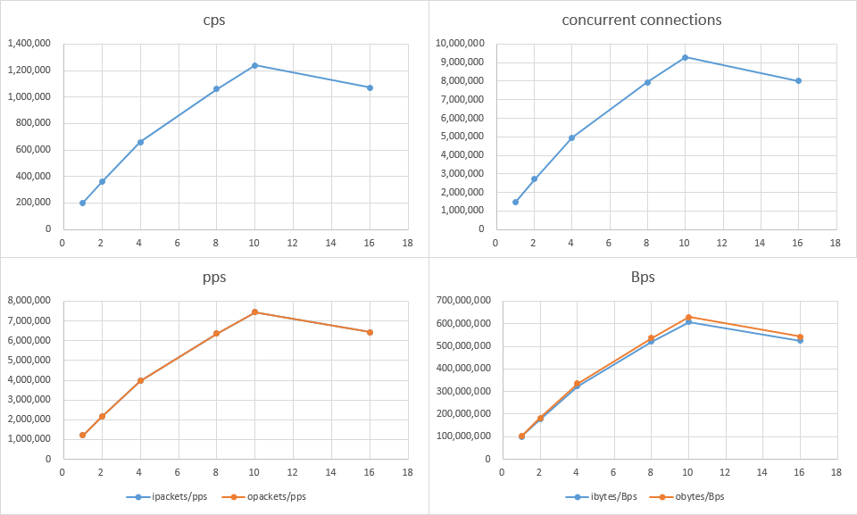
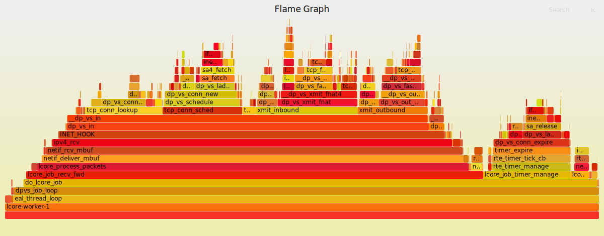
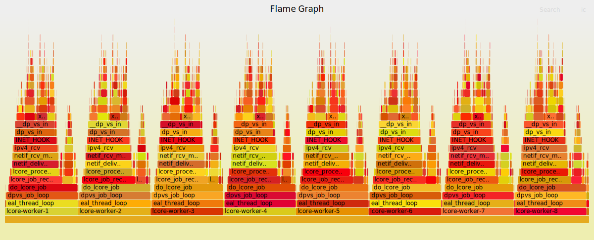
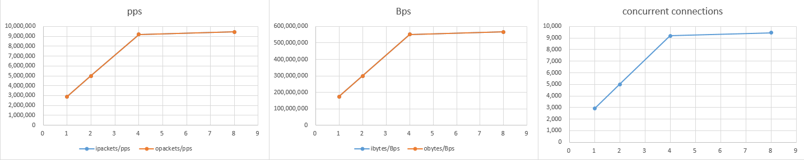
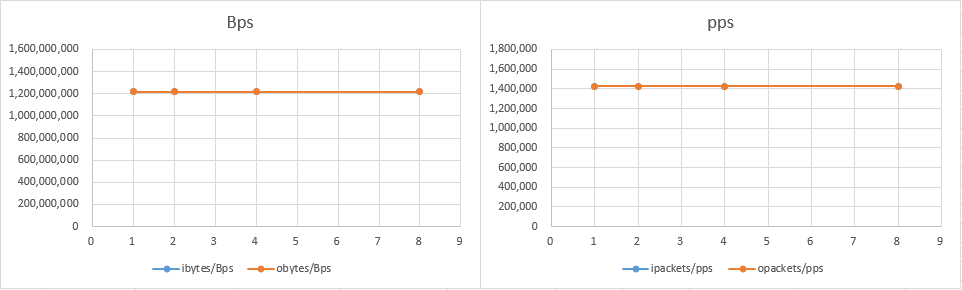

DPVS v1.9.2 Performance Tests
===

* [Test Platform](#platform)
* [TCP CPS/CC Tests](#cps/cc)
* [UDP PPS Tests](#pps)
* [Throughput Tests](#throughput)


<a id='platform'/>

# Test Platform

The performance of DPVS v1.9.2 is examined on two physical servers, one serves as DPVS server, and the other as both backend server(RS) and client(Client). RS and Client take advantages of [dperf](https://github.com/baidu/dperf), a high performance benchmark tool based on DPDK developed by baidu. The dperf server process and dperf client process use isolated NIC interfaces, CPU coers, and hugepage memory in order to run both processes on a single node.

### DPVS Server

+ CPU: Intel(R) Xeon(R) CPU E5-2650 v4 @ 2.20GHz, 2 Sockets, 12 Cores per Socket, 2 Threads per Core
+ Memory: 188G Bytes
+ NIC: Intel Corporation Ethernet Controller 10-Gigabit X540-AT2
+ OS: Centos 7.6
+ DPVS: v1.9.2

### Dperf Server/Client

+ CPU: Intel(R) Xeon(R) CPU E5-2650 v3 @ 2.30GHz, 2 Sockets, 10 Cores per Socket, 2 Threads per Core
+ Memory: 62G Bytes
+ NIC: Intel Corporation Ethernet Controller 10-Gigabit X540-AT2
+ OS: Centos 7.6
+ Dperf: v1.2.0

<a id='cps/cc'/>

# TCP CPS/CC Tests

CPS(Connections per Second) and CC (Concurrent Connections) tests are performed by using the extreme small sized packets (payload_size=1) and variable `cps` of dperf clients. We gradually increase the `cps` of dperf clients until packet loss is seen in DPVS, and then the corresponding CPS and CC are the performance data that we need.

### Dperf Client

```
mode            client
cpu             8-15
slow_start      60
tx_burst        128
launch_num      10
payload_size    1
duration        90s
protocol        tcp
cps             [refer to performance data]
port            0000:04:00.0    192.168.0.30 192.168.7.254
client          192.168.3.0     50
server          192.168.5.1     8
listen          80              1
```

### Dperf Server

```
mode            server
cpu             0-7
tx_burst        128
payload_size    1
duration        100d
port            0000:04:00.1    192.168.1.30   192.168.7.254
client          192.168.0.28    1
client          192.168.1.28    1 
client          192.168.1.30    1 
client          192.168.3.0     200
server          192.168.6.100   8
listen          80              1
```

### DPVS

+ Service: 192.168.5.[1-8]:80, TCP, FullNAT, rr, syn-proxy off
+ Local IP: 192.168.3.[100-149]

```
TCP  192.168.5.1:80 rr
  -> 192.168.6.100:80             FullNat 100    0          4         
  -> 192.168.6.101:80             FullNat 100    0          4         
  -> 192.168.6.102:80             FullNat 100    0          2         
  -> 192.168.6.103:80             FullNat 100    0          1         
  -> 192.168.6.104:80             FullNat 100    0          0         
  -> 192.168.6.105:80             FullNat 100    0          0         
  -> 192.168.6.106:80             FullNat 100    0          1         
  -> 192.168.6.107:80             FullNat 100    0          2         
TCP  192.168.5.2:80 rr
  -> 192.168.6.100:80             FullNat 100    0          1         
  -> 192.168.6.101:80             FullNat 100    0          2         
  ...
...
```

### Performance Data

| workers | cps       | ipackets/pps | opackets/pps | ibytes/Bps  | obytes/Bps  | connections | dperf:pktRx | dperf:pktTx | dperf:bitsRx  | dperf:bitsTx  | dperf:dropTx |
| ------- | --------- | ------------ | ------------ | ----------- | ----------- | ----------- | ----------- | ----------- | ------------- | ------------- | ------------ |
| 1       | 200,000   | 1,211,533    | 1,211,847    | 99,143,458  | 102,396,220 | 1,472,000   | 600,020     | 599,988     | 393,618,488   | 382,378,808   | 0            |
| 2       | 360,000   | 2,166,961    | 2,166,955    | 177,320,954 | 183,100,299 | 2,701,000   | 1,072,119   | 1,076,034   | 703,360,424   | 685,830,112   | 0            |
| 4       | 660,000   | 3,960,726    | 3,960,788    | 324,114,391 | 334,680,450 | 4,941,000   | 1,980,045   | 1,980,054   | 1,298,916,032 | 1,261,958,232 | 0            |
| 8       | 1,060,000 | 6,360,626    | 6,360,628    | 520,511,025 | 537,472,046 | 7,949,000   | 3,180,092   | 3,180,068   | 2,086,137,680 | 2,026,768,232 | 0            |
| 10      | 1,240,000 | 7,440,784    | 7,440,727    | 608,903,706 | 628,741,279 | 9,299,000   | 3,718,514   | 3,719,316   | 2,439,334,056 | 2,370,499,504 | 0            |
| 16      | 1,070,000 | 6,420,639    | 6,420,548    | 525,422,150 | 542,537,169 | 8,019,000   | 3,210,000   | 3,209,989   | 2,105,751,088 | 2,045,839,664 | 0            |




In case of 8-workers, DPVS v1.9.2 can establish **1,000,000 new connections per second**, and hold **8,000,000 concurrent connections** in the meanwhile. The performance gains approximately linearly when worker number is below 10. But an obvious performance loss is seen in 16-workers. One reason is that DPVS doesn't eliminate all racing conditions in datapath, and the problem gets worse with the increase of worker number. Besides, some DPVS workers are assigned to the CPU cores on NUMA socket different from that of NIC when running with 16-workers. Our DPVS server only has 12 CPU cores available per socket.

Let's make a deep insight into the `cpu-clock` events of DPVS with Linux performance analysis tool `perf`. We build DPVS with debug info and then run CPC/CC tests with 1-worker and 8-workers, with dperf `cps` configured to be 100,000 and 600,000 respectively. The performance flame graphs are shown below.





<a id='pps'/>

# UDP PPS Tests

In PPS tests, dperf clients keep a fixed `cps` of 3k and `keepalive` of 2ms, and adjust concurrent connections `cc` to generate different `pps` traffic. The same with CPS/CC tests, an extreme small payload of 1 byte is used. We use UDP protocol for the tests. Besides, `tx_burst` in dperf client is set to 1 to reduce traffic surge.

### Dperf Client

```
mode            client
cpu             8-15
slow_start      60
tx_burst        128
launch_num      1
payload_size    1
duration        90s
protocol        udp
cps             3k
cc              [refer to performance data]
keepalive       2ms
port            0000:04:00.0    192.168.0.30 192.168.7.254
client          192.168.3.0     50
server          192.168.5.1     8
listen          80              1
```
### Dperf Server

```
mode            server
cpu             0-7
tx_burst        128
payload_size    1
duration        100d
protocol        udp
keepalive       10s
port            0000:04:00.1    192.168.1.30   192.168.7.254
client          192.168.0.28    1
client          192.168.1.28    1 
client          192.168.1.30    1 
client          192.168.3.0     200
server          192.168.6.100   8
listen          80              1
```

### DPVS

+ Service: 192.168.5.[1-8]:80, UDP, FullNAT, rr, uoa off
+ Local IP: 192.168.3.[100-149]

```
UDP  192.168.5.1:80 rr
  -> 192.168.6.100:80             FullNat 100    0          0         
  -> 192.168.6.101:80             FullNat 100    0          0         
  -> 192.168.6.102:80             FullNat 100    0          0         
  -> 192.168.6.103:80             FullNat 100    0          0         
  -> 192.168.6.104:80             FullNat 100    0          0         
  -> 192.168.6.105:80             FullNat 100    0          0         
  -> 192.168.6.106:80             FullNat 100    0          0         
  -> 192.168.6.107:80             FullNat 100    0          0         
UDP  192.168.5.2:80 rr
  -> 192.168.6.100:80             FullNat 100    0          0         
  -> 192.168.6.101:80             FullNat 100    0          0         
  ...
...
```

### Performance Data

| workers | connections | ipackets/pps | opackets/pps | ibytes/Bps  | obytes/Bps  | dperf:pktRx | dperf:pktTx | dperf:bitsRx  | dperf:bitsTx  | dperf:dropTx |
| ------- | ----------- | ------------ | ------------ | ----------- | ----------- | ----------- | ----------- | ------------- | ------------- | ------------ |
| 1       | 2,900       | 2,900,244    | 2,900,221    | 174,014,668 | 174,013,684 | 1,449,993   | 1,450,000   | 695,996,816   | 498,800,000   | 0            |
| 2       | 5,000       | 5,000,418    | 5,000,370    | 300,024,968 | 300,022,497 | 2,499,954   | 2,500,000   | 1,199,978,096 | 860,000,000   | 0            |
| 4       | 9,200       | 9,201,066    | 9,201,048    | 552,063,906 | 552,062,986 | 4,486,101   | 4,600,001   | 2,153,329,128 | 1,582,400,344 | 0            |
| 8       | 9,450       | 9,451,027    | 9,451,004    | 567,061,568 | 567,060,365 | 4,723,923   | 4,724,932   | 2,267,483,216 | 1,625,376,608 | 0            |



As shown above, DPVS v1.9.2 can reach the peak of PPS (i.e, about 9,000,000 PPS) with 4-workers in the tests. We may need a 25G/100G NIC for a higher PPS test.

<a id='throughput'/>

# Throughput Tests

In throughput tests, dperf clients keep a fixed `cps` of 400 and `keepalive` of 1ms, and adjust concurrent connections `cc` to generate different `pps` traffic. The `payload_size` of both dperf server and dperf client are set to 800 bytes, and TCP protocol is used.

### Dperf Client

```
mode            client
cpu             8-15
slow_start      60
tx_burst        128
launch_num      10
payload_size    800
duration        90s
protocol        tcp
cps             400
cc              [refer to performance data]
keepalive       1ms
port            0000:04:00.0    192.168.0.30 192.168.7.254
client          192.168.3.0     50
server          192.168.5.1     8
listen          80              1
```

### Dperf Server

```
mode            server
cpu             0-7
tx_burst        128
payload_size    800
duration        100d
protocol        tcp
keepalive       10s
port            0000:04:00.1    192.168.1.30   192.168.7.254
client          192.168.0.28    1
client          192.168.1.28    1 
client          192.168.1.30    1 
client          192.168.3.0     200
server          192.168.6.100   8
listen          80              1
```

## DPVS

DPVS configurations are the same with the `TCP CPS/CC Tests`.


### Performance Data

| workers | connections | ipackets/pps | opackets/pps | ibytes/Bps    | obytes/Bps    | dperf:pktRx | dperf:pktTx | dperf:bitsRx  | dperf:bitsTx  | dperf:dropTx |
| ------- | ----------- | ------------ | ------------ | ------------- | ------------- | ----------- | ----------- | ------------- | ------------- | ------------ |
| 1       | 1,000       | 1,424,608    | 1,424,599    | 1,215,824,068 | 1,215,816,616 | 712,263     | 712,285     | 4,866,168,760 | 4,860,632,840 | 0            |
| 2       | 1,000       | 1,424,748    | 1,424,738    | 1,215,947,746 | 1,215,939,706 | 712,247     | 712,263     | 4,866,065,328 | 4,860,482,712 | 0            |
| 4       | 1,000       | 1,424,876    | 1,424,870    | 1,216,052,235 | 1,216,047,912 | 712,258     | 712,238     | 4,866,134,600 | 4,860,312,112 | 0            |
| 8       | 1,000       | 1,424,788    | 1,424,787    | 1,215,971,428 | 1,215,970,249 | 712,261     | 712,260     | 4,866,160,976 | 4,860,462,240 | 0            |



As shown above, DPVS v1.9.2 fills with ease the full bandwith of 10G NIC using only one worker.
